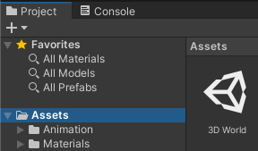
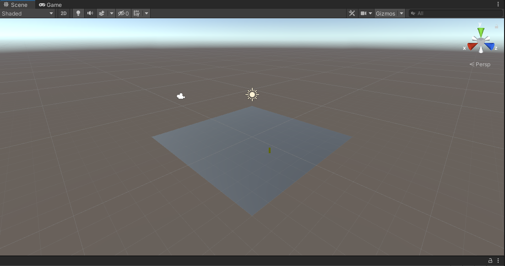
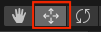

## اضبط المشهد ثلاثي الأبعاد

يحتاج عالمك ثلاثي الأبعاد ، أو "الخريطة"، إلى أرضية وجدران. 

! [منظر المشهد يظهر أرضية طائرة بجدارين من الطوب.] (images / end-walls.png) {: width = "300px"}

يقضي الأشخاص وقتًا أطول في ** بيئات افتراضية عبر الإنترنت **. بالإضافة إلى ممارسة الألعاب ، يمكن للأشخاص الاسترخاء والاستكشاف والتواصل الاجتماعي والتعلم والمشاركة في الترفيه التفاعلي. يسمي بعض الناس مستقبل هذه البيئات ** metaverse **. القدرة على تصميم عوالم ثلاثية الأبعاد هي مهارة مهمة.

يحتاج مشروع الوحدة إلى "أصول" للرسومات والصوت.

--- task ---

قم بتنزيل وفك ضغط حُزْمَة [Unity starter package](https://rpf.io/p/en/explore-a-3d-world-go){: target = "_ blank"} على جهاز الحاسوب الخاص بك. اختر موقعًا معقولاً مثل مجلد المستندات.

--- /task ---

--- task ---

قم بتشغيل Unity Hub وانقر فوق **مشاريع** ثم حدد **مشروع جديد**:

من القائمة ، اختر **جميع القوالب** ثم حدد **3D Core**:

قموا بتحرير إعدادات المشروع لمنح مشروعكم اسمًا معقولًا وحفظوا في مكان معقول. ثم انقر فوق **إنشاء مشروع**:

سيفتح مشروعكم الجديد في Unity Editor. قد يستغرق التحميل بعض الوقت.

--- /task ---

يبدو محرر الوحدة كما يلي:

--- collapse ---

---
العنوان: نوافذ محرر الوحدة وطرق العرض
---

1. **تُستخدم قائمة الوحدة** لاستيراد المشاهد والمشاريع وفتحها وحفظها. يمكنك تعديل تفضيلات Unity Editor الخاصة بكم وإضافة عناصر ومكونات GameObjects جديدة.

2. **يحتوي شريط الأدوات** على أدوات للتنقل في عرض المشهد ، والتحكم في اللعب في عرض اللعبة ، وتخصيص تخطيط محرر الوحدة الخاص بك.

3. **يتم استخدام طريقة عرض المشهد** للتنقل في المشهد وتحريره. يمكنك تحديد مواقع GameObjects بما في ذلك الشخصيات والمشاهد والكاميرات والأضواء.

4. **يمكن الوصول إلى عرض اللعبة** بالنقر فوق علامة التبويب **لعبة**. يظهر المشهد كما ينظر من خلال عدسة الكاميرات الخاصة بكم. عند النقر فوق الزر **Play** للدخول إلى وضع Play ، فإن طريقة عرض اللعبة تحاكي مشهدكم كما يراه المستخدم.

5. **The Hierarchy window** shows all the GameObjects in your Scene and the structure between them. Here, you can add and navigate the GameObjects in your project. GameObjects can have 'child objects' that move with them.

6. **The Project window** shows a library of all the files included in your project. You can find the Assets you want to use here.

7. **The Console window** can be accessed by clicking on the **Console** tab. It shows important messages. This is where you can see compiler errors (errors in your Script) and messages that you print using `Debug.Log()`.

8. **The Inspector window** allows you to view and edit the properties of GameObjects. You can add other components to your GameObjects and edit the values they use.

--- /collapse ---

--- task ---

The Unity starter package you downloaded contains a number of Assets for you to use in your project.

To import them into your new project, click on the **Assets** menu and select **Import package** > **Custom Package...** then navigate to the downloaded **Unity starter package**.

--- /task ---

[[[unity-importing-a-package]]]

--- task ---

The **Project window** is where you can see all the files included in your project. Click on the **Models** folder in the Assets folder to see the models you have imported.

--- /task ---

In Unity, a **Scene** contains GameObjects. A Unity project with multiple game levels might have one scene per level.

--- task ---

Right-click on **SampleScene** in the Hierarchy and choose **Save Scene As**.

In the pop-up window, name your Scene `3D World`:

A new file will appear in the Assets folder in the Project window:

--- /task ---

First, your world needs some ground.

--- task ---

Right-click on your scene (name 3D World) in the Hierarchy window and choose **GameObject** > **3D Object** > **Plane**:

This will create a ground for your world.

The default size for the plane is 10m × 10m. Unity uses metres as the unit of measurement.

--- /task ---

The **material** of a GameObject controls how it looks. Give the plane a different colour material.

--- task ---

In the Project window, right-click on the **Materials** folder and choose **Create** > **Material**.

A new material should appear in the Materials folder. Decide what colour you will use for your floor and name your new material:

Click on the colour next to 'Albedo' in the Inspector window and choose a colour for your material (we used grey):

Drag your new material from the Project window to your plane in the Scene view:

--- /task ---

You can create objects from 3D shapes.

--- task ---

Right-click on your **3D World** scene in the Hierarchy window and choose **GameObject** > **3D Object** > **Cube**.

This will create a cube at the centre of the scene, at (0, 0, 0).

--- /task ---

You can see the cube in the Scene view. This is the behind-the-scenes view of your game where you set everything up.

**Tip:** Click on the **Scene** tab to make sure you can see the Scene view.

--- task ---

Click on the cube in the Scene view or Hierarchy window to select it.

Use <kbd>Shift</kbd>+<kbd>F</kbd> (hold down the <kbd>Shift</kbd> key and tap <kbd>F</kbd>) to focus on the cube.

You can also use the scroll wheel on the mouse, or the up and down arrow keys, to zoom in and out:

--- /task ---

You need to get the cube to sit on the plane.

--- task ---

Click on the cube in the Scene view or Hierarchy window to select it.

**Choose**   
You can either:

+ Change the y position in the Inspector window to 0.5 (half the height of the cube):

+ Use the Move tool to drag the green arrow up until the cube sits on the plane:

--- /task ---

**Tip:** If you make a mistake in the Unity Editor, you can use <kbd>Ctrl</kbd>+<kbd>Z</kbd> (or <kbd>Cmd</kbd>+<kbd>Z</kbd>) to **undo** your last action.

--- task ---

Now change the cube into a wall with the following Position and Scale settings:

{:width="400px"}

You can either enter the values in the Transform component for the cube or click on the Scale tool and drag the handles in the Scene view (this will update the Transform values.)

Zoom out to see your wall:

--- /task ---

A material can have a colour and a texture and there are lots of properties that you can adjust to get different effects. A **texture** is a 2D image that can be created in an image editor.

--- task ---

In the Project window, right-click on the **Materials** folder and choose **Create** > **Material**. You are going to create a coloured brick wall. Give the material a descriptive name:

Click on the colour next to 'Albedo' in the Inspector window and choose a colour for your material:

Add a texture by clicking on the circle to the left of 'Albedo' and selecting **BrickWallAlbedo** texture from the list:

Drag your new material from the Project window to your wall in the Scene view:

--- /task ---

--- task ---

In the Inspector window, right-click on your cube, choose **Rename** from the menu and rename your object from `Cube` to `Wall`:

**Tip:** You can name a new GameObject in the Hierarchy window when you create it and you can change the name in the Inspector window.

--- /task ---

--- task ---

To create a copy of your wall, you can either:
+ Right-click on your Wall object in the Hierarchy window and choose **Duplicate**
+ Select your wall in the Scene view and use <kbd>Ctrl</kbd>+<kbd>D</kbd> (or <kbd>Cmd</kbd>+<kbd>D</kbd>) to duplicate

Your new wall will be in exactly the same place as your first wall.

--- /task ---

--- task ---

Change the y rotation of the new wall to `90`:

--- /task ---

--- task ---

Reposition the new wall to the following position: x = 4, y = 1, z = -1.

You can either enter the values in the Inspector window or drag the arrows in your Scene — it doesn't matter if the position is exact.

Your Scene should look like this:

--- /task ---

--- task ---

Click on your Plane. Change the Scale settings on the Plane to make it bigger so you have more room:

Think of a 4×4 plane as 40 metres by 40 metres in the real world: plenty of room for your character to move around.

--- /task ---

--- task ---

When you have unsaved changes, you will see a '*' next to your Scene in the Hierarchy window.

Save your Scene by clicking **File** > **Save**. Or use <kbd>Ctrl</kbd>+<kbd>S</kbd>.

Also, save your project by clicking **File** > **Save Project**.

Unity does not normally autosave changes, but your starter project contains a script to autosave your project every 60 seconds.

--- /task ---

You can navigate around your scene to see it from different angles. If you get lost, just click on a wall in the Hierarchy window and then use <kbd>Shift</kbd>+<kbd>F</kbd> to focus and then zoom out:

[[[unity-scene-navigation]]]

Remember, if you navigate around then you will be looking at your scene from a different perspective so your view won't look exactly the same as our examples.

--- save ---
