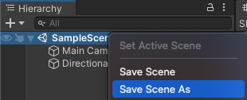
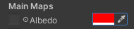

## اضبط المشهد ثلاثي الأبعاد

يحتاج عالمك ثلاثي الأبعاد ، أو "الخريطة"، إلى أرضية وجدران. 

! [منظر المشهد يظهر أرضية طائرة بجدارين من الطوب.] (images / end-walls.png) {: width = "300px"}

يقضي الأشخاص وقتًا أطول في ** بيئات افتراضية عبر الإنترنت **. بالإضافة إلى ممارسة الألعاب ، يمكن للأشخاص الاسترخاء والاستكشاف والتواصل الاجتماعي والتعلم والمشاركة في الترفيه التفاعلي. يسمي بعض الناس مستقبل هذه البيئات ** metaverse **. القدرة على تصميم عوالم ثلاثية الأبعاد هي مهارة مهمة.

يحتاج مشروع الوحدة إلى "أصول" للرسومات والصوت.

--- task ---

قم بتنزيل وفك ضغط حُزْمَة [Unity starter package](https://rpf.io/p/en/explore-a-3d-world-go){: target = "_ blank"} على جهاز الحاسوب الخاص بك. اختر موقعًا معقولاً مثل مجلد المستندات.

--- /task ---

--- task ---

قم بتشغيل Unity Hub وانقر فوق **مشاريع** ثم حدد **مشروع جديد**:

من القائمة ، اختر **جميع القوالب** ثم حدد **3D Core**:

قموا بتحرير إعدادات المشروع لمنح مشروعكم اسمًا معقولًا وحفظوا في مكان معقول. ثم انقر فوق **إنشاء مشروع**:

سيفتح مشروعكم الجديد في Unity Editor. قد يستغرق التحميل بعض الوقت.

--- /task ---

يبدو محرر الوحدة كما يلي:

--- collapse ---

---
العنوان: نوافذ محرر الوحدة وطرق العرض
---

1. **تُستخدم قائمة الوحدة** لاستيراد المشاهد والمشاريع وفتحها وحفظها. يمكنك تعديل تفضيلات Unity Editor الخاصة بكم وإضافة عناصر ومكونات GameObjects جديدة.

2. **يحتوي شريط الأدوات** على أدوات للتنقل في عرض المشهد ، والتحكم في اللعب في عرض اللعبة ، وتخصيص تخطيط محرر الوحدة الخاص بك.

3. **يتم استخدام طريقة عرض المشهد** للتنقل في المشهد وتحريره. يمكنك تحديد مواقع GameObjects بما في ذلك الشخصيات والمشاهد والكاميرات والأضواء.

4. **يمكن الوصول إلى عرض اللعبة** بالنقر فوق علامة التبويب **لعبة**. يظهر المشهد كما ينظر من خلال عدسة الكاميرات الخاصة بكم. عند النقر فوق الزر **Play** للدخول إلى وضع Play ، فإن طريقة عرض اللعبة تحاكي مشهدكم كما يراه المستخدم.

5. **تُظهر نافذة التسلسل الهرمي** جميع كائنات اللعبة في المشهد الخاص بك والهيكل بينها. هنا ، يمكنكم إضافة GameObjects والتنقل عبر مشروعك. يمكن أن تحتوي كائنات GameObjects على "كائنات فرعية" تتحرك معها.

6. **نافذة المشروع**تظهر مكتبة جميع الملفات الذي يتضمنها مشروعك. يمكنكم العثور على الأصول التي تريد استخدامها هنا.

7. **يمكن الوصول إلى نافذة وحدة التحكم** بالنقر فوق علامة التبويب **وحدة التحكم**. يظهر رسائل مهمة. هذا هو المكان الذي يمكنكم فيه رؤية أخطاء المترجم (أخطاء في البرنامج النصي الخاص بكم) والرسائل التي تطبعها باستخدام `Debug.Log ()`.

8. **تتيح لكم نافذة المفتش** عرض خصائص GameObjects وتحريرها. يمكنكم إضافة مكونات أخرى إلى GameObjects الخاصة بكم وتعديل القيم التي يستخدمونها.

--- /collapse ---

--- task ---

تحتوي حزمة Unity starter التي قمت بتنزيلها على عدد من الأصول لتستخدمها في مشروعك.

لاستيرادها إلى مشروعكم الجديد ، انقر فوق قائمة **الأصول** وحدد **حزمة استيراد حزمة مخصصة ... ثم انتقلوا إلى حزمة <Unity starter التي تم تنزيلها.

--- /task ---

[[[unity-importing-a-package]]]

--- task ---

**نافذة المشروع**تظهر مكتبة جميع الملفات الذي يتضمنها مشروعك. انقر على**نموذج**ملف في مجلد الاصول لرؤية النماذج التي قمت بأستيرادها.

--- /task ---

في unity يكون **مشهد**يتضمن كائنات اللعبة. مشروع unity مع مستويات اللعبة المتعددة قد يحتوي مشهد واحد لكل مستوى.

--- task ---

انقر بزر الماوس الأيمن فوق **SampleScene** في التسلسل الهرمي واختر **Save Scene As**.

في النافذة المنبثقة ، قموا بتسمية Scene `3D World`:

سيظهر ملف جديد في مجلد الأصول في نافذة المشروع:

--- /task ---

أولاً ، عالمكم يحتاج إلى بعض الأرضية.

--- task ---

انقر بزر الماوس الأيمن على المشهد الخاص بكم (اسم 3D World) في نافذة التسلسل الهرمي واختر **GameObject** > **3D Object** > **Plane**:

هذا سيخلق أرضية لعالمكم.

الحجم الافتراضي للطائرة هو 10 م × 10 م. تستخدم الوحدة العدادات كوحدة قياس.

--- /task ---

تتحكم المادة **** كائن GameObject في كيفية ظهوره. امنح الطائرة مادة ملونة مختلفة.

--- task ---

في نافذة المشروع ، انقر بزر الماوس الأيمن فوق المجلد **المواد** واختر **إنشاء** > **مادة**.

يجب أن تظهر مادة جديدة في مجلد المواد. حددوا اللون الذي ستستخدمه لأرضيتك وقم بتسمية المادة الجديدة الخاصة بك:

انقر فوق اللون الموجود بجوار "Albedo" في نافذة المفتش واختر لونًا للمادة الخاصة بك (استخدمنا اللون الرمادي):

اسحب المادة الجديدة من نافذة المشروع إلى طائرتك في طريقة عرض المشهد:

--- /task ---

يمكنكم إنشاء كائنات من أشكال ثلاثية الأبعاد.

--- task ---

انقر بزر الماوس الأيمن على مشهد **3D World** في نافذة Hierarchy واختر **GameObject** > **3D Object** > **Cube**.

سيؤدي هذا إلى إنشاء مكعب في وسط المشهد ، عند (0 ، 0 ، 0).

--- /task ---

يمكنك رؤية المكعب في طريقة عرض المشهد. هذه هي طريقة عرض لعبتكم من وراء الكواليس حيث تقوم بإعداد كل شيء.

**نصيحة:** انقر فوق علامة التبويب **المشهد** للتأكد من أنه يمكنك رؤية عرض المشهد.

--- task ---

انقروا فوق المكعب في عرض المشهد أو نافذة التسلسل الهرمي لتحديده.

استخدم <kbd>Shift</kbd>+<kbd>F</kbd> (اضغط باستمرار على مفتاح <kbd>Shift</kbd> واضغط على <kbd>F</kbd>) للتركيز على المكعب.

يمكنكم أيضًا استخدام عجلة التمرير في الماوس ، أو مفتاحي الأسهم لأعلى ولأسفل للتكبير والتصغير:

--- /task ---

تحتاجوا إلى جعل المكعب يجلس على الطائرة.

--- task ---

انقر فوق المكعب في عرض المشهد أو نافذة التسلسل الهرمي لتحديده.

**اختر**   
يمكنك إما:

+ قموا بتغيير موضع y في نافذة المفتش إلى 0.5 (نصف ارتفاع المكعب):

+ استخدموا أداة التحريك لسحب السهم الأخضر لأعلى حتى يستقر المكعب على المستوى:

--- /task ---

**نصيحة:** إذا ارتكبت خطأ في Unity Editor ، يمكنك استخدام <kbd>Ctrl</kbd>+<kbd>Z</kbd> (أو <kbd>Cmd</kbd>+<kbd>Z</kbd>) للتراجع عن **** الإجراء الأخير.

--- task ---

الآن قموا بتغيير المكعب إلى جدار باستخدام إعدادات الموضع والمقياس التالية:

{:width="400px"}

يمكنكم إما إدخال القيم في مكون التحويل للمكعب أو النقر فوق أداة القياس واسحب المقابض في عرض المشهد (سيؤدي ذلك إلى تحديث قيم التحويل.)

تصغير لرؤية الحائط الخاص بكم:

--- /task ---

يمكن أن يكون للمادة لون وملمس وهناك الكثير من الخصائص التي يمكنك تعديلها للحصول على تأثيرات مختلفة. المادة **هي** ثنائية الأبعاد يمكن إنشاؤها في محرر الصور.

--- task ---

في نافذة المشروع ، انقر بزر الماوس الأيمن فوق المجلد **المواد** واختر **إنشاء** > **مادة**. ستقوم بإنشاء جدار من الطوب الملون. امنحوا المادة اسمًا وصفيًا:

انقر على اللون بجوار 'Albedo'في نافذة المفتش واختر لونًا للمادة الخاصة بكم:

أضيفوا نسيجًا بالنقر فوق الدائرة الموجودة على يسار "البيدو" واختيار **نسيج BrickWallAlbedo** من القائمة:

اسحب المادة الجديدة من نافذة المشروع إلى طائرتكم في طريقة عرض المشهد:

--- /task ---

--- task ---

في نافذة المفتش ، انقر بزر الماوس الأيمن على المكعب الخاص بكم ، واختروا**إعادة تسمية** من القائمة وأعد تسمية الكائن من `Cube` إلى `Wall`:

**نصيحة:** يمكنكم تسمية كائن GameObject جديد في نافذة التسلسل الهرمي عند إنشائه ويمكنكم تغيير الاسم في نافذة المفتش.

--- /task ---

--- task ---

لإنشاء نسخة من الحائط الخاص بكم ، يمكنك إما:
+ انقر بزر الماوس الأيمن على كائن الحائط في نافذة التسلسل الهرمي واختر **تكرار**
+ حددوا الحائط الخاص بك في عرض المشهد واستخدم <kbd>Ctrl</kbd>+<kbd>D</kbd> (أو <kbd>Cmd</kbd>+<kbd>D</kbd>) لتكرار

سيكون جداركم الجديد في نفس مكان جداركم الأول تمامًا.

--- /task ---

--- task ---

قموا بتغيير الدوران y للجدار الجديد إلى `90`:

--- /task ---

--- task ---

قموا بتغيير موضع الجدار الجديد إلى الموضع التالي: x = 4 ، y = 1 ، z = -1.

يمكنكم إما إدخال القيم في نافذة المفتش أو سحب الأسهم في المشهد الخاص بكم - لا يهم إذا كان الموضع دقيقًا.

يجب أن تبدو التعليمات البرمجية خاصتك بالشكل التالي:

--- /task ---

--- task ---

انقر على الصورة. قموا بتغيير إعدادات المقياس على المستوى لتكبيرها بحيث يكون لديكم مساحة أكبر:

فكر في طائرة 4 × 4 بحجم 40 مترًا في 40 مترًا في العالم الحقيقي: مساحة كبيرة لشخصيتكم للتنقل.

--- /task ---

--- task ---

عندما يكون لديكم تغييرات غير محفوظة ، سترى علامة "*" بجوار المشهد الخاص بكم في نافذة التسلسل الهرمي.

احفظ المشهد الخاص بكم عن طريق النقر فوق **ملف** > **حفظ**. أو استخدموا <kbd>Ctrl</kbd>+<kbd>S</kbd>.

أيضًا ، احفظ مشروعكم بالنقر فوق **ملف** > **حفظ المشروع**.

لا تقوم الوحدة عادةً بالحفظ التلقائي للتغييرات ، ولكن مشروعكم المبدئي يحتوي على برنامج نصي للحفظ التلقائي لمشروعكم كل 60 ثانية.

--- /task ---

يمكنك التنقل حول مشهدك لرؤيته من زوايا مختلفة. إذا تهت، انقر فوق اللاعب في التدرج الهرمي ثم استخدم <kbd>Shift</kbd>+<kbd>F</kbd> للتركيز على اللاعب:

[[[unity-scene-navigation]]]

تذكروا ، إذا قمت بالتنقل ، فسوف تنظر إلى المشهد الخاص بكم من منظور مختلف حتى لا تبدو طريقة العرض الخاصة بك تمامًا مثل الأمثلة لدينا.

--- save ---
