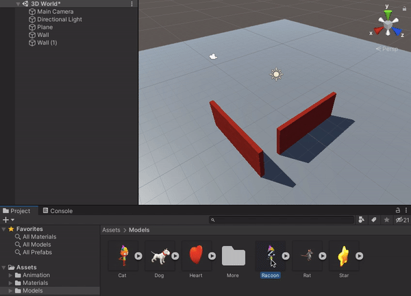

## أضف شخصية ألاعب

سيكون اللاعب في عالمك هو شخصية القط أو الراكون. 

عرض المشهد مع شخصية (images/added-character.png){:width="300px"}

--- task ---

انقر على **Models** في نافذة المشروع. يصف النموذج كيف يبدو شكل كائن ثلاثي الأبعاد ويمكن إنشاؤه باستخدام أدوات النمذجة ثلاثية الأبعاد مثل Blender. لقد قمنا بتضمين بعض النماذج التي يمكنك استخدامها.

اختر إما نموذج `القط` أو `الراكون` واسحبه من نافذة المشروع إلى عرض المشهد:

**نصيحة:** إذا أضفت بِطْرِيق الخطأ قالب " القط" أو " الراكون"، أو إذا كنت تريد تغيير شخصيتك في هذه المرحلة ، فيمكنك حذف النموذج من المشهد. انقر بزر الماوس الأيمن فوق نموذج كائن اللعبة في نافذة التسلسل الهرمي وحدد "حذف".

--- /task ---

ستظهر شخصيتك في عرض المشهد على شكل حرف T.

الوضع ** T-pose ** هو الموضع الافتراضي لشخصية اللعبة قبل أن يتم تحريكها.

--- task ---

انقر فوق شخصيتك في عرض المشهد واضغط على مفتاح <kbd>F</kbd>.

**نصيحة:** إذا ضللت الطريق في عرض المشهد ، يمكنك النقر فوق شخصيتك (أوا ي كائن لُعْبَة آخر) في نافذة التسلسل الهرمي ثم النقر فوق <kbd>Shift</kbd>+<kbd>F</kbd> للتركيز على شخصيتك في عرض المشهد.

--- /task ---

حسنًا ، شخصيتك ترتدي أكسسوارات متعددة.

--- task ---

انقر على شخصيتك في نافذة التسلسل الهرمي. هذا سيؤدي لفتح الاعدادات لكائن اللعبة في نافذة الفحص.

انقر على السهم التالي لشخصيتك في نافذة التسلسل الهرمي لرؤية 'الكائنات الفرعية'. انقر على **شبكة مُعَدَّات البناء**وقم بإزالة تحديد المربع المجاور لأسمه في نافذة الفحص. سيؤدي ذلك إلى إخفاء القبعة الصلبة والسترة عالية اللمعان:

قم بإخفاء الملحقات الأخرى لشخصيتك بنفس الطريقة ، أو احتفظ بأحدها نشطًا.

**نصيحة:** كائنات اللعبة الغير نشطة تظهر باللون الرمادي في نافذة التسلسل الهرمي:

--- /task ---

--- task ---

سيرى اللاعب اللعبة ب "الكاميرا الرئيسية"، التي تظهر كأيقونة كاميرا فيديو في المشهد. حدد الكاميرا في نافذة التسلسل الهرمي لمشاهدة عرض الكاميرا المضمنة:

--- /task ---

عرض اللعبة يُظهر الشكل الذي سيبدو عليه مشروعك للاعب.

--- task ---

انقر فوق علامة عرض اللعبة. شخصيتك ستكون في أي موضع قمت بسحبه إليه في عرض المشهد (قد لا تتمكن من رؤيته).

--- /task ---

إذا كان لديك مساحة كافية على شاشتك ، فهذا مفيد حقًا لمشاهدة عرض المشهد وعرض اللعبة في نفس الوقت.

--- task ---

اسحب علامة عرض اللعبة إلى اليمين بحيث تظهر بجوار عرض المشهد:

--- /task ---

تستخدم Unity محاور x وy وz لوضع الكائنات في بيئة ثلاثيّة الأبعاد:

[[[unity-3D-coordinates]]]

--- task ---

حدد شخصيتك (في نافذة التسلسل الهرمي أو عرض المشهد) ثم قم بتغيير إعدادات "التحويل" الخاصة بها بحيث يكون "الموقع" (0، 0، 0) - مركز العالم:

ستنتقل شخصيتك إلى المركز في عرض المشهد وعرض اللعبة:

--- /task ---

--- task ---

أعد تسمية شخصيتك إلى "لاعب" في نافذة المفتش. إذا أضفت المزيد من كائنات اللعبة سيسهل هذا العثور عليها.

--- /task ---

--- save ---
