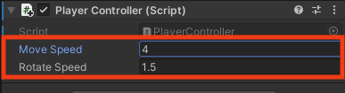

## أضيفوا  حركة الشخصية

<div style="display: flex; flex-wrap: wrap">
<div style="flex-basis: 200px; flex-grow: 1; margin-right: 15px;">
سيتحرك لاعبك باستخدام WASD أو مفاتيح الأسهم. 
</div>
<div>
! [المشهد في عرض اللعبة مع شخصية تتحرك حول المشهد.] (images / Moving-character.gif) {: width = "300px"}
</div>
</div>

<p style="border-left: solid; border-width:10px; border-color: #0faeb0; background-color: aliceblue; padding: 10px;">
تستخدم Unity لغة البرمجة <span style="color: #0faeb0">** C # **</span> (تُنطق C حادًا) ، والتي يستخدمها مطورو البرامج المحترفون. C # هي لغة موجهة للكائنات مع ** فئات ** تحدد سلوك كائنات مماثلة و ** طرق ** ، وهي وظائف تنتمي إلى فئة. في Unity ، يعرّف ** script ** فئة ذات متغيرات وطرق. يمكنكم إضافة نفس البرنامج النصي إلى عدة كائنات GameObjects إذا كانت بحاجة إلى نفس الميزات.</p>

--- task ---

انقروا فوق كائن **Player** GameObject في نافذة التسلسل الهرمي أو عرض المشهد حتى تتمكن من رؤية خصائصه في نافذة المفتش.

{:width="300px"}

**نصيحة:** تأكد من تحديد **Player** وليس أحد الكائنات الفرعية الخاصة به.

انقروا فوق **إضافة مكون** وابدأ في كتابة حرف `` في مربع البحث ، ثم انقر فوق مكون **Character Controller** عندما يظهر:


--- /task ---

يضيف مكون Character Controller ميزات جديدة إلى Player GameObject بما في ذلك طريقة `</strong>` ومصادم **. يمكن استخدام المصادمات لمنع شخصيتكم من السير عبر الأجسام الصلبة واكتشاف وقت حدوث الاصطدامات.</p>

<p style="border-left: solid; border-width:10px; border-color: #0faeb0; background-color: aliceblue; padding: 10px;">
 المصادم <span style="color: #0faeb0">** **</span> هو شكل يُستخدم لاكتشاف متى يصطدم كائن GameObject أو يتقاطع مع كائن GameObject آخر. إنه أسرع بكثير بالنسبة للكمبيوتر في التحقق من الاصطدامات مع شكل مصادم بسيط من الشكل المعقد لكائن GameObject. ** hitbox ** هو نوع من المصادم. </p>

--- task ---

يبلغ ارتفاع مصادم التحكم في الأحرف `2` والمركز عند `0 ، 0 ، 0`؛ هذا يعني أنه تم وضعه نصف أعلى ونصف أسفل المستوى:

{:width="300px"}

يبلغ ارتفاع شخصيتكم `1`، مما يعني أن مركزها على المحور ص هو `0.5`. غيّر القيمة في مركز محور y لـ Character Controller إلى `0.5` والارتفاع إلى `1` لمطابقة الحرف:

{:width="400px"}

{:width="300px"}

--- /task ---

تحتاج شخصيتكم إلى نص حتى يتمكن اللاعب من تحريكها. ستحتاج إلى محرر رمز مثبتًا على جهاز الكمبيوتر الخاص بكم لتحرير هذا البرنامج النصي.

[[[unity-visual-studio-code]]]

--- task ---

انتقل إلى نافذة المفتش الخاصة بالمشغل وانقر فوق الزر **إضافة مكون**. اكتب `script` وحدد **New Script**. قم بتسمية البرنامج النصي الجديد الخاص بك `PlayerController`، ثم اضغط على <kbd>Enter</kbd>.

سيتم حفظ البرنامج النصي الجديد في مجلد الأصول:

{:width="400px"}

--- /task ---

--- task ---

انقروا نقرًا مزدوجًا فوق **PlayerController** في مكون البرنامج النصي في نافذة المفتش. سيفتح البرنامج النصي في محرر كود منفصل وسيحتوي على هذا الرمز:

--- code ---
---
language: cs filename: PlayerController.cs line_numbers: true line_number_start:
line_highlights:
---
using System.Collections; using System.Collections.Generic; using UnityEngine;

public class PlayerController : MonoBehaviour
{ // Start is called before the first frame update void Start()
    {

    }
    
    // Update is called once per frame
    void Update()
    {
    
    }
} --- /code ---

**التصحيح:** تحقق من أن الاسم بعد "class" هو `PlayerController` وهذا يطابق اسم ملف البرنامج النصي الخاص بكم إذا أعدت تسمية الملف بعد إنشائه ، فستحتاج إلى تغيير اسم الفئة في البرنامج النصي.

--- /task ---

يتم استدعاء طريقة البدء مرة واحدة عند تشغيل المشهد الخاص بكم. أضيفوا رمزًا لطباعة الرسالة `بدأ Player` عند بدء تشغيل مشروعكم .

--- task ---

استخدم الأسلوب `Debug.Log ()` لطباعة رسالة عندما يتم استدعاء طريقة `Start` لـ Player GameObject. ستظهر الرسالة في الشريط أسفل محرر الوحدة وفي نافذة وحدة التحكم:

--- code ---
---
language: cs filename: PlayerController.cs - Start() line_numbers: true line_number_start: 7
line_highlights: 10
---

    // Start is called before the first frame update
    void Start()
    {
        Debug.Log("Player started");        
    }
--- /code ---

**نصيحة:** الأسطر التي تبدأ بـ // هي تعليقات تشرح الكود. لست بحاجة إلى كتابتها.

**احفظ** نص برنامج PlayerController الخاص بكم في محرر الكود الخاص بكم ، باستخدام <kbd>Ctrl</kbd>+<kbd>S</kbd> (أو <kbd>Cmd</kbd>+<kbd>S</kbd>) ، ثم ارجع إلى Unity Editor. سيقوم محرر الوحدة بتحميل البرنامج النصي الخاص بكم  ليكون جاهزًا للتشغيل ؛ وهذا قد يستغرق بضع ثوان.

--- /task ---

--- task ---

انقر فوق علامة تبويب نافذة وحدة التحكم لإحضاره إلى المقدمة:

{:width="400px"}

--- /task ---

--- task ---

**اختبار:** انتقل إلى شريط الأدوات وانقر مرة واحدة على الزر **Play** لوضع مشهدك في وضع التشغيل. سيؤدي ذلك إلى محاكاة المشهد الخاص بكم  حيث سيتم عرضه والتفاعل معه بواسطة المستخدم:

{:width="400px"}

يستغرق بدء تشغيل الوحدة بضع ثوانٍ ، ثم يجب أن تشاهد `Debug.Log ()` إخراج "بدء اللاعب" في وحدة التحكم.


**التصحيح:** لن يتم تشغيل المشهد الخاص بك إذا كانت هناك أخطاء في التعليمات البرمجية الخاصة بك. تحقق من نافذة وحدة التحكم للحصول على معلومات. قد ترى:
+ `؛ متوقع` - تحقق من وجود فاصلة منقوطة `؛` في نهاية كل سطر من التعليمات البرمجية.
+ `سطر جديد في الثابت` - فاتك اقتباس `"` من نهاية سلسلة نصية.
+ `} المتوقع` - يجب أن يكون لديكم زوج من الأقواس المتعرجة المفتوحة والمغلقة `{}` حول كل طريقة وحول الفصل. تحقق من تطابق الأقواس المتعرجة.
+ `) المتوقع` - تأكد من وجود إغلاق `)` في نهاية كل استدعاء طريقة ، قبل الفاصلة المنقوطة.
+ `التصحيح` لا يحتوي على تعريف لـ "السجل" - C # حساس لحالة الأحرف ، لذلك يجب أن يكون `Log` برأس مال `L`.

قارن الكود الخاص بكم  مع رمز المثال وتأكد من أن كل شيء متماثل تمامًا.

--- /task ---

--- task ---

انقر مرة واحدة على الزر **Play** مرة أخرى للخروج من وضع التشغيل وسيتوقف إخراج التصحيح.

**نصيحة:** تفقد التغييرات التي تم إجراؤها في وضع التشغيل عند الخروج من وضع التشغيل. تأكد من الخروج من وضع التشغيل عند الانتهاء من الاختبار.

--- /task ---

تخلق الوحدة تأثير الحركة عن طريق رسم الصور بسرعة على الشاشة. كل صورة عبارة عن **إطار**. يتم استدعاء طريقة `Update` مرة واحدة في كل إطار.

--- task ---

Switch to your code editor.

You will be able to use the WASD or arrow keys (players on a mobile or console can use different inputs without you changing your code.)

`Input.GetAxis("Vertical")` takes input from the <kbd>W</kbd> and <kbd>S</kbd> keys or the up and down arrow keys, and returns a number between 1 and -1, which it uses for forwards and backwards movement.

--- code ---
---
language: cs filename: PlayerController.cs - Update() line_numbers: true line_number_start: 14
line_highlights: 16-21
---

    void Update()
    {
        float speed = Input.GetAxis("Vertical");
    
        if (speed != 0) // Player moving
        {
            Debug.Log(speed);
        }
    }
--- /code ---

A `float` is a decimal number.

**Save** your PlayerController script in your code editor, using <kbd>Ctrl</kbd>+<kbd>S</kbd> (or <kbd>Cmd</kbd>+<kbd>S</kbd>), then return to the Unity Editor.

**Tip:** You might find it quicker to use <kbd>Alt</kbd>+<kbd>Tab</kbd> (or <kbd>Cmd</kbd>+<kbd>Tab</kbd>) to switch between your web browser with the project instructions, the Unity Editor, and your code editor.

--- /task ---

--- task ---

**Test:** Go to the Toolbar and click on the **Play** button to put your scene into Play mode.

Place your **mouse pointer in the Game view** and press keys <kbd>W</kbd> and <kbd>S</kbd>. Look at the values logged in the Console window as you press the keys. Each time you press <kbd>W</kbd> a positive number is logged, when you press <kbd>S</kbd> a negative number is logged. A number is only logged if the value of speed **is not** 0 (see line 18 of the code).

The numbers range between -1.0 and 1.0 and correspond to movement from the vertical controls on the keyboard (or a game controller). You can also use the up and down arrow keys.


**Tip:** The output also appears in the bar at the bottom of the Unity Editor.

Click the **Play** button again to exit Play mode and the debug output will stop.

--- /task ---

It's easy to forget whether your game is playing or not. A Play mode colour tint makes it easier to tell when your scene is playing:


--- task ---

To set a tint, go to the **Edit Menu** (or Unity Menu) and select **Preferences**. Choose the **Colours** menu and find the property called **Playmode tint**.

Click on the existing colour to see a colour wheel where you can choose a colour and opacity level:

{:width="400px"}

**Tip:** Try a light colour so that you can still clearly see the text in the editor when the scene is running.

Return to the Unity Editor and press the **Play** button to see your new tint in action. When you are happy with the tint you have chosen, press the **Play** button again to exit Play mode.

--- /task ---

The Character Controller component provides a `SimpleMove` method.

--- task ---

**Add** code to use the vertical input value to move the Player each frame.

You can **delete** the Debug code.

**Tip:** You can also mask the `Debug.Log()` lines by putting `//` at the beginning of the line. You can also mask multiple lines using `/*` and `*/`:
```
        /*if (speed != 0) // Player moving
        {
            Debug.Log(speed);
        }*/
```

Unity uses a special data type called a `Vector3` to store 3D points or directions. The `forward` variable stores the direction that the Player is facing:

--- code ---
---
language: cs filename: PlayerController.cs - Update() line_numbers: true line_number_start: 14
line_highlights: 18-23
---

    void Update()
    {
        float speed = Input.GetAxis("Vertical");
    
        // Forward is the forward direction for this character
        Vector3 forward = transform.TransformDirection(Vector3.forward);
    
        // You need the Character Controller so you can use SimpleMove
        CharacterController controller = GetComponent<CharacterController>();
        controller.SimpleMove(forward * speed);
    }
--- /code ---

--- /task ---

--- task ---

**Test:** Click **Play** to enter Play mode and try out your code. Use the <kbd>W</kbd> and <kbd>S</kbd> keys or the up and down arrow keys to glide forwards and backwards.

**Debug:** Remember to check the Console window for helpful messages. Check brackets, semicolons, and capital letters in your code carefully.

**Tip:** Make sure your mouse pointer is in the **Game view**.

Try and walk through the wall. The `SimpleMove` method from the Character Controller component stops you from being able to walk through GameObjects that have a collider. A collider is automatically added when you create a 3D shape as you did for the wall.

You can pan around in the Scene view by holding your right mouse button and dragging. Pan to get a better view of the wall as your character walks into it:

{:width="500px"}

To move your Player, move the mouse pointer back to the **Game view**.

Click the **Play** button again to exit Play mode.

--- /task ---

--- task ---

Add another line so your character can `Rotate` when the player presses the <kbd>A</kbd> and <kbd>D</kbd> keys or the left and right arrow keys:

--- code ---
---
language: cs filename: PlayerController.cs - Update() line_numbers: true line_number_start: 14
line_highlights: 18-19
---

    void Update()
    {
        float speed = Input.GetAxis("Vertical");
    
        // Rotate around y-axis
        transform.Rotate(0, Input.GetAxis("Horizontal"), 0);
    
        // Forward is the forward direction for this character
        Vector3 forward = transform.TransformDirection(Vector3.forward);
    
        // You need the Character Controller so you can use SimpleMove
        CharacterController controller = GetComponent<CharacterController>();
        controller.SimpleMove(forward * speed);
    }
--- /code ---

Save your code and switch back to the Unity Editor. Unity will load your updated script.

--- /task ---

--- task ---

**Test:** Click **Play** to enter Play mode and try out your code. Use the <kbd>A</kbd> and <kbd>D</kbd> keys or the left and right arrow keys to rotate.

**Debug:** If you are still seeing output to the Console and movement isn't working, then make sure you have saved your script in the code editor.

Click the **Play** button again to exit Play mode.

--- /task ---

You can also control the speed of movement and rotation.

--- task ---

Open your PlayerController script and add variables for the `moveSpeed` and `rotateSpeed`.

--- code ---
---
language: cs filename: PlayerController.cs line_numbers: true line_number_start: 5
line_highlights: 7-8
---
public class PlayerController : MonoBehaviour
{ public float moveSpeed = 4.0f; //The f at the end of the number says it is a floating-point number public float rotateSpeed = 1.5f;

    // Start is called before the first frame update
    void Start()
    {
--- /code ---

--- /task ---

--- task ---

Update the code to `Rotate` and `SimpleMove` your character to multiply them by the new variables:

--- code ---
---
language: cs filename: PlayerController.cs - Update() line_numbers: true line_number_start: 21
line_highlights: 22
---

        // Rotate around y-axis
        transform.Rotate(0, Input.GetAxis("Horizontal") * rotateSpeed, 0);
--- /code ---

and

--- code ---
---
language: cs filename: PlayerController.cs - Update() line_numbers: true line_number_start: 27
line_highlights: 29
---

        // You need the Character Controller so you can use SimpleMove
        CharacterController controller = GetComponent<CharacterController>();
        controller.SimpleMove(forward * speed * moveSpeed);
--- /code ---

--- /task ---

--- task ---

**Test:** Play your scene and check if you are happy with the speed settings.

If you select the Player in your scene view you can make changes to your `moveSpeed` and `rotateSpeed` variables in the Inspector.



--- collapse ---

---
title: Variables in the Inspector
---

When you change the value of a variable in the Inspector, it takes priority over the value set in your script.

Any future changes you make to those values in your script **will not take effect**.

--- /collapse ---

Click the **Play** button again to exit Play mode.

--- /task ---

--- save ---
