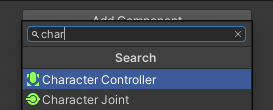
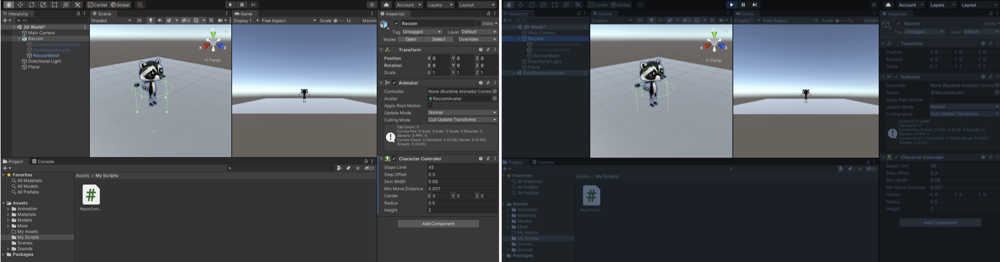

## أضيفوا  حركة الشخصية

<div style="display: flex; flex-wrap: wrap">
<div style="flex-basis: 200px; flex-grow: 1; margin-right: 15px;">
سيتحرك لاعبك باستخدام WASD أو مفاتيح الأسهم. 
</div>
<div>
{:width="300px"}
</div>
</div>

<p style="border-left: solid; border-width:10px; border-color: #0faeb0; background-color: aliceblue; padding: 10px;">
تستخدم Unity لغة البرمجة <span style="color: #0faeb0">**C #**</span> (تُنطق C حادًا) ، والتي يستخدمها مطورو البرامج المحترفون. C # هي لغة موجهة للكائنات مع **فئات** تحدد سلوك كائنات مماثلة و **طرق** ، وهي وظائف تنتمي إلى فئة. في Unity ، يعرّف **script** فئة ذات متغيرات وطرق. يمكنكم إضافة نفس البرنامج النصي إلى عدة كائنات GameObjects إذا كانت بحاجة إلى نفس الميزات.</p>

--- task ---

انقروا فوق كائن **Player** GameObject في نافذة التسلسل الهرمي أو عرض المشهد حتى تتمكن من رؤية خصائصه في نافذة المفتش.

{:width="300px"}

**نصيحة:** تأكد من تحديد **Player** وليس أحد الكائنات الفرعية الخاصة به.

انقروا فوق **إضافة مكون** وابدأ في كتابة حرف `` في مربع البحث ، ثم انقر فوق مكون **Character Controller** عندما يظهر:



--- /task ---

يضيف مكون Character Controller ميزات جديدة إلى Player GameObject بما في ذلك طريقة ** ومصادم **. يمكن استخدام المصادمات لمنع شخصيتكم من السير عبر الأجسام الصلبة واكتشاف وقت حدوث الاصطدامات.</p>

<p style="border-left: solid; border-width:10px; border-color: #0faeb0; background-color: aliceblue; padding: 10px;">
<span style="color: #0faeb0">**المصادم**</span> هو شكل يُستخدم لاكتشاف متى يصطدم كائن GameObject أو يتقاطع مع كائن GameObject آخر. إنه أسرع بكثير بالنسبة للكمبيوتر في التحقق من الاصطدامات مع شكل مصادم بسيط من الشكل المعقد لكائن GameObject. **hitbox** هو نوع من المصادم. </p>

--- task ---

يبلغ ارتفاع مصادم التحكم في الأحرف `2` والمركز عند `0 ، 0 ، 0`؛ هذا يعني أنه تم وضعه نصف أعلى ونصف أسفل المستوى:

{:width="300px"}

يبلغ ارتفاع شخصيتكم `1`، مما يعني أن مركزها على المحور ص هو `0.5`. غيّر القيمة في مركز محور y لـ Character Controller إلى `0.5` والارتفاع إلى `1` لمطابقة الحرف:

{:width="400px"}

{:width="300px"}

--- /task ---

تحتاج شخصيتكم إلى نص حتى يتمكن اللاعب من تحريكها. ستحتاج إلى محرر رمز مثبتًا على جهاز الكمبيوتر الخاص بكم لتحرير هذا البرنامج النصي.

[[[unity-visual-studio]]]

--- task ---

انتقل إلى نافذة المفتش الخاصة بالمشغل وانقر فوق الزر **إضافة مكون**. اكتب `script` وحدد **New Script**. قم بتسمية البرنامج النصي الجديد الخاص بك `PlayerController`، ثم اضغط على <kbd>Enter</kbd>.

سيتم حفظ البرنامج النصي الجديد في مجلد الأصول:

{:width="400px"}

--- /task ---

--- task ---

انقروا نقرًا مزدوجًا فوق **PlayerController** في مكون البرنامج النصي في نافذة المفتش. سيفتح البرنامج النصي في محرر كود منفصل وسيحتوي على هذا الرمز:

--- code ---
---
language: cs
filename: PlayerController.cs
line_numbers: true
line_number_start: 
line_highlights:
---
using System.Collections; 
using System.Collections.Generic; 
using UnityEngine;

public class PlayerController : MonoBehaviour
{
    // Start is called before the first frame update
    void Start()
    {
        
    }

    // Update is called once per frame
    void Update()
    {
        
    }
}
--- /code ---

**التصحيح:** تحقق من أن الاسم بعد "class" هو `PlayerController` وهذا يطابق اسم ملف البرنامج النصي الخاص بكم إذا أعدت تسمية الملف بعد إنشائه ، فستحتاج إلى تغيير اسم الفئة في البرنامج النصي.

--- /task ---

يتم استدعاء طريقة البدء مرة واحدة عند تشغيل المشهد الخاص بكم. أضيفوا رمزًا لطباعة الرسالة `بدأ Player` عند بدء تشغيل مشروعكم .

--- task ---

استخدم الأسلوب `Debug.Log()` لطباعة رسالة عندما يتم استدعاء طريقة `Start` لـ Player GameObject. ستظهر الرسالة في الشريط أسفل محرر الوحدة وفي نافذة وحدة التحكم:

--- code ---
---
language: cs 
filename: PlayerController.cs - Start() 
line_numbers: true 
line_number_start: 7
line_highlights: 10
---
    // Start is called before the first frame update
    void Start()
    {
        Debug.Log("بدأ اللاعب");        
    }
--- /code ---

**نصيحة:** الأسطر التي تبدأ بـ // هي تعليقات تشرح الكود. لست بحاجة إلى كتابتها.

**احفظ** نص برنامج PlayerController الخاص بكم في محرر الكود الخاص بكم ، باستخدام <kbd>Ctrl</kbd>+<kbd>S</kbd> (أو <kbd>Cmd</kbd>+<kbd>S</kbd>) ، ثم ارجع إلى Unity Editor. سيقوم محرر الوحدة بتحميل البرنامج النصي الخاص بكم  ليكون جاهزًا للتشغيل ؛ وهذا قد يستغرق بضع ثوان.

--- /task ---

--- task ---

انقر فوق علامة تبويب نافذة وحدة التحكم لإحضاره إلى المقدمة:

{:width="400px"}

--- /task ---

--- task ---

**اختبار:** انتقل إلى شريط الأدوات وانقر مرة واحدة على الزر **Play** لوضع مشهدك في وضع التشغيل. سيؤدي ذلك إلى محاكاة المشهد الخاص بكم  حيث سيتم عرضه والتفاعل معه بواسطة المستخدم:

{:width="400px"}

يستغرق بدء تشغيل الوحدة بضع ثوانٍ ، ثم يجب أن تشاهد `Debug.Log ()` إخراج "بدء اللاعب" في وحدة التحكم.


**التصحيح:** لن يتم تشغيل المشهد الخاص بك إذا كانت هناك أخطاء في التعليمات البرمجية الخاصة بك. تحقق من نافذة وحدة التحكم للحصول على معلومات. قد ترى:
+ `؛ متوقع` - تحقق من وجود فاصلة منقوطة `؛` في نهاية كل سطر من التعليمات البرمجية.
+ `سطر جديد في الثابت` - فاتك اقتباس `"` من نهاية سلسلة نصية.
+ `} المتوقع` - يجب أن يكون لديكم زوج من الأقواس المتعرجة المفتوحة والمغلقة `{}` حول كل طريقة وحول الفصل. تحقق من تطابق الأقواس المتعرجة.
+ `) المتوقع` - تأكد من وجود إغلاق `)` في نهاية كل استدعاء طريقة ، قبل الفاصلة المنقوطة.
+ `التصحيح` لا يحتوي على تعريف لـ "السجل" - C # حساس لحالة الأحرف ، لذلك يجب أن يكون `Log` برأس مال `L`.

قارن الكود الخاص بكم  مع رمز المثال وتأكد من أن كل شيء متماثل تمامًا.

--- /task ---

--- task ---

انقر مرة واحدة على الزر **Play** مرة أخرى للخروج من وضع التشغيل وسيتوقف إخراج التصحيح.

**نصيحة:** تفقد التغييرات التي تم إجراؤها في وضع التشغيل عند الخروج من وضع التشغيل. تأكد من الخروج من وضع التشغيل عند الانتهاء من الاختبار.

--- /task ---

تخلق الوحدة تأثير الحركة عن طريق رسم الصور بسرعة على الشاشة. كل صورة عبارة عن **إطار**. يتم استدعاء طريقة `Update` مرة واحدة في كل إطار.

--- task ---

ستتمكن من استخدام WASD أو مفاتيح الأسهم (يمكن للاعبين على الهاتف المحمول أو وحدة التحكم استخدام مدخلات مختلفة دون تغيير الرمز الخاص بك.)

`Input.GetAxis("Vertical")` يأخذ الإدخال من مفتاحي <kbd>W</kbd> و <kbd>S</kbd> أو مفاتيح الأسهم لأعلى ولأسفل ، ويعيد رقمًا بين 1 و -1 ، والذي يستخدمه للحركة للأمام وللخلف.

--- code ---
---
language: cs 
filename: PlayerController.cs - Update() 
line_numbers: true 
line_number_start: 14
line_highlights: 16-21
---
    void Update()
    {
        float speed = Input.GetAxis("Vertical");

        if (speed != 0) // ألاعب يتحرك
        {
            Debug.Log(speed);
        }
    }
--- /code ---

`عائم` هو رقم عشري.

**احفظ** نص برنامج PlayerController الخاص بكم في محرر الكود الخاص بكم ، باستخدام <kbd>Ctrl</kbd>+<kbd>S</kbd> (أو <kbd>Cmd</kbd>+<kbd>S</kbd>) ، ثم ارجع إلى Unity Editor.

**نصيحة:** قد تجد أنه من الأسرع استخدام <kbd>Alt</kbd>+<kbd>Tab</kbd> (أو <kbd>Cmd</kbd>+<kbd>Tab</kbd>) للتبديل بين متصفح الويب الخاص بكم  مع تعليمات المشروع ومحرر Unity ومحرر الكود الخاص بكم .

--- /task ---

--- task ---

**اختبار:** انتقل إلى شريط الأدوات وانقر فوق الزر **Play** لوضع مشهدك في وضع التشغيل.

ضع مؤشر الماوس **في عرض اللعبة** واضغط على المفتاحين <kbd>W</kbd> و <kbd>S</kbd>. انظروا إلى القيم التي تم تسجيلها في نافذة وحدة التحكم أثناء الضغط على المفاتيح. في كل مرة تضغط فيها على <kbd>W</kbd> ، يتم تسجيل رقم موجب ، وعند الضغط على <kbd>S</kbd> يتم تسجيل رقم سالب.

تتراوح الأرقام بين -1.0 و 1.0 وتتوافق مع الحركة من عناصر التحكم الرأسية على لوحة المفاتيح (أو وحدة التحكم في اللعبة). يمكنكم أيضًا استخدام مفاتيح الأسهم لأعلى ولأسفل.


**نصيحة:** يظهر الإخراج أيضًا في الشريط الموجود أسفل محرر الوحدة.

انقر فوق الزر **Play** مرة أخرى للخروج من وضع التشغيل وسيتوقف إخراج التصحيح.

--- /task ---

من السهل أن تنسى ما إذا كانت لعبتكم  تلعب أم لا. تسهّل الصبغة اللونية لوضع التشغيل معرفة وقت تشغيل المشهد:



--- task ---

لتعيين صبغة ، انتقل إلى **قائمة التحرير** (أو قائمة الوحدة) وحدد **التفضيلات**. اختر قائمة **Colors** وابحث عن الخاصية المسماة **Playmode tint**.

انقر فوق اللون الموجود لرؤية عجلة الألوان حيث يمكنك اختيار اللون ومستوى التعتيم:

{:width="400px"}

**نصيحة:** جرب لونًا فاتحًا حتى تتمكن من رؤية النص بوضوح في المحرر عند تشغيل المشهد.

ارجع إلى Unity Editor واضغط على الزر **Play** لترى الصبغة الجديدة أثناء العمل. عندما تكون راضيًا عن الصبغة التي اخترتها ، اضغط على الزر **تشغيل** مرة أخرى للخروج من وضع التشغيل.

--- /task ---

يوفر مكون التحكم في الأحرف طريقة `SimpleMove`.

--- task ---

**أضف** كود لاستخدام قيمة الإدخال الرأسي لتحريك اللاعب في كل إطار.

يمكنك **إزالة** رمز التصحيح.

يتم استخدام Unity `Vector3` لتخزين النُّقَط أو الاتجاهات ثلاثية الأبعاد. يخزن المتغير `إلى الأمام` الاتجاه الذي يواجهه اللاعب

--- code ---
---
language: cs 
filename: PlayerController.cs - Update() 
line_numbers: true 
line_number_start: 14
line_highlights: 18-23
---
    void Update()
    {
        float speed = Input.GetAxis("Vertical");

        // إلى الأمام هو الاتجاه الأمامي لهذه الشخصية
        Vector3 forward = transform.TransformDirection(Vector3.forward);

        // أنت بحاجة إلى أداة التحكم في الرموز حتى تتمكن من استخدام SimpleMove
        CharacterController controller = GetComponent<CharacterController>();
        controller.SimpleMove(forward * speed);
    }
--- /code ---

--- /task ---

--- task ---

**اختبار:** انقر فوق **تشغيل** للدخول إلى وضع التشغيل وجرب التعليمات البرمجية الخاصة بكم استخدموا مفتاحي <kbd>W</kbd> و <kbd>S</kbd> أو مفاتيح الأسهم لأعلى ولأسفل للتنقل للأمام وللخلف.

**التصحيح:** تذكر أن تتحقق من نافذة وحدة التحكم للحصول على رسائل مفيدة. تحقق من الأقواس والفواصل المنقوطة والأحرف الكبيرة في التعليمات البرمجية بعناية.

**نصيحة:** تأكد من وجود مؤشر الماوس في عرض اللعبة ****.

هل يمكنك المشي عبر الجدران؟ تمنعك طريقة `SimpleMove` من مكون التحكم في الأحرف من أن تكون قادرًا على السير عبر كائنات GameObject التي تحتوي على مصادم. تتم إضافة الحواجز تلقائيًا عند إنشاء شكل ثلاثي الأبعاد كما فعلت للجدار.

يمكنك التجول في عرض المشهد بالضغط على زر الفأرة الأيمن والسحب. قم بالتحريك للحصول على رؤية أفضل للجدار بينما تدخل شخصيتك فيه:

{:width="500px"}

لتحريك لاعبك ، حرك مؤشر الماوس مرة أخرى إلى عرض **لعبة**.

انقر فوق الزر **Play** مرة أخرى للخروج من وضع التشغيل.

--- /task ---

--- task ---

أضف سطرًا آخر حتى تتمكن شخصيتك من `تدوير` عندما يضغط اللاعب على مفتاحي <kbd>A</kbd> و <kbd>D</kbd> أو مفتاحي الأسهم الأيمن والأيسر:

--- code ---
---
language: cs 
filename: PlayerController.cs - Update() 
line_numbers: true 
line_number_start: 14
line_highlights: 18-19
---
   void Update()
    {
        float speed = Input.GetAxis("Vertical");
        
        // التفاف حول المحور Y
        transform.Rotate(0, Input.GetAxis("Horizontal"), 0);

        // إلى الأمام هو الاتجاه الأمامي لهذه الشخصية
        Vector3 forward = transform.TransformDirection(Vector3.forward);

        // أنت بحاجة إلى أداة التحكم في الرموز حتى تتمكن من استخدام SimpleMove
        CharacterController controller = GetComponent<CharacterController>();
        controller.SimpleMove(forward * speed);
    }
--- /code ---

احفظ الكود الخاص بك وقم بالرجوع إلى Unity Editor. ستقوم الوحدة بتحميل البرنامج النصي المحدث الخاص بك.

--- /task ---

--- task ---

**اختبار:** انقر فوق **تشغيل** للدخول إلى وضع التشغيل وجرب التعليمات البرمجية الخاصة بكم استخدم مفتاحي <kbd>A</kbd> و <kbd>D</kbd> أو مفتاحي الأسهم الأيمن والأيسر للتدوير.

**التصحيح:** إذا كنت لا تزال ترى الإخراج إلى وحدة التحكم والحركة لا تعمل ، فتأكد من أنك قمت بحفظ البرنامج النصي الخاص بك في محرر التعليمات البرمجية.

انقر فوق الزر **تشغيل** حتى تتمكن من سماع الصوت.

--- /task ---

يمكنكم أيضًا التحكم في سرعة الحركة والدوران.

--- task ---

افتح البرنامج النصي PlayerController وأضف متغيرات لـ `moveSpeed` و `rotateSpeed`.

--- code ---
---
language: cs 
filename: PlayerController.cs 
line_numbers: true 
line_number_start: 5
line_highlights: 7-8
---
public class PlayerController : MonoBehaviour
{
    public float moveSpeed = 4.0f; //تشير f في نهاية الرَّقَم إلى أنه رَقَم ذو فاصلة عائمة
    public float rotateSpeed = 1.5f;

    // Start is called before the first frame update
    void Start()
    {
--- /code ---

--- /task ---

--- task ---

قم بتحديث الكود إلى `قم بتدوير شخصيتك` و `SimpleMove` لمضاعفتهم بالمتغيرات الجديدة:

--- code ---
---
language: cs 
filename: PlayerController.cs - Update() 
line_numbers: true 
line_number_start: 21
line_highlights: 22
---
        // التفاف حول المحور Y
        transform.Rotate(0, Input.GetAxis("Horizontal") * rotateSpeed, 0);
--- /code ---

and

--- code ---
---
language: cs 
filename: PlayerController.cs - Update() 
line_numbers: true 
line_number_start: 27
line_highlights: 29
---
        // أنت بحاجة إلى أداة التحكم في الرموز حتى تتمكن من استخدام SimpleMove
        CharacterController controller = GetComponent<CharacterController>();
        controller.SimpleMove(forward * speed * moveSpeed);
--- /code ---

--- /task ---

--- task ---

**اختبار:** قم بتشغيل المشهد الخاص بك وتحقق مما إذا كنت راضيًا عن إعدادات السرعة.

قم بإجراء التغييرات على `moveSpeed` و `rotateSpeed` في البرنامج النصي الخاص بك حتى تشعر بالرضا.

**نصيحة:** يمكنك إخفاء `Debug.Log ()` سطور عن طريق وضع `//` في بداية السطر. يمكنك أيضًا إخفاء خطوط متعددة باستخدام `/ *` و `* /`:
```
        /*if (speed != 0) // ألاعب يتحرك
        {
            Debug.Log(speed);
        }*/
```

انقر فوق الزر **Play** مرة أخرى للخروج من وضع التشغيل.

--- /task ---

--- save ---
