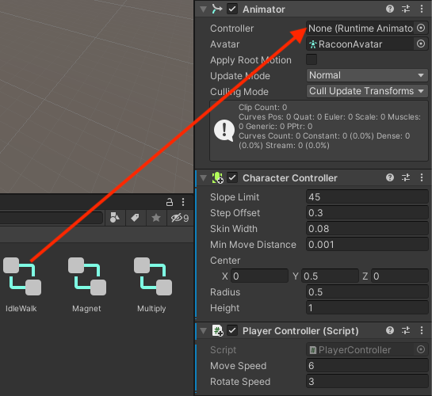
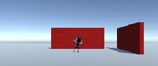
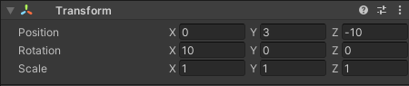

## الرسوم المتحركة وموضع الكاميرا

يتحرك لاعبون ، لكنه عالق في وضع على شكل حرف T في الوقت الحالي. يمكنك تحسين ذلك باستخدام الرسوم المتحركة.

--- task ---

اسحب **IdleWalk** animator من مجلد **Animation** > **Animators** في نافذة Project إلى خاصية Controller لمكون Animator في شخصيتك:

سيؤدي هذا إلى إضافة الرسوم المتحركة الخمول والمشي إلى شخصيتك باستخدام معلمة `إلى الأمام` منطقية يمكنك استخدامها للتحكم في الرسوم المتحركة التي يتم تشغيلها.

--- /task ---

--- task ---

**اختبار:** قم بتشغيل مشروعك وتأكد من أنه يمكنك رؤية الرسوم المتحركة الخمول:

--- /task ---

--- task ---

أضف رمزًا إلى طريقة `Update` من البرنامج النصي الخاص بك بحيث عندما تتحرك الشخصية للأمام ، فإنها تستخدم رسمًا متحركًا مشيًا ، وإلا فإنها تستخدم رسمًا متحركًا خاملًا:

--- code ---
---
language: cs filename: PlayerController.cs - Update() line_numbers: true line_number_start: 17
line_highlights: 21-31
---

    void Update()
    {
        float speed = Input.GetAxis("Vertical");
    
        //Set animations
        Animator anim = gameObject.GetComponent<Animator>();
    
        if (Input.GetAxis("Vertical") > 0) // Forwards
        {
            anim.SetBool("forward", true);
        }
        else // Idle
        {
            anim.SetBool("forward", false);
        }
    
        // Rotate around y-axis
        transform.Rotate(0, Input.GetAxis("Horizontal"), 0);
--- /code ---

--- /task ---

--- task ---

**اختبار:** قم بتشغيل مشروعك وتأكد من أنه يمكنك رؤية تغيير الرسوم المتحركة للمشي عند المضي قدمًا والتبديل إلى وضع الخمول عندما لا تمضي قدمًا:

--- /task ---

في الألعاب ، غالبًا ما تتبع الكاميرا المشغل.

يعد وضع كاميرا افتراضية ** افتراضية ** في بيئة ثلاثية الأبعاد أمرًا أساسيًا لإنشاء المنظور الصحيح للمستخدمين. تؤثر مستويات الرؤية من عدسة الكاميرا على مستوى الصعوبة وتؤثر على جو اللعبة. 

--- task ---

في نافذة التسلسل الهرمي ، اسحب **الكاميرا الرئيسية** إلى Player GameObject ؛ سيصبح "ابنًا" للاعب وسيتبع اللاعب في جميع الأنحاء.

--- /task ---

--- task ---

**اختبار:** قم بتشغيل مشروعك. ستتبع الكاميرا الآن شخصيتك ، لكنها بعيدة بعض الشيء وغالبًا ما تكون الجدران بين الاعب والكاميرا.

--- /task ---

يمكنك ضبط موضع الكاميرا وتدويرها في عرض المشهد أو نافذة المفتش.

--- task ---

اخرج من وضع التشغيل وحدد **الكاميرا الرئيسية** في نافذة التسلسل الهرمي. اضبط إعدادات التحويل الخاصة به للحصول على عرض منظور الشخص الثالث للاعب الخاص بك ، والنظر لأسفل من خلف المشغل وفوقه:

يمكنكم وضع الكاميرا في عرض المشهد باستخدام أداتي التحويل والتدوير إذا كنت تفضل:

--- /task ---

--- task ---

**اختبار:** قم بتشغيل مشروعك. ستتبع الكاميرا الآن شخصيتك بالكاميرا خلف شخصيتك وفوقها مباشرة وتنظر إلى أسفل بزاوية.

اضبط إعدادات الكاميرا حتى تصبح سعيد معهم

**نصيحة:** يمكنك تجربة الإعدادات في وضع التشغيل ولكنك تحتاج إلى الخروج من وضع التشغيل وتحديث الإعدادات للاحتفاظ بها.

ماذا يحدث إذا خرجت من حافة الطائرة؟ لا تقلق من أن شخصيتك ستعود إلى المركز في المرة التالية التي تدخل فيها وضع التشغيل:

--- /task ---

--- save ---
