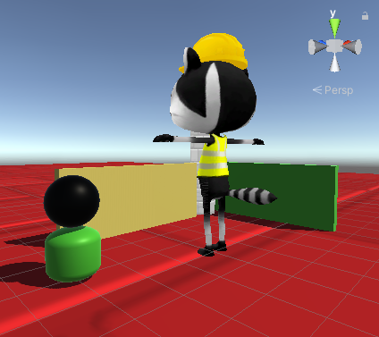

## قم بترقية أو تطوير مشروعك

الآن يمكنك جعل عالمك الثلاثي الأبعاد بالطريقة التي تريدها.

تستطيع:
+ أضف المزيد من الكائنات ثلاثية الأبعاد إلى عالمك ، جرب الكرات والكبسولات
+ جرب ألوانًا ومواد مختلفة
+ قم بتغيير إعدادات المقاييس أو قيم التحويل لشخصيتك لتكبيرها أو تصغيرها - ستحتاج إلى تغيير جميع القيم الثلاث لإبقائها متناسبة
+ قم بتمكين وتعطيل الملحقات المختلفة في نافذة المفتش للحصول على الشكل الذي تريده
+ اضبط حركة اللاعب وسرعة الدوران
+ اضبط موضع الكاميرا

يمكنك تنزيل المشاريع الأساسية والممتدة كحزم إلى جانب مشروعات WebGL من دليل الحلول المضغوطة على [https://rpf.io/p/en/explore-a-3d-world-get](https://rpf.io/p/en/explore-a-3d-world-get)

--- collapse ---

---
المشروع المكتمل
---

يمكنك الحصول على [المشروع كاملاً من هنا](https://rpf.io/p/en/explore-a-3d-world-get){:target="_blank"}.

يمكنك عرض المشروع المكتمل أدناه.

<iframe allowtransparency="true" width="710" height="450" src="https://explore-a-3d-world-extended.rpfilt.repl.co" frameborder="0"></iframe>

--- /collapse ---

--- save ---
