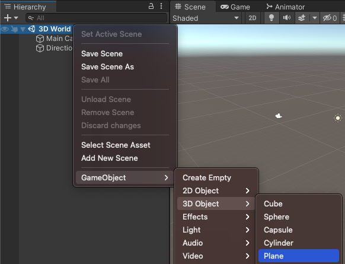
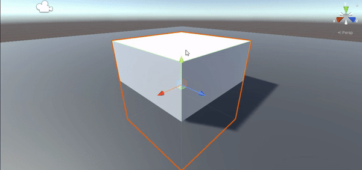
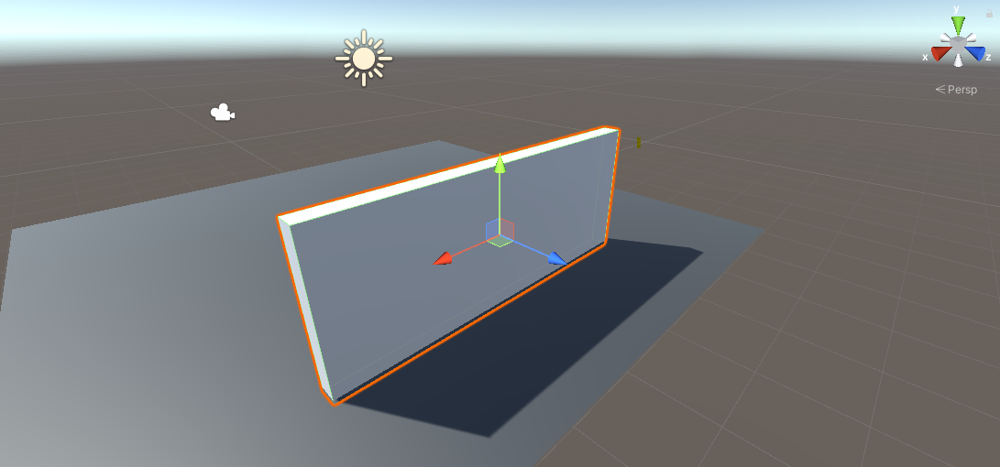
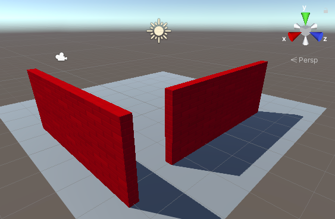

## Set the 3D scene

Your 3D world,  or 'map', needs a floor and walls. 

{:width="300px"}

People are spending more time in **online virtual environments**. As well as playing games, people relax, explore, socialise, learn and participate in interactive entertainment. Some people call the future of these environments the **metaverse**. Being able to design 3D worlds is an important skill.

A Unity project needs graphics and sound 'Assets'.  

Download the [Unity starter package](http://rpf.io/unity-starter){:target="_blank"} to your computer. Choose a sensible location such as your Documents folder. 
--- /task ---

--- task ---

Launch the Unity Hub and click 'Projects' then select 'New project':

From the list of templates, select '3D Core': 

Edit the Project Settings to give your project a sensible name and save it to a sensible location. Then click 'Create project':

Your new project will open in the Unity Editor.

--- /task ---

The Unity editor looks like this (your Scene View and Game View might not be side-by-side):

--- collapse ---

---
title: The Unity Editor windows and views
---

1. **The Unity Menu** - is used to import, open and save scenes and projects. You can amend your Unity Editor preferences and add new GameObjects and components. 

2. **The Toolbar** - contains tools for navigating round in the Scene View, controlling play of the Game View and customising your Unity Editor layout. 

3. **The Scene View** - is used to navigate and edit your Scene. You can select and position GameObjects including characters, scenery, cameras and lights.

4. **The Game View** - shows the scene as it looks through the lens of your cameras. When you click on the Play button to enter Playmode The Game View simulates your scene as it would be viewed by a user. 

5. **The Hierarchy Window** - shows all the GameObjects in your Scene and the structure between them. You can add and navigate the GameObjects in your project. GameObjects can had child objects that move with them.

6. **The Project Window** - shows a library of all the files included in your project. You can find Assets to use here.

7. **The Console Window** - shows important messages. This is where you can see Compiler errors (errors in your Script) and messages that you print using `Debug.Log()`.

8. **The Inspector Window** - allows you to view and edit the properties of GameObjects. You can add other components to your GameObjects and edit the values they use. 

--- /collapse ---

--- task ---

The 'Unity starter package' you downloaded contains a number of Assets to use in your project. 

To import them into your new project, click on the 'Assets' menu and select 'Import package' > 'Custom Package...' then navigate to the downloaded 'Unity starter package'.

--- /task ---

--- task ---

The **Project Window** is where you can see all the files included in your project. 

Click on the Project window and make sure you can see the Assets included in the 'Unity starter package':

--- /task ---

In Unity, a **Scene** contains GameObjects. A Unity project with multiple game levels might have one scene per level. 

--- task ---

Right-click on 'SampleScene' in the Hierarchy and choose 'Save Scene As'. 

In the popup window, name your Scene '3D World'. Leave the folder set to your Assets folder for this project:

A new file will appear in the Project Window:

--- /task ---

Your world needs some ground. 

--- task ---

Right-click on your scene (name '3D World') in the Hierachy and choose 'GameObject' -> '3D Object' -> 'Plane': 

This will create a 'Ground' for your World. 

The default size for the plane is 10m x 10m. Unity uses metres as the unit of measurement. 

--- /task ---

You can create objects from 3D shapes. 

--- task ---

Right-click on your '3D World' scene in the Hierarchy and choose 'GameObject' -> '3D Object' -> 'Cube'. 

This will create a cube at the centre of the scene, at (0, 0, 0).

--- /task ---

You can see the cube in the Scene view. This is the behind-the-scenes view of your game where you set everything up.

**Tip:** Click on the 'Scene' tab to make sure you can see the Scene view. 

--- task ---
Click on the Cube in the Scene view or Hierarchy window to select it.

Use 'Shift-F' (hold down the Shift key and tap F) to focus on the cube. 

You can also use the scroll wheel on the mouse, or the up and down arrow keys, to zoom in and out:

--- /task ---

You need to get the cube to sit on the plane. 

--- task ---

Click on the Cube in the Scene view or Hierarchy window to select it.

**Choose** You can either:

+ Change the Y position in the Inspector to 0.5 (half the height of the cube):

+ Drag the green arrow up until the cube sits on the plane:

--- /task ---

**Tip:** If you make a mistake in the Unity editor you can use 'Ctrl-Z' ('Cmd-Z') to **undo** your last action. 

--- task ---

Now change the cube into a wall with the following Position and Scale settings: 

You can either enter the values in the Transform for the Cube or drag the arrows (this will update the Transform values.)

Zoom out to see your wall:

--- /task ---

The **material** of a GameObject controls how it looks. A material can have a colour and a texture and there are lots of properties that you can adjust to get different effects. A **texture** is a 2D image that can be created in an image editor.

--- task ---

In the Model view, navigate to ‘My Assets’ then right-click and choose ‘Create’ -> ‘Material’. Give the material a descriptive name:

Click on the colour next to ‘Base Map’ in the Inspector and choose a colour for your material:

Add a texture by clicking on the circle to the left of ‘Base Map’ and selecting 'BrickWallAlbedo' texture from the list: 

Drag your new material from the Project window to your wall in the Scene view:

--- /task ---

--- task ---

In the Inspector window, rename your object from 'Cube' to `Wall`:

**Tip:** You can name a new GameObject in the Hierarchy window when you create it and you can change the name in the Inspector window.

--- /task ---

--- task ---

To create a copy of your wall you can either:
+ Right-click on your 'Wall' object in the Hierarchy window and choose 'Duplicate'. 
+ Select your wall in the Scene view and use 'Ctrl-D' (or 'Cmd-D') to duplicate.

Your new wall will be in exactly the same place as your first wall. 

--- /task ---

--- task ---

Change the Y rotation of the new wall to `90`: 

--- /task ---

--- task ---

Reposition the new wall to following position:

You can either enter the values in the Inspector window or drag the arrows in the scene - it doesn't matter if the position is exact.

Your scene should look like this:

--- /task ---

--- task ---

Change the 'Scale' settings on the Plane to make it bigger so you have more room: 

Think of a 4x4 plane as 40 metres by 40 metres in the real world. Plenty of room for your character to move around.

--- /task ---

--- task ---

When you have unsaved changes you will see a '*' next to your scene in the Hierarchy window.

Save your scene by clicking 'File' -> 'Save' or 'Ctrl-S'. 

Also, save your project by clicking 'File' -> 'Save Project'.

Unity does not normally autosave changes, but your starter project contains a script to autosave your project every 60 seconds. 

--- /task ---

You can navigate around your scene to see it from different angles. If you get lost just click on a wall in the Hierarchy window and then 'Shift-F' to focus and then zoom out: 

[[[unity-scene-navigation]]]

Remember, if you navigate around then you will be looking at your scene from a different perspective so your view won't look exactly the same as our examples.

--- save ---