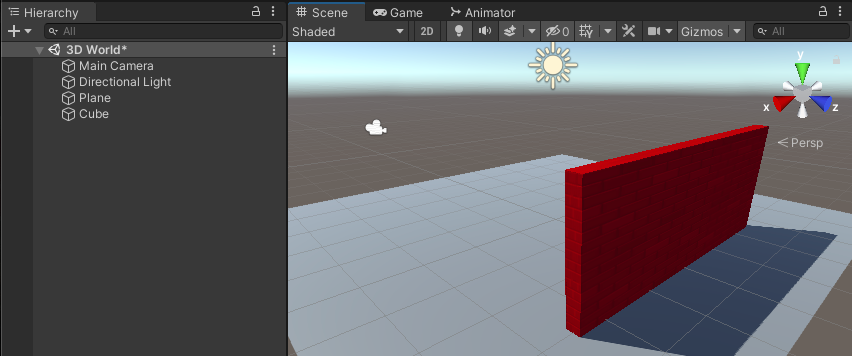

## Set the 3D scene

Add a player character and a floor for them to stand on.

Image, gif or video showing what they will achieve by the end of the step. {:width="300px"}

--- task ---

Download the [Unity starter project](http://rpf.io/unity-starter){:target="_blank"} to your computer. 

Unzip/extract the downloaded file on your computer, choose a sensible location such as your Documents folder. 

Launch the Unity Hub and click 'Open' then choose the folder you extracted the downloaded starter project to: 

Your project will open in the Unity Editor.

--- /task ---

The Unity editor looks like this:

--- collapse ---

---
title: The Unity Editor windows and views
---

1. The Unity Menu - is used to import, open and save scenes and projects. You can amend your Unity Editor preferences and add new Game objects and components. 

2. The Toolbar - contains tools for navigating round in the Scene View, controlling play of the Game View and customising your Unity Editor layout. 

3. The Scene View - is used to navigate and edit your Scene. You can select and position Game objects including characters, scenery, cameras and lights.

4. The Game View - shows the scene as it looks through the lens of your cameras. When you click on the Play button to enter Play mode The Game View simulates your scene as it would be viewed by a user. 

5. The Hierarchy Window - shows all the Game objects in your Scene and the structure between them. You can add and navigate the Game objects in your project. Game objects can had child objects that move with them.

6. The Project Window - shows a library of all the files included in your project. You can find Assets to use here.

7. The Console Window - shows important messages. This is where you can see Compiler errors (errors in your Script) and messages that you print using `Debug.Log()`.

8. The Inspector Window - allows you to view and edit the properties of Game objects. You can add other components to your Game objects and edit the values they use. 

--- /collapse ---

--- task ---

The Projects Window is where you can see all the files for your projects including 'Assets' that you can use in your project.

Click on the Projects tab and make sure you can see the Assets included in the starter project:

--- /task ---

In Unity, a Scene contains Game objects. A game with multiple levels might have one scene per level. 

--- task ---

Click 'File -> Save As' and name your Scene '3D World'. 

Select the location dropdown and navigate to your `Scenes` folder:

A new file will appear in the Project Window:

--- /task ---

Your world needs some ground. 

--- task ---

Right-click on your scene (name '3D World') in the Hierachy and choose 'GameObject' -> '3D Object' -> 'Plane'. 

This will create a 'Ground' for your World. 

The default size for the plane is 10m x 10m. Unity uses metres as the unit of measurement. 

--- /task ---

--- task ---
In the Projects View, open the Materials folder and drag the 'Yellow Stone' material to the plane in the Scene view.

The plane will immediately have the new material.

--- /task ---

You can create objects from 3D shapes. 

--- task ---
Right-click on your '3D World' scene in the Hierarchy and choose 'GameObject' -> '3D Object' -> 'Cube'. 

This will create a cube at the centre of the scene, at (0, 0, 0).

--- /task ---

You need to get the cube to sit on the plane. 
--- task ---
Click on the Cube in the Scene view or Hierarchy to select it.

**Choose** You can either:

+ Drag the green arrow up until the cube sits on the plane.

+ Change the Y position in the Inspector to 0.5 (half the height of the cube) 

--- /task ---

--- task ---
Now change the cube into a wall with the following Position and Scale settings. 

Position X=0, Y=1, Z=3
Scale X=5, Y=2, Z=0.25

You can either enter the values in the Transform for the Cube or drag the arrows (this will update the Transform values.)

--- /task ---

--- task ---
Drag the 'Red Brick' material from the Materials folder in the Project view to the wall in the scene. 

--- /task ---

--- task ---
In the Inspector, rename your object from Cube to Wall.

--- /task ---

--- task ---
Right-click on your 'Wall' object in the Hierarchy and choose 'Duplicate' to create a copy of the wall. It will be in exactly the same place as your first wall. 
--- /task ---

--- task ---
Change the Y rotation of the new wall to 90. 

--- /task ---

--- task ---
Reposition the new wall to following position:

X=4, Y=1, Z=-1

You can either enter the values in the Inspector or drag the arrows in the scene - it doesn't matter if the position is exact.

Your scene should look like this:

--- /task ---

--- task ---
Unity does not autosave changes. When you have unsaved changes you will see a '*' next to your scene in the Hierarchy.

Save your scene by clicking 'File' -> 'Save' or 'Ctrl-S'. 

Also, save your project by clicking 'File' -> 'Save Project'.

--- /task ---

--- save ---