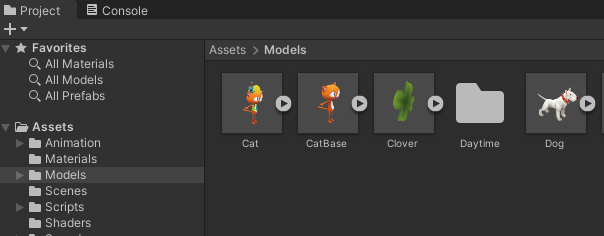

## Set the 3D scene

Add a player character and a floor for them to stand on.

Image, gif or video showing what they will achieve by the end of the step. {:width="300px"}

--- task ---

Download the [Unity starter project](http://rpf.io/unity-starter){:target="_blank"} to your computer. 

Unzip/extract the downloaded file on your computer, choose a sensible location such as your Documents folder. 

Launch the Unity Hub and click 'Open' then choose the folder you extracted the downloaded starter project to: 

Your project will open in the Unity Editor.

--- /task ---

The Unity editor looks like this:

--- collapse ---

---
title: 1. The Unity Menu
---

--- /collapse ---

--- collapse ---

---
title: 2. The Toolbar
---

The Toolbar contains tools for navigating round in the Scene View, controlling play of the Game View and customising your Unity Editor layout. 

--- /collapse ---

--- collapse ---

---
title: 3. The Scene View
---

The Scene View is used to navigate and edit your Scene. You can select and position Game objects including characters, scenery, cameras and lights.

--- /collapse ---

--- collapse ---

---
title: 4. The Game View
---

The Game View shows the scene as it looks through the lens of your cameras. When you click on the Play button to enter PlayMode The GameView simulates your scene as it would be viewed by a user.  

--- /collapse ---

--- collapse ---

---
title: 5. The Hierarchy Window
---

The Hierarchy View shows all the Game objects in your Scene and the structure between them. You can add and navigate the Game objects in your project. Game objects can had child objects that move with them.

--- /collapse ---

--- collapse ---

---
title: 6. The Project Window
---

The Project Window shows a library of all the files included in your project. You can find Assets to use here.

--- /collapse ---

--- collapse ---

---
title: 7. The Console Window
---

The Console Window shows important messages. This is where you can see Compiler errors (errors in your Script) and messages that you print using Debug.Log().

--- /collapse ---

--- collapse ---

---
title: 8. The Inspector Window
---

The Inspector Window allows you to view and edit the properties of Game objects. You can add other components to your Game objects and edit the values they use. 

--- /collapse ---

--- task ---

The Projects Window is where you can see all the files for your projects including 'Assets' that you can use in your project.

Click on the Projects tab and make sure you can see the Assets included in the starter project:

--- /task ---

In Unity, a Scene contains Game objects. A game with multiple levels might have one scene per level. 

--- task ---

Click 'File -> Save As' and name your Scene '3D World'. 

Select the location dropdown and navigate to your `Scenes` folder:

A new file will appear in the Project Window:

e

--- /task ---

--- task ---

Double click on the Models folder. A model describes what a 3D object looks like and can be created using 3D modelling tools. We have included some models that you can use. 

Choose either the `Cat` or `Raccoon model` and drag it from the Projects Window to the Scene View.

--- /task ---

--- task ---

--- /task ---

--- task ---

Step content... 
Can use:
**Test:**
**Choose:**
**Tip:**

--- /task ---

--- save ---