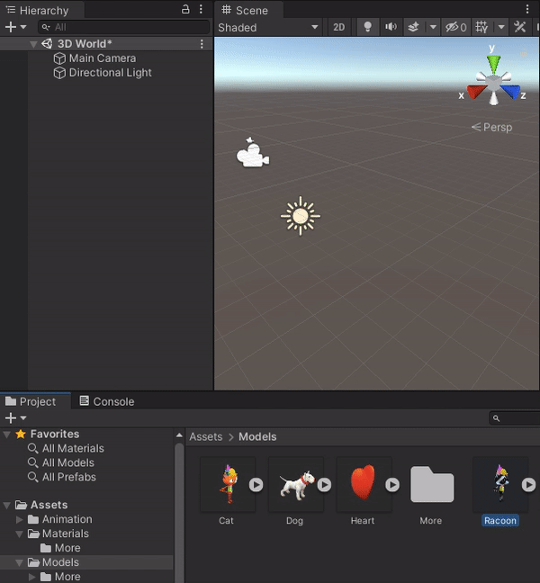
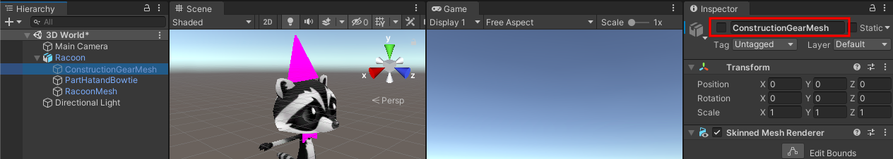
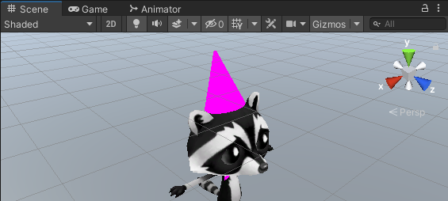
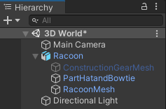
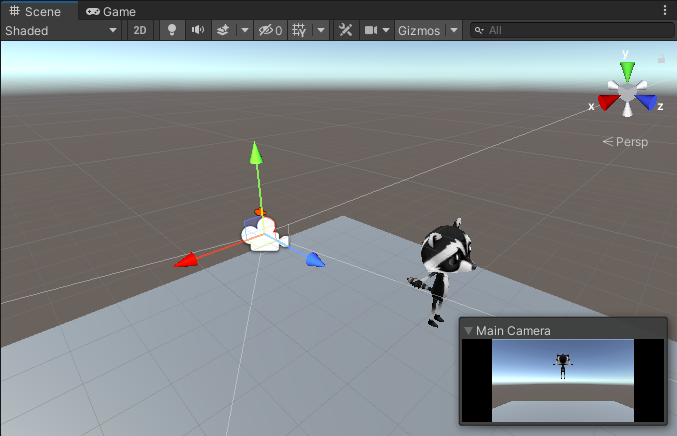
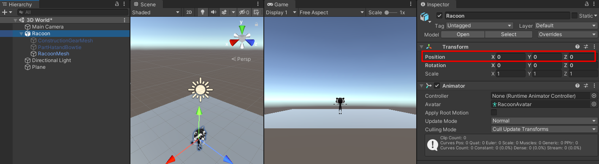
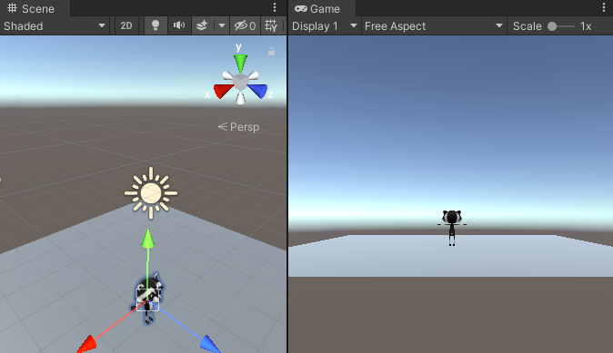

## Add a player character

Add a Cat or Raccoon character.  

{:width="300px"}

--- task ---

Double click on the Models folder in the Project Window. A model describes what a 3D object looks like and can be created using 3D modelling tools. We have included some models that you can use. 

Choose either the `Cat` or `Raccoon` model and drag it from the Projects Window to the Scene View.

--- /task ---

Your character will appear in the Scene view. This is the behind-the-scenes view of your game where you set everything up.

--- task ---
Click on your character in the Scene view and tap the 'F' key. 

**Tip:** If you get lost in the Scene view, you can click on your character (or another Game object) in the Hierarchy window and then click 'Shift-F' to focus on your character in the Scene view.

--- /task ---
Hmm, your character is wearing multiple accessories. 

--- task ---
Click on your character in the Hierarchy. This will open the settings for the game object in the Inspector Window.

Click on the arrow next to your Character in the hierarchy to see the ‘child objects’. Click on ‘ConstructionGearMesh’ and uncheck the box next to it’s name in the Inspector. This will hide the hat.

Hide the other accessories for your character in the same way, or just keep one active.

**Tip:** Game objects that are not active appeared greyed out in the Hierarchy Window

--- /task ---

The player will see the game through the Main Camera which is shown as a video camera icon in the scene:

The Game view shows what your project will look like to a Player.

--- task ---
Click on the Game view tab. Your character will be in whatever position you dragged it to in the Scene view (you might not be able to see it). 

--- /task ---

If you have enough room on your screen then it's really useful to see the Scene view and the Game view at the same time. 

--- task ---
Drag the Game view tab to the right so that it appears next to the Scene view:

--- /task ---

Unity uses X, Y and Z coordinates to position Game objects in 3D space. 

[unity-3d-coordinates]

--- task ---

Select your character (in the Hierarchy or Scene view) and then change its Transform settings so the Position is (0, 0, 0) - the centre of the world.

Your character will move to the centre in the Scene view and the Game view.

--- /task ---

--- task ---
Rename your character to 'Player' in the Inspector. This will make it easy to find if you add more game objects.

--- /task ---

--- save ---