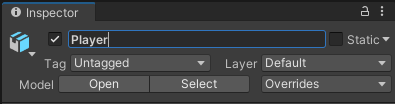

## Add a player character

The player in your world will be a Cat or Raccoon character. 

{:width="300px"}

--- task ---

Click on the **Models** folder in the Project window. A model describes what a 3D object looks like and can be created using 3D modelling tools such as Blender. We have included some models that you can use. 

Choose either the `Cat` or `Raccoon` model and drag it from the Project window to the Scene view:

**Tip:** If you have accidentally added 'CatBase' or 'RaccoonBase' models, or if you want to change your character at this point, you can delete the model from the scene. Right-click on the model GameObject in the Hierarchy window and select 'Delete'.

--- /task ---

Your character will appear in the Scene view in a T-pose. 

The **T-pose** is the default position for a game character before it has been animated.

--- task ---

Click on your character in the Scene view and tap the <kbd>F</kbd> key. 

**Tip:** If you get lost in the Scene view, you can click on your character (or another GameObject) in the Hierarchy window and then click <kbd>Shift</kbd>+<kbd>F</kbd> to focus on your character in the Scene view.

--- /task ---

Hmm, your character is wearing multiple accessories. 

--- task ---

Click on your character in the Hierarchy window. This will open the settings for the GameObject in the Inspector window.

Click on the arrow next to your character in the Hierarchy window to see the 'child objects'. Click on **ConstructionGearMesh** and uncheck the box next to its name in the Inspector window. This will hide the hard hat and high-vis vest:

Hide the other accessories for your character in the same way, or just keep one active.

**Tip:** GameObjects that are not active appear greyed out in the Hierarchy window:

--- /task ---

--- task ---

The player will see the game through the 'Main Camera', which is shown as a video camera icon in the Scene. Select the camera in the Hierarchy window to see the embedded camera view:

--- /task ---

The Game view shows what your project will look like to a player.

--- task ---

Click on the Game view tab. Your character will be in whatever position you dragged it to in the Scene view (you might not be able to see it). 

--- /task ---

If you have enough room on your screen, then it's really useful to see the Scene view and the Game view at the same time. 

--- task ---

Drag the Game view tab to the right so that it appears next to the Scene view:

--- /task ---

Unity uses x, y, and z coordinates to position GameObjects in 3D space: 

[[[unity-3D-coordinates]]]

--- task ---

Select your character (in the Hierarchy window or Scene view) and then change its 'Transform' settings so the 'Position' is (0, 0, 0) — the centre of the world:

Your character will move to the centre in the Scene view and the Game view:

--- /task ---

--- task ---

Rename your character to 'Player' in the Inspector window. This will make it easy to find if you add more GameObjects.

--- /task ---

--- save ---
