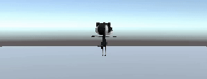
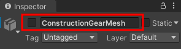
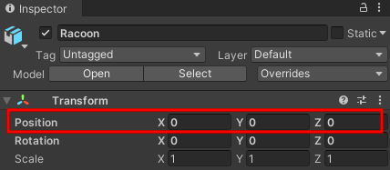
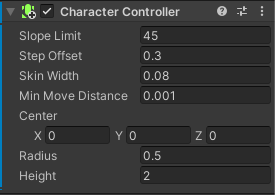
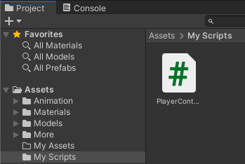
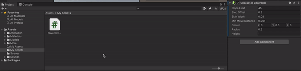

## Add a player character

<div style="display: flex; flex-wrap: wrap">
<div style="flex-basis: 200px; flex-grow: 1; margin-right: 15px;">
Get your player moving with WASD or arrow keys. 
</div>
<div>
{:width="300px"}
</div>
</div>

--- task ---

Double click on the Models folder. A model describes what a 3D object looks like and can be created using 3D modelling tools. We have included some models that you can use. 

Choose either the `Cat` or `Raccoon` model and drag it from the Projects Window to the Scene View.


--- /task ---

Your character will appear in the Scene view. This is the behind-the-scenes view of your game where you set everything up.

--- task ---
Click on your character in the Scene view and tap the 'F' key. This will focus on your character. You can also use the scroll wheel on your mouse to zoom in and out. 

**Tip:** If you get lost in the Scene view, you can click on your character (or another game object) in the Hierarchy window and then click 'Shift-F' to focus on your character in the Scene view.

--- /task ---

Hmm, your character is wearing multiple accessories. 

--- task ---

Click on your character in the Hierarchy. This will open the settings for the game object in the Inspector Window.

Click on the arrow next to your Character in the hierarchy to see the 'child objects'. Click on 'ConstructionGearMesh' and uncheck the box next to it's name in the Inspector. This will hide the hat. 




Hide the other accessories for your character in the same way, or just keep one active. 

**Tip:** Game objects that are not active appeared greyed out in the Hierarchy Window


--- /task ---

The player will see the game through the Main Camera which is shown as a video camera icon in the scene:


The Game view shows what your project will look like to a Player.

--- task ---
Click on the Game view tab. Your character will be in whatever position you dragged it to in the Scene view (you might not be able to see it). 

--- /task ---

If you have enough room on your screen then it's really useful to see the Scene view and the Game view at the same time. 

--- task ---
Drag the Game view tab to the right so that it appears next to the Scene view:


--- /task ---

Unity uses X, Y and Z coordinates to position Game objects in 3D space. 

[unity-3d-coordinates]

--- task ---

Click on your character in the Hierarchy and then change its Transform settings so the Position is (0, 0, 0) - the centre of the world.



Your character will move to the centre in the Scene view and the Game view.


--- /task ---

<p style="border-left: solid; border-width:10px; border-color: #0faeb0; background-color: aliceblue; padding: 10px;">
Unity uses the <span style="color: #0faeb0">**C#**</span> (say C sharp) programming language which is used by professional software developers. C# is an object-oriented language with **classes** that define behaviour for similar objects and **methods** which are functions that belong to a class. In Unity, a **script** defines a class with variables and methods. You can add the same script to multiple game objects if they need the same features.</p>

--- task ---
Click on your character in the Hierarchy or Scene view so you can see its properties in the Inspector. 

Click 'Add Component' and start to type 'char' in the Search box, click on the CharacterController component when it appears. 


This adds new features to your player Game object including a `Move` method. 



--- /task ---

--- task ---

The Character Controller has a Height of `2` and a centre at `0, 0, 0` this means it is positioned half above and half below the plane. 


Your character has a height of `1` meaning their centre on the y-axis is at `0.5`. Change the value in the Character Controller y-axis centre to `0.5` and the Height to `1` to match the character. 


--- /task ---

Your character needs a script so that the player can move it around.

--- task ---

Go to the Project Window and right-click on the `Assets` folder. From the **Create** menu choose **Folder**. Rename your folder to 'My Scripts'.


--- /task ---

--- task ---

Right click on the `My Scripts` folder and go to the **Create** menu. Select **C# Script** name your new script `PlayerController`.



--- /task ---

--- task ---
Double-click on the script to open it. The script will open in a separate editor. 

```
using System.Collections;
using System.Collections.Generic;
using UnityEngine;

public class PlayerController : MonoBehaviour
{
    // Start is called before the first frame update
    void Start()
    {
        
    }

    // Update is called once per frame
    void Update()
    {
        
    }
}
```

**Debug:** Check that the name after `class` is `PlayerController` and matches the name of your script file. If you rename the file after creating it then you will need to change the class name in the script.

--- /task ---

Unity creates the effect of movement by quickly drawing images to the screen. Each image is a 'frame'. 

--- task ---

You will be able to use WASD or arrow keys (players on mobile or console can use different inputs without you changing your code.)

**Tip:** The lines starting with `//` are comments that explain the code. You don't need to type them.

```
   // Update is called once per frame
    void Update()
    {
        float speed = Input.GetAxis("Vertical");
        Debug.Log(speed);
    }

A `float` is a decimal number.

```

Save your `PlayerController` script in your Script Editor then return to the Unity Editor. 

--- /task ---

--- task ---

Click on your character in the Hierarchy window. Go to the Project window and drag the `PlayerController` script across to the Inspector window.



--- /task ---

--- task ---

Click on the **Console** window tab to bring it to the front. 

**Test:** Go to the Toolbar and click on the **Play** button to put your scene into Play mode. This will simulate your scene as it would be viewed and interacted with by a user.  


Place your mouse pointer in the Game view and press keys `W` and `S`. Look at the values logged in the Console window as you press the keys. Each time you press `W` a positive number is logged, when you press `S` a negative number is logged.

--- /task ---

It is useful to add a colour tint to the editor whilst it is in Playmode. This makes it easier to tell whether your scene is running or not.


--- task ---

To set a tint, go to the **Unity Menu** and select **Preferences**. Choose the **Colours** menu and find the property called **Playmode tint**.

Click on the existing colour to see a colour wheel where you can choose a colour and opacity level.


Return to the Unity editor and press the **Play** button to see your new tint in action. When you are happy with the tint you have chosen, press the **Play** button again to exit Play mode.

--- /task ---

The CharacterController component provides a `SimpleMove` method.

--- task ---
Update your code to use the Vertical input value to move the player each frame. (You can remove the `Debug` line.)

```
    void Update()
    {
        // We need the CharacterController so we can use SimpleMove
        CharacterController controller = GetComponent<CharacterController>();

        // forward is the forward direction for this character
        Vector3 forward = transform.TransformDirection(Vector3.forward);
        float speed = Input.GetAxis("Vertical");
        controller.SimpleMove(forward * speed);
    }
 ```
 
--- /task ---

--- task ---
**Test:** Click Play to enter Playmode and try out your code. Use W/S or up and down arrow keys to glide forwards and backwards. 

What happens if you go off the edge of the plane? Don't worry your character will go back to the centre next time you enter Playmode.

--- /task ---

--- task ---
Add another line so your character can rotate when the player presses A/D or the left and right arrow keys. 

```
    // Update is called once per frame
    void Update()
    {
        // We need the CharacterController so we can use SimpleMove
        CharacterController controller = GetComponent<CharacterController>();

        // Rotate around y - axis
        transform.Rotate(0, Input.GetAxis("Horizontal"), 0);
```

--- /task ---

--- task ---
**Test:** Click Play to enter Playmode and try out your code. Use A/D or left and right arrow keys to rotate. 
--- /task ---


--- save ---