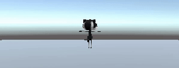
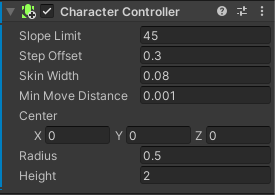
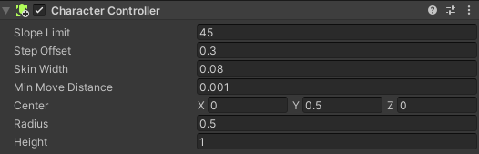
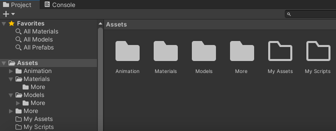
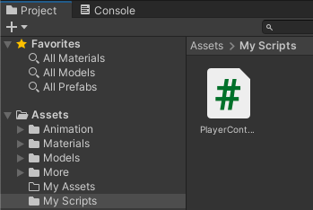
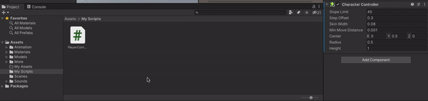
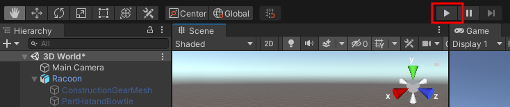
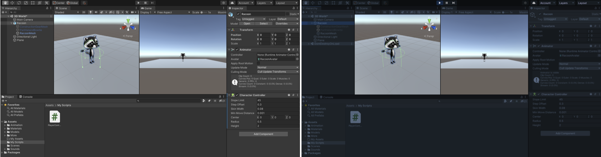
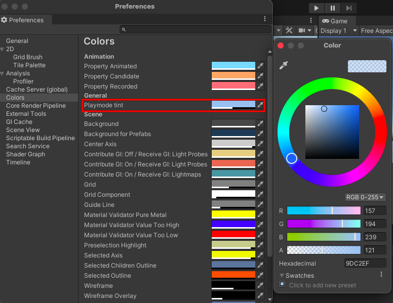

## Add character movement

<div style="display: flex; flex-wrap: wrap">
<div style="flex-basis: 200px; flex-grow: 1; margin-right: 15px;">
Get your player moving with WASD or arrow keys. 
</div>
<div>
{:width="300px"}
</div>
</div>

<p style="border-left: solid; border-width:10px; border-color: #0faeb0; background-color: aliceblue; padding: 10px;">
Unity uses the <span style="color: #0faeb0">**C#**</span> (say C sharp) programming language which is used by professional software developers. C# is an object-oriented language with **classes** that define behaviour for similar objects and **methods** which are functions that belong to a class. In Unity, a **script** defines a class with variables and methods. You can add the same script to multiple game objects if they need the same features.</p>

--- task ---
Click on your character in the Hierarchy or Scene view so you can see its properties in the Inspector. 

Click 'Add Component' and start to type 'char' in the Search box, click on the CharacterController component when it appears. 


This adds new features to your player Game object including a `Move` method. 



--- /task ---

--- task ---

The Character Controller has a Height of `2` and a centre at `0, 0, 0` this means it is positioned half above and half below the plane. 


Your character has a height of `1` meaning their centre on the y-axis is at `0.5`. Change the value in the Character Controller y-axis centre to `0.5` and the Height to `1` to match the character. 




--- /task ---

Your character needs a script so that the player can move it around.

--- task ---

Go to the Project Window and right-click on the `Assets` folder. From the **Create** menu choose **Folder**. Rename your folder to 'My Scripts'.



--- /task ---

--- task ---

Right click on the `My Scripts` folder and go to the **Create** menu. Select **C# Script** name your new script `PlayerController`.



--- /task ---

--- task ---
Double-click on the script to open it. The script will open in a separate editor. 

```
using System.Collections;
using System.Collections.Generic;
using UnityEngine;

public class PlayerController : MonoBehaviour
{
    // Start is called before the first frame update
    void Start()
    {
        
    }

    // Update is called once per frame
    void Update()
    {
        
    }
}
```

**Debug:** Check that the name after `class` is `PlayerController` and matches the name of your script file. If you rename the file after creating it then you will need to change the class name in the script.

--- /task ---

Unity creates the effect of movement by quickly drawing images to the screen. Each image is a 'frame'. 

--- task ---

You will be able to use WASD or arrow keys (players on mobile or console can use different inputs without you changing your code.)

**Tip:** The lines starting with `//` are comments that explain the code. You don't need to type them.

```
   // Update is called once per frame
    void Update()
    {
        float speed = Input.GetAxis("Vertical");
        Debug.Log(speed);
    }

A `float` is a decimal number.

```

Save your `PlayerController` script in your Script Editor then return to the Unity Editor. 

--- /task ---

--- task ---

Click on your character in the Hierarchy window. Go to the Project window and drag the `PlayerController` script across to the Inspector window.



--- /task ---

--- task ---

Click on the **Console** window tab to bring it to the front. 

**Test:** Go to the Toolbar and click on the **Play** button to put your scene into Play mode. This will simulate your scene as it would be viewed and interacted with by a user.  



Place your mouse pointer in the Game view and press keys `W` and `S`. Look at the values logged in the Console window as you press the keys. Each time you press `W` a positive number is logged, when you press `S` a negative number is logged.

--- /task ---

It is useful to add a colour tint to the editor whilst it is in Playmode. This makes it easier to tell whether your scene is running or not.



--- task ---

To set a tint, go to the **Unity Menu** and select **Preferences**. Choose the **Colours** menu and find the property called **Playmode tint**.

Click on the existing colour to see a colour wheel where you can choose a colour and opacity level.



Return to the Unity editor and press the **Play** button to see your new tint in action. When you are happy with the tint you have chosen, press the **Play** button again to exit Play mode.

--- /task ---

The CharacterController component provides a `SimpleMove` method.

--- task ---
Update your code to use the Vertical input value to move the player each frame. (You can remove the `Debug` line.)

```
    void Update()
    {
        // We need the CharacterController so we can use SimpleMove
        CharacterController controller = GetComponent<CharacterController>();

        // forward is the forward direction for this character
        Vector3 forward = transform.TransformDirection(Vector3.forward);
        float speed = Input.GetAxis("Vertical");
        controller.SimpleMove(forward * speed);
    }
 ```
 
--- /task ---

--- task ---
**Test:** Click Play to enter Playmode and try out your code. Use W/S or up and down arrow keys to glide forwards and backwards. 

What happens if you go off the edge of the plane? Don't worry your character will go back to the centre next time you enter Playmode.

--- /task ---

--- task ---
Add another line so your character can rotate when the player presses A/D or the left and right arrow keys. 

```
    // Update is called once per frame
    void Update()
    {
        // We need the CharacterController so we can use SimpleMove
        CharacterController controller = GetComponent<CharacterController>();

        // Rotate around y - axis
        transform.Rotate(0, Input.GetAxis("Horizontal"), 0);
```

--- /task ---

--- task ---
**Test:** Click Play to enter Playmode and try out your code. Use A/D or left and right arrow keys to rotate. 
--- /task ---

You can also control the speed of movement and rotation.

--- task ---
Open your `PlayerController` script and add variables for the `moveSpeed` and `rotateSpeed`. Making these variables `public` means that you can set them in the Unity Inspector.

```
public class PlayerController : MonoBehaviour
{
    public float moveSpeed;
    public float rotateSpeed;
```
--- /task ---

--- task ---
Update the code to `Rotate` and `SimpleMove` your character to multiple by the new variables:

```
        transform.Rotate(0, Input.GetAxis("Horizontal") * rotateSpeed, 0);
```

and,

```
        controller.SimpleMove(forward * speed * moveSpeed);
```
--- /task ---

--- task ---
Save your script and return to the Unity editor. When your script has compiled, click on your character in the Hierarchy. You should be able to see your new variables in the Inspector. 

Set their values to `3` and `1`:


--- /task ---

--- task ---
**Test:** Play your scene and check if you are happy with the speed settings. 

**Tip:** You can use Playmode to try out different settings in but if you have changed them you will need to exit Playmode and set the values again in the Inspector to keep the settings you prefer.

--- /task ---

--- save ---