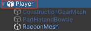
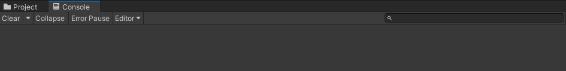
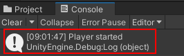

## Add character movement

<div style="display: flex; flex-wrap: wrap">
<div style="flex-basis: 200px; flex-grow: 1; margin-right: 15px;">
Your player will move with the WASD or arrow keys. 
</div>
<div>
{:width="300px"}
</div>
</div>

<p style="border-left: solid; border-width:10px; border-color: #0faeb0; background-color: aliceblue; padding: 10px;">
Unity uses the <span style="color: #0faeb0">**C#**</span> (pronounced C sharp) programming language, which is used by professional software developers. C# is an object-oriented language with **classes** that define behaviour for similar objects and **methods**, which are functions that belong to a class. In Unity, a **script** defines a class with variables and methods. You can add the same script to multiple GameObjects if they need the same features.</p>

--- task ---

Click on the **Player** GameObject in the Hierarchy window or Scene view so you can see its properties in the Inspector window. 

{:width="300px"}

**Tip:** Make sure you have the **Player** selected and not one of its child objects.

Click **Add Component** and start to type `character` in the Search box, then click on the **Character Controller** component when it appears: 


--- /task ---

The Character Controller component adds new features to your Player GameObject including a `SimpleMove` method and a **collider**. Colliders can be used to stop your character walking through solid objects and to detect when collisions take place.

<p style="border-left: solid; border-width:10px; border-color: #0faeb0; background-color: aliceblue; padding: 10px;">
 A <span style="color: #0faeb0">**collider**</span> is a shape that is used to detect when a GameObject collides, or intersects, with another GameObject. It's much quicker for a computer to check for collisions with a simple collider shape than the complex shape of a GameObject. A **hitbox** is a kind of collider. </p>

--- task ---

The Character Controller collider has a height of `2` and a centre at `0, 0, 0`; this means it is positioned half above and half below the plane: 

{:width="300px"}

Your character has a height of `1`, meaning their centre on the y-axis is at `0.5`. Change the value in the Character Controller y-axis centre to `0.5` and the height to `1` to match the character: 

{:width="400px"}

{:width="300px"}

--- /task ---

Your character needs a script so that the player can move it around. You'll need a code editor installed on your computer to edit this script.

[[[unity-visual-studio]]]

--- task ---

Go to the Inspector window for the Player and click on the **Add Component** button. Type `script` and select **New Script**. Name your new script `PlayerController`, then press <kbd>Enter</kbd>.

The new script will be saved in the Assets folder:

{:width="400px"}

--- /task ---

--- task ---

Double-click on **PlayerController** in the script component in the Inspector window. The script will open in a separate code editor and have this code: 

--- code ---
---
language: cs
filename: PlayerController.cs
line_numbers: true
line_number_start: 
line_highlights: 
---
using System.Collections;
using System.Collections.Generic;
using UnityEngine;

public class PlayerController : MonoBehaviour
{
    // Start is called before the first frame update
    void Start()
    {
        
    }

    // Update is called once per frame
    void Update()
    {
        
    }
}
--- /code ---

**Debug:** Check that the name after 'class' is `PlayerController` and this matches the name of your script file: if you rename the file after creating it, then you will need to change the class name in the script.

--- /task ---

The Start method is called once when you play your scene. Add code to print the message `Player started` when your project starts running.

--- task ---

Use the `Debug.Log()` method to print a message when the `Start` method is called for the Player GameObject. The message will appear in the bar at the bottom of the Unity Editor and in the Console window:

--- code ---
---
language: cs
filename: PlayerController.cs - Start()
line_numbers: true
line_number_start: 7
line_highlights: 10
---
    // Start is called before the first frame update
    void Start()
    {
        Debug.Log("Player started");        
    }
--- /code ---

**Tip:** The lines starting with // are comments that explain the code. You don’t need to type them.

**Save** your PlayerController script in your code editor, using <kbd>Ctrl</kbd>+<kbd>S</kbd> (or <kbd>Cmd</kbd>+<kbd>S</kbd>), then return to the Unity Editor. The Unity Editor will load your script to get it ready to run; this may take a few seconds. 

--- /task ---

--- task ---

Click on the Console window tab to bring it to the front:

{:width="400px"}

--- /task ---

--- task ---

**Test:** Go to the Toolbar and click once on the **Play** button to put your scene into Play mode. This will simulate your scene as it would be viewed and interacted with by a user:  

{:width="400px"}

Unity takes a few seconds to start up, then you should see the `Debug.Log()` 'Player started' output in the Console. 



**Debug:** Your scene won't play if there are errors in your code. Check the Console window for information. You may see:
+ `; expected` – check for a semicolon `;` at the end of each line of code. 
+ `Newline in constant` – you missed a quote `"` from the end of a text string.
+ `} expected` – you should have a pair of open and close curly brackets `{}` around each method and around the class. Check that your curly brackets match.
+ `) expected` – make sure there's a closing `)` at the end of each method call, before the semicolon.
+ `Debug` does not contain a definition for 'log' – C# is case sensitive, so it needs to be `Log` with a capital `L`.

Compare your code with the example code and make sure everything is exactly the same.

--- /task ---

--- task ---

Click once on the **Play** button again to exit Play mode and the debug output will stop.

**Tip:** Changes made in Play mode are lost when you exit Play mode. Make sure you exit Play mode when you finish testing. 

--- /task ---

Unity creates the effect of movement by quickly drawing images to the screen. Each image is a **frame**. The `Update` method is called once every frame.

--- task ---

You will be able to use the WASD or arrow keys (players on a mobile or console can use different inputs without you changing your code.)

`Input.GetAxis("Vertical")` takes input from the <kbd>W</kbd> and <kbd>S</kbd> keys or the up and down arrow keys, and returns a number between 1 and -1, which it uses for forwards and backwards movement. 

--- code ---
---
language: cs
filename: PlayerController.cs - Update()
line_numbers: true
line_number_start: 14
line_highlights: 16-21
---
    void Update()
    {
        float speed = Input.GetAxis("Vertical");

        if (speed != 0) // Player moving
        {
            Debug.Log(speed);
        }
    }
--- /code ---

A `float` is a decimal number.

**Save** your PlayerController script in your code editor, using <kbd>Ctrl</kbd>+<kbd>S</kbd> (or <kbd>Cmd</kbd>+<kbd>S</kbd>), then return to the Unity Editor.

**Tip:** You might finding it quicker to use <kbd>Alt</kbd>+<kbd>Tab</kbd> (or <kbd>Cmd</kbd>+<kbd>Tab</kbd>) to switch between your web browser with the project instructions, the Unity Editor, and your code editor.

--- /task ---

--- task ---

**Test:** Go to the Toolbar and click on the **Play** button to put your scene into Play mode.

Place your **mouse pointer in the Game view** and press keys <kbd>W</kbd> and <kbd>S</kbd>. Look at the values logged in the Console window as you press the keys. Each time you press <kbd>W</kbd> a positive number is logged, when you press <kbd>S</kbd> a negative number is logged. 

The numbers range between -1.0 and 1.0 and correspond to movement from the vertical controls on the keyboard (or a game controller). You can also use the up and down arrow keys.


**Tip:** The output also appears in the bar at the bottom of the Unity Editor. 

Click the **Play** button again to exit Play mode and the debug output will stop.

--- /task ---

It's easy to forget whether your game is playing or not. A Play mode colour tint makes it easier to tell when your scene is playing:


--- task ---

To set a tint, go to the **Edit Menu** (or Unity Menu) and select **Preferences**. Choose the **Colours** menu and find the property called **Playmode tint**.

Click on the existing colour to see a colour wheel where you can choose a colour and opacity level:

{:width="400px"}

**Tip:** Try a light colour so that you can still clearly see the text in the editor when the scene is running. 

Return to the Unity Editor and press the **Play** button to see your new tint in action. When you are happy with the tint you have chosen, press the **Play** button again to exit Play mode.

--- /task ---

The Character Controller component provides a `SimpleMove` method.

--- task ---

**Add** code to use the vertical input value to move the Player each frame. 

You can **remove** the Debug code.

A Unity `Vector3` is used to store 3D points or directions. The `forward` variable stores the direction that the Player is facing:

--- code ---
---
language: cs
filename: PlayerController.cs - Update()
line_numbers: true
line_number_start: 14
line_highlights: 18-23
---
    void Update()
    {
        float speed = Input.GetAxis("Vertical");

        // Forward is the forward direction for this character
        Vector3 forward = transform.TransformDirection(Vector3.forward);

        // You need the Character Controller so you can use SimpleMove
        CharacterController controller = GetComponent<CharacterController>();
        controller.SimpleMove(forward * speed);
    }
--- /code ---
 
--- /task ---

--- task ---

**Test:** Click **Play** to enter Play mode and try out your code. Use the <kbd>W</kbd> and <kbd>S</kbd> keys or the up and down arrow keys to glide forwards and backwards. 

**Debug:** Remember to check the Console window for helpful messages. Check brackets, semicolons, and capital letters in your code carefully.

**Tip:** Make sure your mouse pointer is in the **Game view**.

Try and walk through the wall. The `SimpleMove` method from the Character Controller component stops you from being able to walk through GameObjects that have a collider. A collider is automatically added when you create a 3D shape as you did for the wall. 

You can pan around in the Scene view by holding your right mouse button and dragging. Pan to get a better view of the wall as your character walks into it:

{:width="500px"}

To move your Player, move the mouse pointer back to the **Game view**.

Click the **Play** button again to exit Play mode.

--- /task ---

--- task ---

Add another line so your character can `Rotate` when the player presses the <kbd>A</kbd> and <kbd>D</kbd> keys or the left and right arrow keys: 

--- code ---
---
language: cs
filename: PlayerController.cs - Update()
line_numbers: true
line_number_start: 14
line_highlights: 18-19
---
    void Update()
    {
        float speed = Input.GetAxis("Vertical");
        
        // Rotate around y-axis
        transform.Rotate(0, Input.GetAxis("Horizontal"), 0);

        // Forward is the forward direction for this character
        Vector3 forward = transform.TransformDirection(Vector3.forward);

        // You need the Character Controller so you can use SimpleMove
        CharacterController controller = GetComponent<CharacterController>();
        controller.SimpleMove(forward * speed);
    }
--- /code ---

Save your code and switch back to the Unity Editor. Unity will load your updated script.

--- /task ---

--- task ---

**Test:** Click **Play** to enter Play mode and try out your code. Use the <kbd>A</kbd> and <kbd>D</kbd> keys or the left and right arrow keys to rotate. 

**Debug:** If you are still seeing output to the Console and movement isn't working, then make sure you have saved your script in the code editor.

Click the **Play** button again to exit Play mode.

--- /task ---

You can also control the speed of movement and rotation.

--- task ---

Open your PlayerController script and add variables for the `moveSpeed` and `rotateSpeed`.

--- code ---
---
language: cs
filename: PlayerController.cs
line_numbers: true
line_number_start: 5
line_highlights: 7-8
---
public class PlayerController : MonoBehaviour
{
    public float moveSpeed = 4.0f; //The f at the end of the number says it is a floating-point number
    public float rotateSpeed = 1.5f;

    // Start is called before the first frame update
    void Start()
    {
--- /code ---

--- /task ---

--- task ---

Update the code to `Rotate` and `SimpleMove` your character to multiply them by the new variables:

--- code ---
---
language: cs
filename: PlayerController.cs - Update()
line_numbers: true
line_number_start: 21
line_highlights: 22
---
        // Rotate around y-axis
        transform.Rotate(0, Input.GetAxis("Horizontal") * rotateSpeed, 0);
--- /code ---

and

--- code ---
---
language: cs
filename: PlayerController.cs - Update()
line_numbers: true
line_number_start: 27
line_highlights: 29
---
        // You need the Character Controller so you can use SimpleMove
        CharacterController controller = GetComponent<CharacterController>();
        controller.SimpleMove(forward * speed * moveSpeed);
--- /code ---

--- /task ---

--- task ---

**Test:** Play your scene and check if you are happy with the speed settings.

If you select the Player in your scene view you can make changes to your `moveSpeed` and `rotateSpeed` variables in the Inspector. 


--- collapse ---

---
title: Variables in the Inspector
---

When you change the value of a variable in the Inspector, it takes priority over the value set in your script. 

Any future changes you make to those values in your script **will not take effect**. 

--- /collapse ---

**Tip:** You can mask the `Debug.Log()` lines by putting `//` at the beginning of the line. 
You can also mask multiple lines using `/*` and `*/`:
```
        /*if (speed != 0) // Player moving
        {
            Debug.Log(speed);
        }*/
```

Click the **Play** button again to exit Play mode. 

--- /task ---

--- save ---
