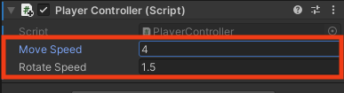
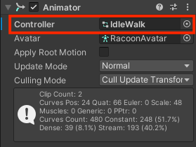

## Improve player movement

You can also control the speed of movement and rotation.

--- task ---
Open your `PlayerController` script and add variables for the `moveSpeed` and `rotateSpeed`. Making these variables `public` means that you can set them in the Unity Inspector.

```
public class PlayerController : MonoBehaviour
{
    public float moveSpeed;
    public float rotateSpeed;
```
--- /task ---

--- task ---
Update the code to `Rotate` and `SimpleMove` your character to multiple by the new variables:

```
        transform.Rotate(0, Input.GetAxis("Horizontal") * rotateSpeed, 0);
```

and,

```
        controller.SimpleMove(forward * speed * moveSpeed);
```
--- /task ---

--- task ---
Save your script and return to the Unity editor. When your script has compiled, click on your character in the Hierarchy. You should be able to see your new variables in the Inspector. 

Set their values to `3` and `1`:



--- /task ---

--- task ---
**Test:** Play your scene and check if you are happy with the speed settings. 

**Tip:** You can use Playmode to try out different settings in but if you have changed them you will need to exit Playmode and set the values again in the Inspector to keep the settings you prefer.

--- /task ---

Your player is moving around, but at the moment, it's stuck in a T-pose position. You can improve this by using animations. 


--- task ---
Drag the 'IdleWalk' Animator from the Animations folder in the Projects Window to the Controller property of the Animator component of your character.



This will add Idle and Walk animations to your character with an `isMoving` Boolean that you can use to control which animation plays.

--- /task ---

--- task ---
**Test:** Play your project and make sure you can see the Idle animation.
--- /task ---

--- task ---
Add code to the Update method of your script to make your character use a different animation when moving forward.

```
void Update() {

    Animator anim = gameObject.GetComponent<Animator>();

    if (Input.GetAxis("Vertical") > 0)
    {
        anim.SetBool("isMoving", true);
        //Debug.Log("Walk");
    }
    else 
    {
        anim.SetBool("isMoving", false);
        //Debug.Log("Idle");
    }
```
--- /task ---

--- task ---
**Test:** Play your project and make sure you can see the animation change to Walk when you move forward and switch to Idle when you are not moving forward. 

--- /task ---

In games, the camera often follows the player. 

--- task ---
In the Hierarchy, drag the Main Camera to the Player GameObject, it will become a child of the Player and will follow the player around. 

--- /task ---

--- task ---
**Test:** Play your project. The camera will now follow your character, but it's a bit far away. 

--- /task ---

--- task ---
You can adjust the position and rotation of the camera in the Scene view or the Inspector.

Try these settings to get a 3rd person view of your Player:

Y
--- /task ---

--- save ---