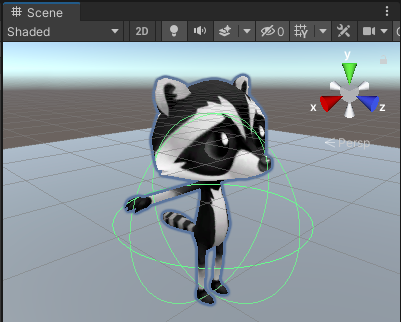

## Add character movement

<div style="display: flex; flex-wrap: wrap">
<div style="flex-basis: 200px; flex-grow: 1; margin-right: 15px;">
Get your player moving with WASD or arrow keys. 
</div>
<div>
{:width="300px"}
</div>
</div>

<p style="border-left: solid; border-width:10px; border-color: #0faeb0; background-color: aliceblue; padding: 10px;">
Unity uses the <span style="color: #0faeb0">**C#**</span> (say C sharp) programming language which is used by professional software developers. C# is an object-oriented language with **classes** that define behaviour for similar objects and **methods** which are functions that belong to a class. In Unity, a **script** defines a class with variables and methods. You can add the same script to multiple game objects if they need the same features.</p>

--- task ---
Click on your character in the Hierarchy or Scene view so you can see its properties in the Inspector. 

Click 'Add Component' and start to type 'char' in the Search box, click on the CharacterController component when it appears. 


--- /task ---

The CharacterController component adds new features to your player Game object including a `Move` method and a **collider**. Colliders can be used to stop your character walking through solid objects and to detect when collisions take place.

<p style="border-left: solid; border-width:10px; border-color: #0faeb0; background-color: aliceblue; padding: 10px;">
 A <span style="color: #0faeb0">**collider**</span> is a shape that is used to detect when a Game object collides, or intersects, with another Game object. It's much quicker for a computer to check for collisions with a simple collider shape than the complex shape of a Game object.</p>

--- task ---

The Character Controller collider has a Height of `2` and a centre at `0, 0, 0` this means it is positioned half above and half below the plane. 

{:width="300px"}

Your character has a height of `1` meaning their centre on the y-axis is at `0.5`. Change the value in the Character Controller y-axis centre to `0.6` and the Height to `1` to match the character. 

{:width="400px"}

{:width="300px"}

--- /task ---

Your character needs a script so that the player can move it around.

--- task ---

Go to the Project Window and right-click on the `Assets` folder. From the **Create** menu choose **Folder**. Rename your folder to 'My Scripts'.

{:width="400px"}

--- /task ---

--- task ---

Right click on the `My Scripts` folder and go to the **Create** menu. Select **C# Script** name your new script `PlayerController`.

{:width="300px"}

--- /task ---

--- task ---
Double-click on the script to open it. The script will open in a separate code editor. 

```
using System.Collections;
using System.Collections.Generic;
using UnityEngine;

public class PlayerController : MonoBehaviour
{
    // Start is called before the first frame update
    void Start()
    {
        
    }

    // Update is called once per frame
    void Update()
    {
        
    }
}
```

**Debug:** Check that the name after `class` is `PlayerController` and matches the name of your script file. If you rename the file after creating it then you will need to change the class name in the script.

--- /task ---

Unity creates the effect of movement by quickly drawing images to the screen. Each image is a 'frame'. 

--- task ---

You will be able to use WASD or arrow keys (players on mobile or console can use different inputs without you changing your code.)

**Tip:** The lines starting with `//` are comments that explain the code. You don't need to type them.

```
   // Update is called once per frame
    void Update()
    {
        float speed = Input.GetAxis("Vertical");
        Debug.Log(speed);
    }

```

A `float` is a decimal number.

**Save** your `PlayerController` script in your code editor, using 'Ctrl-S' (or 'Cmd-S'), then return to the Unity Editor.

<mark>Do we want to be specific about the editor?</mark>

**Tip:** You might finding it quicker to use 'Alt-Tab' (or 'Cmd-Tab') to switch between your Web browser with the project instructions, the Unity editor and your code editor.

**Debug:** Your scene won't play if there are errors in your code. Check the Console window for information. You may see:
+ '; expected' - check for a semicolon `;` at the end of each line of code. 
+ 'Newline in constant' - you missed a quote `"` from the end of a text string.
+ '} expected' - you should have a pair of open and close curly brackets `{}` around each method and around the class. Check that your curly brackets match.
+ ') expected' - make sure there's a closing `)` at the end of each Method call, before the semicolon.
+ ''Input' does not contain a definition for 'getAxis'' - C# is case sensitive, it needs to be `GetAxis` with a capital `G`.

Compare your code with the example code and make sure everything is exactly the same.
--- /task ---

--- task ---

Click on your character in the Hierarchy window. Go to the Project window and drag the `PlayerController` script across to the Inspector window.


--- /task ---

--- task ---

Click on the **Console** window tab to bring it to the front. 

{:width="400px"}

**Test:** Go to the Toolbar and click on the **Play** button to put your scene into Play mode. This will simulate your scene as it would be viewed and interacted with by a user.  

{:width="400px"}

Unity takes a few seconds to start up, then you should start to see output in the Console. 

Place your **mouse pointer in the Game view** and press keys `W` and `S`. Look at the values logged in the Console window as you press the keys. Each time you press `W` a positive number is logged, when you press `S` a negative number is logged. 

The numbers range between -1.0 and 1.0 and correspond to movement from the vertical controls on the keyboard (or a games controller). You can also use the up and down arrow keys.

**Tip:** The output also appears in the bar at the bottom on the Unity editor. 

Click the 'Play' button again to exit Playmode and the debug output will stop.

--- /task ---

It's easy to forget whether your game is playing or not. A Playmode colour tint makes it easier to tell when your scene is playing.


--- task ---

To set a tint, go to the **Edit Menu** (or **Unity Menu**) and select **Preferences**. Choose the **Colours** menu and find the property called **Playmode tint**.

Click on the existing colour to see a colour wheel where you can choose a colour and opacity level.

{:width="400px"}

Return to the Unity editor and press the **Play** button to see your new tint in action. When you are happy with the tint you have chosen, press the **Play** button again to exit Play mode.

--- /task ---

The CharacterController component provides a `SimpleMove` method.

--- task ---
Update your code to use the Vertical input value to move the player each frame. (You can remove the `Debug` line.)

```
    void Update()
    {
        float speed = Input.GetAxis("Vertical");
        // forward is the forward direction for this character
        Vector3 forward = transform.TransformDirection(Vector3.forward);

        // We need the CharacterController so we can use SimpleMove
        CharacterController controller = GetComponent<CharacterController>();       
        controller.SimpleMove(forward * speed);
    }
 ```
 
--- /task ---

--- task ---
**Test:** Click Play to enter Playmode and try out your code. Use W/S or up and down arrow keys to glide forwards and backwards. 

**Debug:** Remember to check the Console for helpful messages. Check brackets, semicolons and capital letters carefully.

**Tip:** Make sure your mouse pointer is in the **Game view**.

Try and walk through the wall. The `Move` Method from the `CharacterController` component stops you from being able to walk through objects that have a collider. A collider is automatically added when you create a 3D shape as you did for the Wall. 

You can pan around in the **Scene view** by holding your right-mouse button and dragging. Pan to get a better view of the wall as your character walks into it.

{:width="500px"}

To move your player, move the mouse pointer back to the **Game view**.

--- /task ---

--- task ---
Add another line so your character can `Rotate` when the player presses A/D or the left and right arrow keys. 

```
void Update()
    {
        float speed = Input.GetAxis("Vertical");

        // Rotate around y - axis
        transform.Rotate(0, Input.GetAxis("Horizontal"), 0);
```

Save your code and switch back to the Unity editor. Unity will load your updated Script.

--- /task ---

--- task ---
**Test:** Click Play to enter Playmode and try out your code. Use A/D or left and right arrow keys to rotate. 

**Debug:** If you are still seeing output to the console and movement isn't working, then make sure you have saved your script in the code editor.

--- /task ---

You can also control the speed of movement and rotation.

--- task ---
Open your `PlayerController` script and add variables for the `moveSpeed` and `rotateSpeed`. Making these variables `public` means that you can set them in the Unity Inspector and access them from other Game objects.

```
public class PlayerController : MonoBehaviour
{
    public float moveSpeed = 2.0f;
    public float rotateSpeed = 2.0f;
```
--- /task ---

--- task ---
Update the code to `Rotate` and `SimpleMove` your character to multiple by the new variables:

```
        transform.Rotate(0, Input.GetAxis("Horizontal") * rotateSpeed, 0);
```

and,

```
        controller.SimpleMove(forward * speed * moveSpeed);
```
--- /task ---

--- task ---
Save your script and return to the Unity editor. When your script has compiled, click on your character in the Hierarchy. You should be able to see your new variables in the Inspector. 

Set their values to `3` and `1`:

{:width="400px"}

--- /task ---

--- task ---
**Test:** Play your scene and check if you are happy with the speed settings. 

Make changes to the 'Move Speed' and 'Rotate Speed' in the **Inspector** until you are happy. 

**Tip:** You can use Playmode to try out different settings but if you have changed them you will need to exit Playmode and set the values again in the Inspector to keep the settings you prefer.

--- /task ---

--- save ---