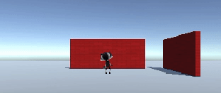
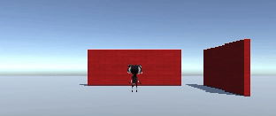

## Animation and camera angle

Your player is moving around, but at the moment, it's stuck in a T-pose position. You can improve this by using animations. 


--- task ---
Drag the 'IdleWalk' Animator from the Animations folder in the Projects Window to the Controller property of the Animator component of your character.


This will add Idle and Walk animations to your character with an `isMoving` Boolean that you can use to control which animation plays.

--- /task ---

--- task ---
**Test:** Play your project and make sure you can see the Idle animation.


--- /task ---

--- task ---
Add code to the Update method of your script to make your character use a different animation when moving forward.

```
void Update() {

    Animator anim = gameObject.GetComponent<Animator>();

    if (Input.GetAxis("Vertical") > 0)
    {
        anim.SetBool("isMoving", true);
        //Debug.Log("Walk");
    }
    else 
    {
        anim.SetBool("isMoving", false);
        //Debug.Log("Idle");
    }
```
--- /task ---

--- task ---
**Test:** Play your project and make sure you can see the animation change to Walk when you move forward and switch to Idle when you are not moving forward. 



--- /task ---

In games, the camera often follows the player. 

<p style="border-left: solid; border-width:10px; border-color: #0faeb0; background-color: aliceblue; padding: 10px;">
The placement of a <span style="color: #0faeb0">virtual camera</span> in a 3d environment is key for creating the right perspective for users. Visibility levels from the camera lens effect the difficulty level and influence the atmosphere of a game. 
</p>

--- task ---
In the Hierarchy, drag the Main Camera to the Player GameObject, it will become a child of the Player and will follow the player around. 


--- /task ---

--- task ---
**Test:** Play your project. The camera will now follow your character, but it's a bit far away. 


--- /task ---

You can adjust the position and rotation of the camera in the Scene view or the Inspector.

--- task ---

Try these settings to get a 3rd person view of your Player, looking down from behind and above your player. 


You can position the camera in the Scene view using the Transform and Rotate tools if you prefer.


--- /task ---

--- task ---
**Test:** Play your project. The camera will now follow your character with the camera just behind and above your character and looking down at an angle.


--- /task ---

--- save ---