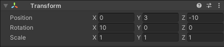
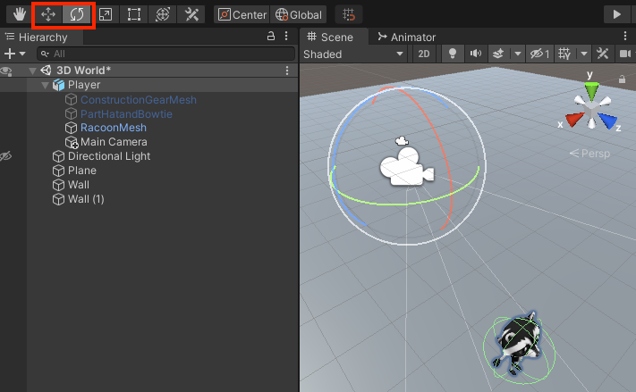

## Animation and camera position

Your Player is moving around, but at the moment, it's stuck in a T-pose position. You can improve this by using animations. 

--- task ---

Drag the **IdleWalk** animator from the **Animation** > **Animators** folder in the Project window to the Controller property of the Animator component of your character:

This will add Idle and Walk animations to your character with a `forward` Boolean parameter that you can use to control which animation plays.

--- /task ---

--- task ---

**Test:** Play your project and make sure you can see the Idle animation:

--- /task ---

--- task ---

Add code to the `Update` method of your script so that when the character is moving forward it uses a walking animation, otherwise it uses an idle animation: 

--- code ---
---
language: cs
filename: PlayerController.cs - Update()
line_numbers: true
line_number_start: 17
line_highlights: 21-31
---
    void Update()
    {
        float speed = Input.GetAxis("Vertical");

        //Set animations
        Animator anim = gameObject.GetComponent<Animator>();

        if (Input.GetAxis("Vertical") > 0) // Forwards
        {
            anim.SetBool("forward", true);
        }
        else // Idle
        {
            anim.SetBool("forward", false);
        }

        // Rotate around y-axis
        transform.Rotate(0, Input.GetAxis("Horizontal"), 0);
--- /code ---

--- /task ---

--- task ---

**Test:** Play your project and make sure you can see the animation change to walk when you move forward and switch to idle when you are not moving forward: 

--- /task ---

In games, the camera often follows the Player. 

The placement of a **virtual camera** in a 3D environment is key for creating the right perspective for users. Visibility levels from the camera lens affect the difficulty level and influence the atmosphere of a game. 

--- task ---

In the Hierarchy window, drag the **Main Camera** to the Player GameObject; it will become a 'child' of the Player and will follow the Player around. 

--- /task ---

--- task ---

**Test:** Play your project. The camera will now follow your character, but it's a bit far away and walls often come between the Player and the camera. 

--- /task ---

You can adjust the position and rotation of the camera in the Scene view or the Inspector window.

--- task ---

Exit Play mode and select the **Main Camera** in the Hierarchy window. Adjust its Transform settings to get a third-person view of your Player, looking down from behind and above your Player: 

You can position the camera in the Scene view using the Transform and Rotate tools if you prefer:

--- /task ---

--- task ---

**Test:** Play your project. The camera will now follow your character with the camera just behind and above your character and looking down at an angle.

Adjust the camera settings until you are happy with them.

**Tip:** You can try settings out in Play mode but you need to exit Play mode and update the settings to keep them.

What happens if you go off the edge of the plane? Don't worry your character will go back to the centre next time you enter Play mode:

--- /task ---

--- save ---
