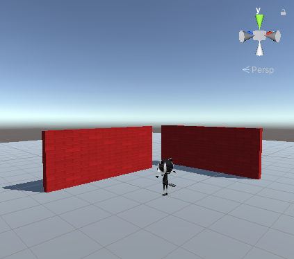

## You will make

Crea un mundo 3D en Unity y explóralo con un personaje 3D animado.

Este proyecto es presentado gracias al generoso apoyo de [Unity Technologies](https://unity.com/){:target="_blank"}.  Estos [proyectos](https://projects.raspberrypi.org/en/pathways/unity-intro){:target="_blank"} ofrecen a los jóvenes la oportunidad de dar sus primeros pasos en la creación de mundos virtuales utilizando Real-Time 3D.

**Unity** es un entorno de desarrollo para crear juegos, entornos virtuales, novelas visuales, animaciones digitales y más. Puedes usar Unity para desarrollar juegos multiplataforma en 2D y 3D para PC, consolas, dispositivos móviles e Internet.

Vas a:
+ Comprender el entorno de Unity, incluido el Scene editor (Editor de escenas)
+ Agregar objetos 3D con materiales como escenario
+ Crear un personaje de jugador con animaciones que puedan moverse

### Experiencia previa recomendada
Este proyecto es adecuado para estudiantes con experiencia previa en codificación, como [Scratch](https://projects.raspberrypi.org/en/pathways/scratch-intro){:target="_blank"} o [Python](https://projects.raspberrypi.org/en/pathways/python-intro){:target="_blank"}, que se sientan cómodos escribiendo código basado en texto.

### Necesitarás
Este proyecto requiere el Unity Editor, que puede ser instalado desde el Unity Hub. Esta es una descarga grande e instalación larga, por lo que te recomendamos que la instales antes de comenzar este proyecto.

Puedes seguir nuestra [Guia de Unity](https://projects.raspberrypi.org/en/projects/unity-guide){:target="_blank"} para instalar Unity Hub y Unity Editor para tu sistema operativo.

También deberías descargar el [Paquete de inicio de Unity](https://rpf.io/p/en/explore-a-3d-world-go){:target="_blank"} y recursos antes de comenzar.

Moving and looking around the 3D environment is much easier if you have an external mouse, rather than a trackpad.

If you don't have an external mouse right now don't worry, you can still complete this project with a trackpad.

--- no-print ---

--- task ---
### Play ▶️

**Click on the embedded project.** ⬇️ Navigate the 3D world using the WASD or arrow keys. What does the raccoon do when standing still? How do they move when walking? Can you walk through the walls?

<iframe allowtransparency="true" width="710" height="450" src="https://explore-a-3d-world-basic.rpfilt.repl.co" frameborder="0"></iframe>

--- /task ---

--- /no-print ---

--- print-only ---

--- /print-only ---
