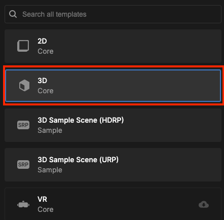
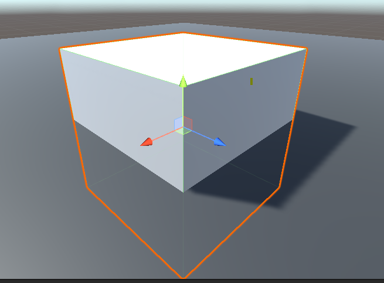
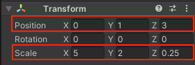
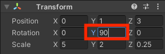

## Prepara la escena 3D

Tu mundo 3D, o 'mapa', necesita un suelo y paredes. 

{:width="300px"}

Las personas pasan cada vez más tiempo en **mundos virtuales en línea**. Además de jugar, la gente se relaja, explora, socializa y aprende. Ser capaz de diseñar mundos en 3D le brinda infinitas oportunidades para crear experiencias interactivas como estas.

Un proyecto de Unity necesita 'Activos' gráficos y de sonido.

--- task ---

Descarga y descomprime el [Paquete de inicio de Unity](https://rpf.io/p/en/explore-a-3d-world-go){:target="_blank"} en tu computadora. Elige una ubicación conveniente, como tu carpeta Documentos.

--- /task ---

--- task ---

Inicia el Unity Hub y haz clic en **Proyectos** luego selecciona **Nuevo Proyecto**:

De la lista, elige **Todas las plantillas** y luego selecciona **3D Core**:

Edita la configuración del proyecto para darle a tu proyecto un buen nombre y guárdalo en una ubicación conveniente. Luego haz clic en **Crear proyecto**:

Tu nuevo proyecto se abrirá en el Editor de Unity. Puede tomar algún tiempo para cargar.

--- /task ---

El Editor de Unity se ve así:

--- collapse ---

---
title: Las ventanas y vistas del Unity Editor
---

1. **El menú de Unity** se usa para importar, abrir y guardar escenas y proyectos. Puedes modificar las preferencias de Unity Editor y agregar nuevos Objetos del juego y Componentes.

2. **La barra de herramientas** contiene herramientas para navegar en la Vista de escena, controlar el juego en la Vista de juego y personalizar el diseño del Editor de Unity.

3. **La Vista de Escena** se usa para navegar y editar tu escena. Puedes seleccionar y colocar Objetos del juego, includos personajes, escenarios, cámaras y luces.

4. **La vista de juego** puede mostrarse al hacer clic en la pestaña **Juego**. Te muestra la escena tal y como se ve a través de la lente de tus cámaras. Cuando haces clic en el botón **Jugar** para ingresar al Modo de juego, la Vista de juego simula tu escena tal y como la vería un usuario.

5. **La ventana de jerarquía** muestra todos los Objetos del juego en tu escena y la estructura que hay entre ellos. Aquí, puedes agregar y navegar los Objetos del juego en tu proyecto. Los Objetos del juego pueden tener 'objetos secundarios' que se mueven con ellos.

6. **La ventana Proyecto** muestra una biblioteca de todos los archivos incluidos en tu proyecto. Puedes encontrar los Activos que quieras utilizar aquí.

7. **La ventana Consola** puede mostrarse al hacer clic en la pestaña **Consola**. Muestra mensajes importantes. Aquí es donde puedes ver los errores del compilador (errores en tu Script) y los mensajes que imprimes cuando usas `Debug.Log()`.

8. **La ventana Inspector** te permite ver y editar las propiedades de tus Objetos del juego. Puedes agregar otros componentes a tus Objetos del juego y editar los valores que usan.

--- /collapse ---

--- task ---

El paquete de inicio de Unity que descargaste contiene una cantidad de Activos que puedes usar en tu proyecto.

Para importarlos a tu nuevo proyecto, haz clic en el menú **Activos** y selecciona **Importar paquete** >**Paquete Personalizado...** luego navega hasta el **Paquete de inicio de Unity** que descargaste previamente.

--- /task ---

[[[unity-importing-a-package]]]

--- task ---

**La ventana Proyecto ** es donde puedes ver todos los archivos incluidos en tu proyecto. Haz clic en la carpeta **Modelos** que está dentro de la carpeta Activos para ver los modelos que has importado.

--- /task ---

En Unity, una **Escena** contiene Objetos del juego. Un proyecto de Unity con varios niveles de juego podría tener una escena por nivel.

--- task ---

Haz clic derecho en **Escena de Muestra** en la ventana Jerarquia y elige **Guardar escena como**.

En la ventana emergente, nombra a tu Escena como `Mundo 3D`:

Aparecerá un nuevo archivo en la carpeta Activos en la ventana Proyecto:

--- /task ---

Primero que nada, tu mundo necesitará un suelo.

--- task ---

Hagz clic derecho en tu escena (nombrada 3D World) en la ventana Jerarquia y elige **Objeto del juego** > **Objecto 3D** > **Cubo**:

Esto creará el suelo para tu mundo.

El tamaño por defecto para el suelo plano es de 10m × 10m. Unity utiliza metros como unidad de medida.

--- /task ---

El **material** de un Objeto de juego controla su apariencia. Dale al plano del suelo un material de color diferente.

--- task ---

En la ventana Proyecto, haz clic con el botón derecho en la carpeta **Materials** y elige **Crear** > **Material**.

Debería aparecer un nuevo material en la carpeta Materiales. Decide qué color usarás para el piso y nombra tu nuevo material:

Da clic en el color junto a 'Albedo' en la ventana de Inspeccion y elije un color para tu material (usaremos gris):

Arrastra tu nuevo material desde la ventana de Proyecto a tu plano en la vista de escena:

--- /task ---

Puede crear objetos a partir de formas 3D.

--- task ---

Hagz clic derecho en tu escena **Mundo 3D World** en la ventana Jerarquia y elige **ObjetoJuego** > **Objecto 3D** > **Cubo**.

Esto creará un cubo en el centro de la escena, en (0, 0, 0).

--- /task ---

Puede ver el cubo en la vista Escena. Esta es la vista "detrás de camaras" de tu juego donde configuras todo.

**Sugerencia:** Has clic en la pestaña **Escena** para asegurarte de que puedes ver la vista Escena.

--- task ---

Has clic en el cubo en la vista de escena o en la ventana de jerarquía para seleccionarlo.

Use <kbd>Shift</kbd>+<kbd>F</kbd> (mantenga presionada la tecla <kbd>Shift</kbd> y presione <kbd>F</kbd>) para enfocarse en el cubo.

También puede usar la rueda de desplazamiento del mouse o las teclas de flecha hacia arriba y hacia abajo para acercar y alejar:

--- /task ---

Necesitas colocar el cubo sobre el avión.

--- task ---

Haga clic en el cubo en la vista de escena o en la ventana de jerarquía para seleccionarlo.

**Elija**   
Alguno de estos:

+ Cambie la posición Y en la ventana del Inspector a 0.5 (la mitad de la altura del cubo):

+ Use la herramienta Mover para arrastrar la flecha verde hacia arriba hasta que el cubo este en el plano:

--- /task ---

**Sugerencia:** Si comete un error en el editor Unity, puede usar <kbd>Ctrl</kbd>+<kbd>Z</kbd> (o <kbd>Cmd</kbd>+<kbd>Z</kbd>) para **deshacer** su última acción.

--- task ---

Ahora cambia el cubo a una pared con los siguientes ajustes de Posición y Escala:

{:width="400px"}

Puede ingresar los valores en el componente Transformar para el cubo o hacer clic en la herramienta Escala y arrastrar los controladores en la vista Escena (esto actualizará los valores de Transformación)

Aleja el zoom para ver tu muro:

--- /task ---

Un material puede tener color y textura y hay muchas propiedades que puedes ajustar para obtener diferentes efectos. Una **textura** es una imagen 2D que se puede crear en un editor de imágenes.

--- task ---

En la ventana Projecto, haz clic con el botón derecho en la carpeta **Materiales** y elige **Crear** > **Material**. Vas a crear una pared de ladrillos de colores. Dale al material un nombre descriptivo:

Haga clic en el color junto a 'Albedo' en la ventana de Inspeccion y elija un color para su material:

Agregue una textura haciendo clic en el círculo a la izquierda de 'Albedo' y seleccionando **MuroLadrilloAlbedo** textura de la lista:

Arrastre su nuevo material desde la ventana Proyecto a su pared en la vista Escena:

--- /task ---

--- task ---

En la ventana de Inspeccion, haga clic con el botón derecho en su cubo, elija **Renombrar** en el menú y cambie el nombre de su objeto de `Cubo` a `Pared`:

**Sugerencia:** Puede nombrar un nuevo Objecto de juego en la ventana Jerarquía cuando lo crea y puede cambiar el nombre en la ventana Inspector.

--- /task ---

--- task ---

Para crear una copia de su muro, puede:
+ Haga clic con el botón derecho en su objeto Muro en la ventana Jerarquía y elija **Duplicar**
+ Seleccione su pared en la vista Escena y use <kbd>Ctrl</kbd>+<kbd>D</kbd> (o <kbd>Cmd</kbd>+<kbd>D</kbd>) para duplicar

Tu nueva pared estará exactamente en el mismo lugar que tu primera pared.

--- /task ---

--- task ---

Cambie la rotación y del nuevo muro a `90`:

--- /task ---

--- task ---

Vuelva a colocar el nuevo muro en la siguiente posición: x = 4, y = 1, z = -1.

Puede ingresar los valores en la ventana Inspector o arrastrar las flechas en su escena; no importa si la posición es exacta.

Tu escena debería verse así:

--- /task ---

--- task ---

Haga clic en su plano. Cambie la configuración de Escala en el Plano para hacerlo más grande y tener más espacio:

Piense en un plano 4×4 de 40 metros por 40 metros en el mundo real: suficiente espacio para que su personaje se mueva.

--- /task ---

--- task ---

Cuando tenga cambios sin guardar, verá un '*' al lado de su Escena en la ventana de Jerarquía.

Guarde su escena haciendo clic en **Archivo** > **Guardar**. O use <kbd>Ctrl</kbd>+<kbd>S</kbd>.

Además, guarde su proyecto haciendo clic en **Archivo** > **Guardar proyecto**.

Unity normalmente no guarda automáticamente los cambios, pero su proyecto inicial contiene una secuencia de comandos para guardar automáticamente su proyecto cada 60 segundos.

--- /task ---

Puede navegar por su escena para verla desde diferentes ángulos. Si se pierde, simplemente haga clic en una pared en la ventana Jerarquía y luego use <kbd>Shift</kbd>+<kbd>F</kbd> para enfocar y luego alejar:

[[[unity-scene-navigation]]]

Recuerde, si navega, verá su escena desde una perspectiva diferente, por lo que su vista no se verá exactamente igual a la de nuestros ejemplos.

--- save ---
