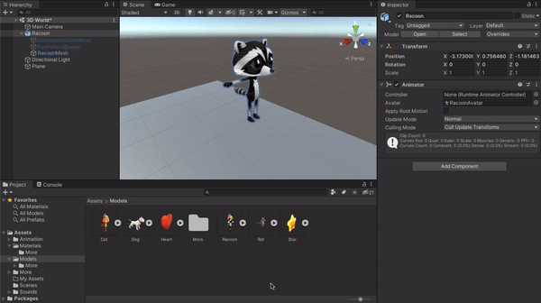
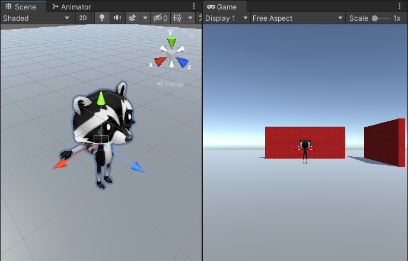

## Agrega un personaje

El jugador en tu mundo será un Gato o un Mapache. 

{:width="300px"}

--- task ---

Haga clic en la carpeta **Modelos** en la ventana Proyecto. Un modelo describe cómo se ve un objeto 3D y se puede crear usando herramientas de modelado 3D como Blender. Hemos incluido algunos modelos que puedes utilizar.

Elija el modelo `Gato` o `Mapache` y arrástrelo desde la ventana Proyecto a la vista Escena:

**Sugerencia:** Si accidentalmente agregó los modelos 'BaseGato' o 'BaseMapache', o si desea cambiar su personaje en este punto, puede eliminar el modelo de la escena. Haga clic derecho en el modelo Objeto de juego en la ventana de Jerarquía y seleccione 'Eliminar'.

--- /task ---

Tu personaje aparecerá en la vista de escena con una pose T.

La **pose T** es la posición predeterminada para un personaje de juego antes que este haya sido animado.

--- task ---

Haz clic en tu personaje en la vista de escena y presiona la tecla <kbd>F</kbd>.

**Sugerencia:** Si estas perdido en la vista de Escena, puedes hacer clic en su personaje (u otro Objeto de juego) en la ventana de Jerarquía y luego hacer clic en <kbd>Shift</kbd>+<kbd>F</kbd> para enfocar tu personaje en la vista de Escena.

--- /task ---

Hmm, tu personaje lleva varios accesorios.

--- task ---

Haz clic en tu personaje en la ventana de Jerarquía. Esto abrirá la configuración de Objeto de juego en la ventana de Inspeccion.

Haz clic en la flecha al lado de tu personaje en la ventana de Jerarquía para ver los 'objetos hijos'. Haga clic en **Malla de engranajes de construcción** y desmarque la casilla junto a su nombre en la ventana de Inspeccion. Esto ocultará el casco y el chaleco de alta visibilidad:

Oculta los otros accesorios para tu personaje de la misma manera, o simplemente mantén uno activo.

**Sugerencia:** Los Objetos de juego que no están activos aparecen atenuados en la ventana Jerarquía:

--- /task ---

--- task ---

El jugador verá el juego a través de la 'Cámara principal', que se muestra como un ícono de cámara de video en la Escena. Seleccione la cámara en la ventana Jerarquía para ver la vista de cámara incrustada:

--- /task ---

La vista del juego muestra cómo se verá tu proyecto para un jugador.

--- task ---

Haz clic en la pestaña Vista del juego. Tu personaje estará en cualquier posición a la que lo hayas arrastrado en la vista de escena (es posible que no puedas verlo).

--- /task ---

Si tienes suficiente espacio en pantalla, entonces es realmente útil ver la vista de escena y la vista de juego al mismo tiempo.

--- task ---

Arrastre la pestaña Vista de juego hacia la derecha para que aparezca junto a la vista Escena:

--- /task ---

Unity usa coordenadas x, y y z para colocar lso Objetos de Juego en el espacio 3D:

[[[unity-3D-coordinates]]]

--- task ---

Selecciona tu personaje (en la ventana Jerarquía o en la vista Escena) y luego cambia su configuración de 'Transformar' para que la 'Posición' sea (0, 0, 0) — el centro del mundo:

Tu personaje se moverá al centro en la vista de escena y en la vista de juego:

--- /task ---

--- task ---

Cambia el nombre de tu personaje a 'Jugador' en la ventana de Inspeccion. Esto hará que sea más fácil de encontrar si agrega más Objetos de juego.

--- /task ---

--- save ---
