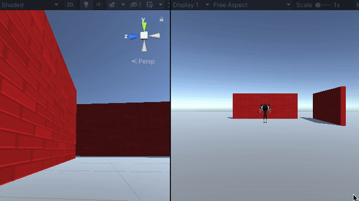

## Agrega movimiento a tu personaje

<div style="display: flex; flex-wrap: wrap">
<div style="flex-basis: 200px; flex-grow: 1; margin-right: 15px;">
Tu jugador se moverá con las teclas WASD o las teclas de flechas. 
</div>
<div>
{:width="300px"}
</div>
</div>

<p style="border-left: solid; border-width:10px; border-color: #0faeb0; background-color: aliceblue; padding: 10px;">
Unity utiliza el lenguaje de programación <span style="color: #0faeb0">**C#**</span> (pronunciado C sharp), que utilizan los desarrolladores de software profesionales. C# es un lenguaje orientado a objetos con **clases** que definen el comportamiento de objetos y **métodos** similares, que son funciones que pertenecen a una clase. En Unity, un **codigo** define una clase con variables y métodos. Puede agregar el mismo codigo a varios Objectos de juego si necesitan las mismas funciones.</p>

--- task ---

Haga clic en Objectos de juego**Jugador** en la ventana Jerarquía o en la vista Escena para poder ver sus propiedades en la ventana de Inspeccion.

{:width="300px"}

**Sugerencia:** Asegúrese de tener seleccionado el **Jugador** y no uno de sus objetos hijos.

Haga clic en **Añadir Componente** y comience a escribir `caracteres` en el cuadro de búsqueda, luego haga clic en el componente **Controlador de personajes** cuando este aparezca:


--- /task ---

El componente Controlador de Personaje agrega nuevas funciones a su Objeto de juego Jugador, incluido un método `MovimientoSimple` y un **colisionador**. Los colisionadores se pueden usar para evitar que tu personaje camine a través de objetos sólidos y para detectar cuándo se producen colisiones.

<p style="border-left: solid; border-width:10px; border-color: #0faeb0; background-color: aliceblue; padding: 10px;">
 Un <span style="color: #0faeb0">**colisionador**</span> es una figura que se usa para detectar cuando un Objecto de juego choca o se cruza con otro Objecto de juego. Es mucho más rápido para una computadora buscar colisiones con una forma de colisionador simple que con la forma compleja de un Objeto de juego. Una **Caja de Choque** es una especie de colisionador. </p>

--- task ---

El colisionador del controlador de personajes tiene una altura de `2` y un centro en `0, 0, 0`; esto significa que se coloca la mitad por encima y la mitad por debajo del plano:

{:width="300px"}

Tu personaje tiene una altura de `1`, lo que significa que su centro en el eje Y está en `0.5`. Cambie el valor en el centro del eje Y del controlador de caracteres a `0.5` y la altura a `1` para que coincida con el personaje:

{:width="400px"}

{:width="300px"}

--- /task ---

Tu personaje necesita una secuencia de codigo para que el jugador pueda moverlo. Necesitará un editor de código instalado en su computadora para editar esta secuencia de codigo.

[[[unity-visual-studio-code]]]

--- task ---

Vaya a la ventana Inspector del jugador y haga clic en el botón **Agregar componente**. Escriba la `secuencia de codigo` y seleccione **Nueva secuencia de codigo**. Nombre su nuevo script `ControladorJugador`, luego presione <kbd>Enter</kbd>.

La nueva secuencia de codigo se guardara en la carpeta Activos:

{:width="400px"}

--- /task ---

--- task ---

Haga doble clic en **ControladorJugador** en el componente de secuencia de codigo en la ventana de Inspeccion. La secuencia de código se abrirá en un editor de código separado y tendrá este código:

--- code ---
---
language: cs filename: PlayerController.cs line_numbers: true line_number_start:
line_highlights:
---
using System.Collections; using System.Collections.Generic; using UnityEngine;

public class PlayerController : MonoBehaviour
{ // Start is called before the first frame update void Start()
    {

    }
    
    // Update is called once per frame
    void Update()
    {
    
    }
} --- /code ---

**Depuración:** Verifique que el nombre después de 'clase' sea `ControladorJugador` y coincida con el nombre de su archivo de secuencia de comandos: si cambia el nombre del archivo después de crearlo, deberá cambiar el nombre de la clase en la secuencia de comandos.

--- /task ---

El método Inicio se llama una vez cuando reproduce su escena. Agregue código para imprimir el mensaje `El jugador comenzó` cuando su proyecto comience a ejecutarse.

--- task ---

Utilice el método `Debug.Log()` para imprimir un mensaje cuando se llame al método `Inicio` para el Obejto de juego Jugador. El mensaje aparecerá en la barra en la parte inferior del Editor de Unity y en la ventana Consola:

--- code ---
---
language: cs filename: PlayerController.cs - Start() line_numbers: true line_number_start: 7
line_highlights: 10
---

    // Start is called before the first frame update
    void Start()
    {
        Debug.Log("Player started");        
    }
--- /code ---

**Sugerencia:** Las líneas que comienzan con // son comentarios que explican el código. No es necesario escribirlos.

**Guarde** su secuencia de comandos ControladorJugador en su editor de código, usando <kbd>Ctrl</kbd>+<kbd>S</kbd> (o <kbd>Cmd</kbd>+<kbd>S</kbd>), luego regrese al Editor de Unity. El Editor de Unity cargará su secuencia de código para que esté listo para ejecutarse; Esto puede tardar unos pocos segundos.

--- /task ---

--- task ---

Haga clic en la pestaña de la ventana Consola para traerla al frente:

{:width="400px"}

--- /task ---

--- task ---

**Prueba:** Vaya a la barra de herramientas y haga clic una vez en el botón **Reproducir** para poner su escena en modo Reproducir. Esto simulará su escena, como sería vista y como se interactuaria con ella por parte de un usuario:

{:width="400px"}

Unity tarda unos segundos en iniciarse, luego debería ver el resultado `Debug.Log()` 'Jugador iniciado' en la consola.


**Depuración:** Su escena no se reproducirá si hay errores en su código. Consulte la ventana Consola para obtener información. Podrias ver:
+ `; esperado`: verifique si hay un punto y coma `;` al final de cada línea de código.
+ `Nueva línea en la constante`: se perdió una comilla `"` del final de una cadena de texto.
+ `} esperado` - usted debe tener un par de corchetes abiertos y cerrados `{}` alrededor de cada método y alrededor de la clase. Compruebe que sus corchetes coincidan.
+ `) esperado` - asegúrese de que haya un cierre de parentesis `)` al final de cada llamada al método, antes del punto y coma.
+ `El depurador` no contiene una definición para 'registro': C# distingue entre mayúsculas y minúsculas, por lo que debe ser `Log` con mayúscula `L`.

Compare su código con el código de ejemplo y asegúrese de que todo sea exactamente igual.

--- /task ---

--- task ---

Haga clic una vez en el botón **Reproducir** nuevamente para salir del modo Reproducir y la salida de depuración se detendrá.

**Sugerencia:** Los cambios realizados en el modo de reproducción se pierden cuando sale del modo de reproducción. Asegúrese de salir del modo de reproducción cuando termine la prueba.

--- /task ---

Unity crea el efecto de movimiento al dibujar rápidamente imágenes en la pantalla. Cada imagen es un **cuadro**. El método `Actualizar` se llama una vez por cada cuadro.

--- task ---

Switch to your code editor.

You will be able to use the WASD or arrow keys (players on a mobile or console can use different inputs without you changing your code.)

`Input.GetAxis("Vertical")` takes input from the <kbd>W</kbd> and <kbd>S</kbd> keys or the up and down arrow keys, and returns a number between 1 and -1, which it uses for forwards and backwards movement.

--- code ---
---
language: cs filename: PlayerController.cs - Update() line_numbers: true line_number_start: 14
line_highlights: 16-21
---

    void Update()
    {
        float speed = Input.GetAxis("Vertical");
    
        if (speed != 0) // Player moving
        {
            Debug.Log(speed);
        }
    }
--- /code ---

Un `flotante` es un número decimal.

**Guarde** su secuencia de comandos ControladorJugador en su editor de código, usando <kbd>Ctrl</kbd>+<kbd>S</kbd> (o <kbd>Cmd</kbd>+<kbd>S</kbd>), luego regrese al Editor de Unity.

**Sugerencia:** Puede que le resulte más rápido usar <kbd>Alt</kbd>+<kbd>Tab</kbd> (o <kbd>Cmd</kbd>+<kbd>Tab</kbd>) para cambiar entre su navegador web con las instrucciones del proyecto, el editor de Unity y su editor de código.

--- /task ---

--- task ---

**Prueba:** Vaya a la barra de herramientas y haga clic en el botón **Reproducir** para poner su escena en modo Reproducir.

Coloque **el puntero del mouse en la Vista de juego** y presione las teclas <kbd>W</kbd> y <kbd>S</kbd>. Mire los valores registrados en la ventana Consola mientras presiona las teclas. Cada vez que presiona <kbd>W</kbd> se registra un número positivo, cuando presiona <kbd>S</kbd> se registra un número negativo. Solo se registra un número si el valor de la velocidad **no es** 0 (consulte la línea 18 del código).

Los números oscilan entre -1,0 y 1,0 y corresponden al movimiento de los controles verticales del teclado (o un controlador de juego). También puede utilizar las teclas de flecha arriba y abajo.


**Sugerencia:** La salida también aparece en la barra en la parte inferior del editor Unity.

Haga clic en el botón **Reproducir** nuevamente para salir del modo Reproducir y la salida de depuración se detendrá.

--- /task ---

Es fácil olvidar si tu juego está jugando o no. Un color del modo de reproducción hace que sea más fácil saber cuándo se está reproduciendo su escena:


--- task ---

Para establecer un color, vaya al **Menú de edición** (o Menú de Unity) y seleccione **Preferencias**. Elija el menú **Colores** y busque la propiedad llamada **Color del Mode de juego**.

Haga clic en el color existente para ver una rueda de colores donde puede elegir un color y un nivel de opacidad:

{:width="400px"}

**Sugerencia:** Pruebe con un color claro para poder ver claramente el texto en el editor cuando la escena se está ejecutando.

Vuelva al Editor de Unity y presione el botón **Reproducir** para ver su nuevo tinte en acción. Cuando esté satisfecho con el color que ha elegido, presione el botón **Reproducir** nuevamente para salir del modo Reproducir.

--- /task ---

El componente Controlador de caracteres proporciona un método `Movimiento Simple`.

--- task ---

**Agregue** código para usar el valor de entrada vertical para mover el jugador en cada cuadro.

Puede **eliminar** el código de depuración.

**Sugerencia:** Puede enmascarar las lineas del `Debug.Log()` poniendo `//` al principio de la línea. También puede enmascarar varias líneas usando `/*` y `*/`:
```
        /*if (speed != 0) // Player moving
        {
            Debug.Log(speed);
        }*/
```

Unity usa un tipo de datos especial llamado `Vector3` para almacenar puntos o direcciones en 3D. La variable `adelante` almacena la dirección hacia la que mira el jugador:

--- code ---
---
language: cs filename: PlayerController.cs - Update() line_numbers: true line_number_start: 14
line_highlights: 18-23
---

    void Update()
    {
        float speed = Input.GetAxis("Vertical");
    
        // Forward is the forward direction for this character
        Vector3 forward = transform.TransformDirection(Vector3.forward);
    
        // You need the Character Controller so you can use SimpleMove
        CharacterController controller = GetComponent<CharacterController>();
        controller.SimpleMove(forward * speed);
    }
--- /code ---

--- /task ---

--- task ---

**Prueba:** Haga clic en **Reproducir** para ingresar al modo Reproducir y probar su código. Utilice las teclas <kbd>W</kbd> y <kbd>S</kbd> o las teclas de flecha arriba y abajo para deslizarse hacia adelante y hacia atrás.

**Depuración:** Recuerde consultar la ventana Consola para ver mensajes útiles. Revise cuidadosamente los corchetes, los puntos y comas y las letras mayúsculas en su código.

**Sugerencia:** Asegúrese de que el puntero del mouse esté en la **Vista del juego**.

Intenta caminar a través de la pared. El método `Movimiento Simple` del componente Controlador de personajes impide que pueda caminar a través de Objectos del Juego que tienen un colisionador. Un colisionador se agrega automáticamente cuando crea una figura 3D como lo hizo para la pared.

Puede desplazarse por la vista de escena manteniendo presionado el botón derecho del mouse y arrastrando. Desplácese para obtener una mejor vista de la pared a medida que su personaje camina hacia ella:

{:width="500px"}

Para mover su jugador, mueva el puntero del mouse de regreso a la vista **Juego**.

Haga clic en el botón **Reproducir** nuevamente para salir del modo Reproducir.

--- /task ---

--- task ---

Agregue otra línea para que su personaje pueda `Rotar` cuando el jugador presiona las teclas <kbd>A</kbd> y <kbd>D</kbd> o las teclas de flecha izquierda y derecha:

--- code ---
---
language: cs filename: PlayerController.cs - Update() line_numbers: true line_number_start: 14
line_highlights: 18-19
---

    void Update()
    {
        float speed = Input.GetAxis("Vertical");
    
        // Rotate around y-axis
        transform.Rotate(0, Input.GetAxis("Horizontal"), 0);
    
        // Forward is the forward direction for this character
        Vector3 forward = transform.TransformDirection(Vector3.forward);
    
        // You need the Character Controller so you can use SimpleMove
        CharacterController controller = GetComponent<CharacterController>();
        controller.SimpleMove(forward * speed);
    }
--- /code ---

Guarda tu secuencia de código y regresa al Editor de Unity. Unity cargará su secuencia de código actualizada.

--- /task ---

--- task ---

**Prueba:** Haga clic en **Reproducir** para ingresar al modo Reproducir y probar su código. Use las teclas <kbd>A</kbd> y <kbd>D</kbd> o las teclas de flecha izquierda y derecha para rotar.

**Depuración:** Si sigue viendo el resultado en la Consola y el movimiento no funciona, asegúrese de haber guardado su secuencia de código en el editor de código.

Haga clic en el botón **Reproducir** nuevamente para salir del modo Reproducir.

--- /task ---

También puede controlar la velocidad de movimiento y rotación.

--- task ---

Abre tu secuencia de comandos del Controlador de Juegador y agrega variables para `Vlocidad de Movimiento` y `Velocidad de Rotación`.

--- code ---
---
language: cs filename: PlayerController.cs line_numbers: true line_number_start: 5
line_highlights: 7-8
---
public class PlayerController : MonoBehaviour
{ public float moveSpeed = 4.0f; //The f at the end of the number says it is a floating-point number public float rotateSpeed = 1.5f;

    // Start is called before the first frame update
    void Start()
    {
--- /code ---

--- /task ---

--- task ---

Actualice el código a `Rotar` y `Movimiento Simple` de tu personaje para multiplicarlos por las nuevas variables:

--- code ---
---
language: cs filename: PlayerController.cs - Update() line_numbers: true line_number_start: 21
line_highlights: 22
---

        // Rotate around y-axis
        transform.Rotate(0, Input.GetAxis("Horizontal") * rotateSpeed, 0);
--- /code ---

y

--- code ---
---
language: cs filename: PlayerController.cs - Update() line_numbers: true line_number_start: 27
line_highlights: 29
---

        // You need the Character Controller so you can use SimpleMove
        CharacterController controller = GetComponent<CharacterController>();
        controller.SimpleMove(forward * speed * moveSpeed);
--- /code ---

--- /task ---

--- task ---

**Prueba:** Reproduzca su escena y verifique si está satisfecho con la configuración de velocidad.

Si selecciona el reproductor en su vista de escena, puede realizar cambios en sus variables `moveSpeed` y `rotateSpeed` en el Inspector.


--- collapse ---

---
title: Variables en el Inspector
---

Cuando cambia el valor de una variable en el Inspector, tiene prioridad sobre el valor establecido en su secuencia de comandos.

Cualquier cambio futuro que realice a esos valores en su secuencia de comandos **no tendrá efecto**.

--- /collapse ---

Haga clic en el botón **Reproducir** nuevamente para salir del modo Reproducir.

--- /task ---

--- save ---
