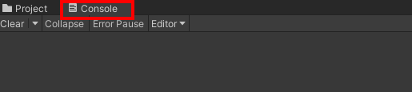
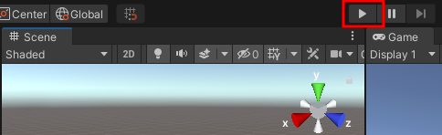
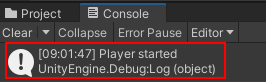
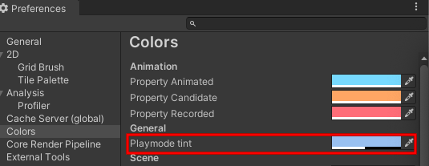

## Agrega movimiento a tu personaje

<div style="display: flex; flex-wrap: wrap">
<div style="flex-basis: 200px; flex-grow: 1; margin-right: 15px;">
Tu jugador se moverá con las teclas WASD o las teclas de flechas. 
</div>
<div>
{:width="300px"}
</div>
</div>

<p style="border-left: solid; border-width:10px; border-color: #0faeb0; background-color: aliceblue; padding: 10px;">
Unity utiliza el lenguaje de programación <span style="color: #0faeb0">**C#**</span> (pronunciado C sharp), que utilizan los desarrolladores de software profesionales. C# es un lenguaje orientado a objetos con **clases** que definen el comportamiento de objetos y **métodos** similares, que son funciones que pertenecen a una clase. En Unity, un **codigo** define una clase con variables y métodos. Puede agregar el mismo codigo a varios Objectos de juego si necesitan las mismas funciones.</p>

--- task ---

Haga clic en Objectos de juego**Jugador** en la ventana Jerarquía o en la vista Escena para poder ver sus propiedades en la ventana de Inspeccion.

{:width="300px"}

**Sugerencia:** Asegúrese de tener seleccionado el **Jugador** y no uno de sus objetos hijos.

Haga clic en **Añadir Componente** y comience a escribir `caracteres` en el cuadro de búsqueda, luego haga clic en el componente **Controlador de personajes** cuando este aparezca:


--- /task ---

El componente Controlador de Personaje agrega nuevas funciones a su Objeto de juego Jugador, incluido un método `MovimientoSimple` y un **colisionador**. Los colisionadores se pueden usar para evitar que tu personaje camine a través de objetos sólidos y para detectar cuándo se producen colisiones.

<p style="border-left: solid; border-width:10px; border-color: #0faeb0; background-color: aliceblue; padding: 10px;">
 Un <span style="color: #0faeb0">**colisionador**</span> es una figura que se usa para detectar cuando un Objecto de juego choca o se cruza con otro Objecto de juego. Es mucho más rápido para una computadora buscar colisiones con una forma de colisionador simple que con la forma compleja de un Objeto de juego. Una **Caja de Choque** es una especie de colisionador. </p>

--- task ---

El colisionador del controlador de personajes tiene una altura de `2` y un centro en `0, 0, 0`; esto significa que se coloca la mitad por encima y la mitad por debajo del plano:

{:width="300px"}

Tu personaje tiene una altura de `1`, lo que significa que su centro en el eje Y está en `0.5`. Cambie el valor en el centro del eje Y del controlador de caracteres a `0.5` y la altura a `1` para que coincida con el personaje:

{:width="400px"}

{:width="300px"}

--- /task ---

Tu personaje necesita una secuencia de codigo para que el jugador pueda moverlo. Necesitará un editor de código instalado en su computadora para editar esta secuencia de codigo.

[[[unity-visual-studio-code]]]

--- task ---

Vaya a la ventana Inspector del jugador y haga clic en el botón **Agregar componente**. Escriba la `secuencia de codigo` y seleccione **Nueva secuencia de codigo**. Nombre su nuevo script `ControladorJugador`, luego presione <kbd>Enter</kbd>.

La nueva secuencia de codigo se guardara en la carpeta Activos:

{:width="400px"}

--- /task ---

--- task ---

Haga doble clic en **ControladorJugador** en el componente de secuencia de codigo en la ventana de Inspeccion. La secuencia de código se abrirá en un editor de código separado y tendrá este código:

--- code ---
---
language: cs filename: PlayerController.cs line_numbers: true line_number_start:
line_highlights:
---
using System.Collections; using System.Collections.Generic; using UnityEngine;

public class PlayerController : MonoBehaviour
{ // Start is called before the first frame update void Start()
    {

    }
    
    // Update is called once per frame
    void Update()
    {
    
    }
} --- /code ---

**Depuración:** Verifique que el nombre después de 'clase' sea `ControladorJugador` y coincida con el nombre de su archivo de secuencia de comandos: si cambia el nombre del archivo después de crearlo, deberá cambiar el nombre de la clase en la secuencia de comandos.

--- /task ---

El método Inicio se llama una vez cuando reproduce su escena. Agregue código para imprimir el mensaje `El jugador comenzó` cuando su proyecto comience a ejecutarse.

--- task ---

Utilice el método `Debug.Log()` para imprimir un mensaje cuando se llame al método `Inicio` para el Obejto de juego Jugador. El mensaje aparecerá en la barra en la parte inferior del Editor de Unity y en la ventana Consola:

--- code ---
---
language: cs filename: PlayerController.cs - Start() line_numbers: true line_number_start: 7
line_highlights: 10
---

    // Start is called before the first frame update
    void Start()
    {
        Debug.Log("Player started");        
    }
--- /code ---

**Sugerencia:** Las líneas que comienzan con // son comentarios que explican el código. No es necesario escribirlos.

**Guarde** su secuencia de comandos ControladorJugador en su editor de código, usando <kbd>Ctrl</kbd>+<kbd>S</kbd> (o <kbd>Cmd</kbd>+<kbd>S</kbd>), luego regrese al Editor de Unity. El Editor de Unity cargará su secuencia de código para que esté listo para ejecutarse; Esto puede tardar unos pocos segundos.

--- /task ---

--- task ---

Haga clic en la pestaña de la ventana Consola para traerla al frente:

{:width="400px"}

--- /task ---

--- task ---

**Prueba:** Vaya a la barra de herramientas y haga clic una vez en el botón **Reproducir** para poner su escena en modo Reproducir. Esto simulará su escena, como sería vista y como se interactuaria con ella por parte de un usuario:

{:width="400px"}

Unity tarda unos segundos en iniciarse, luego debería ver el resultado `Debug.Log()` 'Jugador iniciado' en la consola.



**Depuración:** Su escena no se reproducirá si hay errores en su código. Consulte la ventana Consola para obtener información. Podrias ver:
+ `; esperado`: verifique si hay un punto y coma `;` al final de cada línea de código.
+ `Nueva línea en la constante`: se perdió una comilla `"` del final de una cadena de texto.
+ `} esperado` - usted debe tener un par de corchetes abiertos y cerrados `{}` alrededor de cada método y alrededor de la clase. Compruebe que sus corchetes coincidan.
+ `) esperado` - asegúrese de que haya un cierre de parentesis `)` al final de cada llamada al método, antes del punto y coma.
+ `El depurador` no contiene una definición para 'registro': C# distingue entre mayúsculas y minúsculas, por lo que debe ser `Log` con mayúscula `L`.

Compare su código con el código de ejemplo y asegúrese de que todo sea exactamente igual.

--- /task ---

--- task ---

Haga clic una vez en el botón **Reproducir** nuevamente para salir del modo Reproducir y la salida de depuración se detendrá.

**Sugerencia:** Los cambios realizados en el modo de reproducción se pierden cuando sale del modo de reproducción. Asegúrese de salir del modo de reproducción cuando termine la prueba.

--- /task ---

Unity crea el efecto de movimiento al dibujar rápidamente imágenes en la pantalla. Cada imagen es un **cuadro**. El método `Actualizar` se llama una vez por cada cuadro.

--- task ---

Switch to your code editor.

You will be able to use the WASD or arrow keys (players on a mobile or console can use different inputs without you changing your code.)

`Input.GetAxis("Vertical")` takes input from the <kbd>W</kbd> and <kbd>S</kbd> keys or the up and down arrow keys, and returns a number between 1 and -1, which it uses for forwards and backwards movement.

--- code ---
---
language: cs filename: PlayerController.cs - Update() line_numbers: true line_number_start: 14
line_highlights: 16-21
---

    void Update()
    {
        float speed = Input.GetAxis("Vertical");
    
        if (speed != 0) // Player moving
        {
            Debug.Log(speed);
        }
    }
--- /code ---

A `float` is a decimal number.

**Save** your PlayerController script in your code editor, using <kbd>Ctrl</kbd>+<kbd>S</kbd> (or <kbd>Cmd</kbd>+<kbd>S</kbd>), then return to the Unity Editor.

**Tip:** You might find it quicker to use <kbd>Alt</kbd>+<kbd>Tab</kbd> (or <kbd>Cmd</kbd>+<kbd>Tab</kbd>) to switch between your web browser with the project instructions, the Unity Editor, and your code editor.

--- /task ---

--- task ---

**Test:** Go to the Toolbar and click on the **Play** button to put your scene into Play mode.

Place your **mouse pointer in the Game view** and press keys <kbd>W</kbd> and <kbd>S</kbd>. Look at the values logged in the Console window as you press the keys. Each time you press <kbd>W</kbd> a positive number is logged, when you press <kbd>S</kbd> a negative number is logged. A number is only logged if the value of speed **is not** 0 (see line 18 of the code).

The numbers range between -1.0 and 1.0 and correspond to movement from the vertical controls on the keyboard (or a game controller). You can also use the up and down arrow keys.


**Tip:** The output also appears in the bar at the bottom of the Unity Editor.

Click the **Play** button again to exit Play mode and the debug output will stop.

--- /task ---

It's easy to forget whether your game is playing or not. A Play mode colour tint makes it easier to tell when your scene is playing:


--- task ---

To set a tint, go to the **Edit Menu** (or Unity Menu) and select **Preferences**. Choose the **Colours** menu and find the property called **Playmode tint**.

Click on the existing colour to see a colour wheel where you can choose a colour and opacity level:

{:width="400px"}

**Tip:** Try a light colour so that you can still clearly see the text in the editor when the scene is running.

Return to the Unity Editor and press the **Play** button to see your new tint in action. When you are happy with the tint you have chosen, press the **Play** button again to exit Play mode.

--- /task ---

The Character Controller component provides a `SimpleMove` method.

--- task ---

**Add** code to use the vertical input value to move the Player each frame.

You can **delete** the Debug code.

**Tip:** You can also mask the `Debug.Log()` lines by putting `//` at the beginning of the line. You can also mask multiple lines using `/*` and `*/`:
```
        /*if (speed != 0) // Player moving
        {
            Debug.Log(speed);
        }*/
```

Unity uses a special data type called a `Vector3` to store 3D points or directions. The `forward` variable stores the direction that the Player is facing:

--- code ---
---
language: cs filename: PlayerController.cs - Update() line_numbers: true line_number_start: 14
line_highlights: 18-23
---

    void Update()
    {
        float speed = Input.GetAxis("Vertical");
    
        // Forward is the forward direction for this character
        Vector3 forward = transform.TransformDirection(Vector3.forward);
    
        // You need the Character Controller so you can use SimpleMove
        CharacterController controller = GetComponent<CharacterController>();
        controller.SimpleMove(forward * speed);
    }
--- /code ---

--- /task ---

--- task ---

**Test:** Click **Play** to enter Play mode and try out your code. Use the <kbd>W</kbd> and <kbd>S</kbd> keys or the up and down arrow keys to glide forwards and backwards.

**Debug:** Remember to check the Console window for helpful messages. Check brackets, semicolons, and capital letters in your code carefully.

**Tip:** Make sure your mouse pointer is in the **Game view**.

Try and walk through the wall. The `SimpleMove` method from the Character Controller component stops you from being able to walk through GameObjects that have a collider. A collider is automatically added when you create a 3D shape as you did for the wall.

You can pan around in the Scene view by holding your right mouse button and dragging. Pan to get a better view of the wall as your character walks into it:

{:width="500px"}

To move your Player, move the mouse pointer back to the **Game view**.

Click the **Play** button again to exit Play mode.

--- /task ---

--- task ---

Add another line so your character can `Rotate` when the player presses the <kbd>A</kbd> and <kbd>D</kbd> keys or the left and right arrow keys:

--- code ---
---
language: cs filename: PlayerController.cs - Update() line_numbers: true line_number_start: 14
line_highlights: 18-19
---

    void Update()
    {
        float speed = Input.GetAxis("Vertical");
    
        // Rotate around y-axis
        transform.Rotate(0, Input.GetAxis("Horizontal"), 0);
    
        // Forward is the forward direction for this character
        Vector3 forward = transform.TransformDirection(Vector3.forward);
    
        // You need the Character Controller so you can use SimpleMove
        CharacterController controller = GetComponent<CharacterController>();
        controller.SimpleMove(forward * speed);
    }
--- /code ---

Save your code and switch back to the Unity Editor. Unity will load your updated script.

--- /task ---

--- task ---

**Test:** Click **Play** to enter Play mode and try out your code. Use the <kbd>A</kbd> and <kbd>D</kbd> keys or the left and right arrow keys to rotate.

**Debug:** If you are still seeing output to the Console and movement isn't working, then make sure you have saved your script in the code editor.

Click the **Play** button again to exit Play mode.

--- /task ---

You can also control the speed of movement and rotation.

--- task ---

Open your PlayerController script and add variables for the `moveSpeed` and `rotateSpeed`.

--- code ---
---
language: cs filename: PlayerController.cs line_numbers: true line_number_start: 5
line_highlights: 7-8
---
public class PlayerController : MonoBehaviour
{ public float moveSpeed = 4.0f; //The f at the end of the number says it is a floating-point number public float rotateSpeed = 1.5f;

    // Start is called before the first frame update
    void Start()
    {
--- /code ---

--- /task ---

--- task ---

Update the code to `Rotate` and `SimpleMove` your character to multiply them by the new variables:

--- code ---
---
language: cs filename: PlayerController.cs - Update() line_numbers: true line_number_start: 21
line_highlights: 22
---

        // Rotate around y-axis
        transform.Rotate(0, Input.GetAxis("Horizontal") * rotateSpeed, 0);
--- /code ---

and

--- code ---
---
language: cs filename: PlayerController.cs - Update() line_numbers: true line_number_start: 27
line_highlights: 29
---

        // You need the Character Controller so you can use SimpleMove
        CharacterController controller = GetComponent<CharacterController>();
        controller.SimpleMove(forward * speed * moveSpeed);
--- /code ---

--- /task ---

--- task ---

**Test:** Play your scene and check if you are happy with the speed settings.

If you select the Player in your scene view you can make changes to your `moveSpeed` and `rotateSpeed` variables in the Inspector.


--- collapse ---

---
title: Variables in the Inspector
---

When you change the value of a variable in the Inspector, it takes priority over the value set in your script.

Any future changes you make to those values in your script **will not take effect**.

--- /collapse ---

Click the **Play** button again to exit Play mode.

--- /task ---

--- save ---
