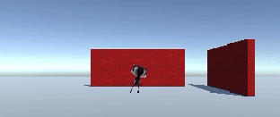

## Animación y posición de cámara

Su jugador se está moviendo, pero en este momento está atascado en una posición de T-pose. Puedes mejorar esto usando animaciones.

--- task ---

Selecciona el reproductor en la ventana Hierarchy.

Arrastra el animador **IdleWalk** desde la carpeta **Animación** > **Animadores** en la ventana de Proyecto a la propiedad Controller del componente Animador de tu personaje:

Esto agregará animaciones de Inactividad y Caminar a su personaje con un parámetro booleano `adelante` que puede usar para controlar qué animación se reproduce.

--- /task ---

--- task ---

**Prueba:** Ejecute su proyecto y asegúrese de que puede ver la animación inactiva:

--- /task ---

--- task ---

Agregue código al método `Actualizar` de su secuencia de comandos para que cuando el personaje se mueva hacia adelante use una animación para caminar, de lo contrario, use una animación inactiva:

--- code ---
---
language: cs filename: PlayerController.cs - Update() line_numbers: true line_number_start: 17
line_highlights: 21-31
---

    void Update()
    {
        float speed = Input.GetAxis("Vertical");
    
        //Set animations
        Animator anim = gameObject.GetComponent<Animator>();
    
        if (speed != 0) // Is moving
        {
            anim.SetBool("forward", true);
        }
        else // Idle
        {
            anim.SetBool("forward", false);
        }
    
        // Rotate around y-axis
        transform.Rotate(0, Input.GetAxis("Horizontal"), 0);
--- /code ---

--- /task ---

--- task ---

**Prueba:** Ejecute su proyecto y asegúrese de que puede ver el cambio de animación para caminar cuando avanza y pasar a inactivo cuando no avanza:

--- /task ---

En los juegos, la cámara suele seguir al jugador.

La ubicación de una **cámara virtual** en un entorno 3D es clave para crear la perspectiva adecuada para los usuarios. Los niveles de visibilidad de la lente de la cámara afectan el nivel de dificultad e influyen en la atmósfera de un juego. 

--- task ---

En la ventana Jerarquía, arrastre la **Cámara principal** al Objecto del Juego del jugador; se convertirá en un 'hijo' del Jugador y lo seguirá.

--- /task ---

--- task ---

**Prueba:** Juega tu proyecto. La cámara ahora seguirá a tu personaje, pero está un poco lejos y las paredes a menudo se interponen entre el jugador y la cámara.

--- /task ---

Puede ajustar la posición y la rotación de la cámara en la vista de escena o en la ventana de inspección.

--- task ---

Salga del modo de ejecución y seleccione la **Cámara principal** en la ventana Jerarquía. Ajuste su configuración de transformación para obtener una vista en tercera persona de su jugador, mirando hacia abajo desde atrás y por encima de su jugador:

Puede colocar la cámara en la vista de escena usando las herramientas Transformar y Rotar si lo prefiere:

--- /task ---

--- task ---

**Prueba:** Juega tu proyecto. La cámara ahora seguirá a tu personaje con la cámara justo detrás y encima de tu personaje y mirando hacia abajo en ángulo.

Ajuste la configuración de la cámara hasta que esté satisfecho con ellos.

**Sugerencia:** Puede probar la configuración en el modo Juego, pero debe salir del modo Juego y actualizar la configuración para mantenerla.

¿Qué sucede si te sales del borde del avión? No te preocupes, tu personaje volverá al centro la próxima vez que ingreses al modo de Juego:

--- /task ---

--- save ---
