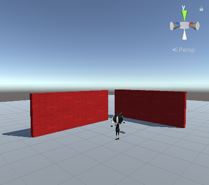

## You will make

Crée un monde en 3D dans Unity et explore-le avec un personnage joueur 3D animé.

Ce projet t'est présenté grâce au soutien généreux de [Unity Technologies](https://unity.com/){:target="_blank"}.  Ces [projets](https://projects.raspberrypi.org/en/pathways/unity-intro){:target="_blank"} proposent aux jeunes de faire leurs premiers pas dans la création de mondes virtuels en 3D temps réel.

**Unity** est un environnement de développement permettant de créer des jeux, des environnements virtuels, des romans visuels, des animations numériques, etc. Tu peux utiliser Unity pour développer des jeux multiplateformes 2D et 3D pour PC, consoles, appareils mobiles et Internet.

Tu vas :
+ Comprendre l'environnement Unity, y compris l'éditeur de scène
+ Ajouter des objets 3D avec des matériaux comme décor
+ Créer un personnage joueur avec des animations de déplacement

### Expérience précédente recommandée
Ce projet convient aux apprenants ayant déjà une expérience de codage, tels que [Scratch](https://projects.raspberrypi.org/en/pathways/scratch-intro){:target="_blank"} ou [Python](https://projects.raspberrypi.org/en/pathways/python-intro){:target="_blank"}, qui sont à l'aise avec la saisie de code textuel.

### Tu auras besoin de :
Ce projet nécessite l'éditeur Unity, qui peut être installé à partir de Unity Hub. Il s'agit d'un téléchargement et d'une installation volumineux, nous te recommandons donc de l'installer avant de commencer ce projet.

Tu peux suivre notre [guide Unity](https://projects.raspberrypi.org/en/projects/unity-guide){:target="_blank"} pour installer Unity Hub et l'éditeur Unity pour ton système d'exploitation.

Tu devras également télécharger le [package de démarrage Unity](https://rpf.io/p/en/explore-a-3d-world-go){:target="_blank"} d'assets avant de commencer.

Moving and looking around the 3D environment is much easier if you have an external mouse, rather than a trackpad.

If you don't have an external mouse right now don't worry, you can still complete this project with a trackpad.

--- no-print ---

--- task ---
### Play ▶️

**Click on the embedded project.** ⬇️ Navigate the 3D world using the WASD or arrow keys. What does the raccoon do when standing still? How do they move when walking? Can you walk through the walls?

<iframe allowtransparency="true" width="710" height="450" src="https://explore-a-3d-world-basic.rpfilt.repl.co" frameborder="0"></iframe>

--- /task ---

--- /no-print ---

--- print-only ---

--- /print-only ---
