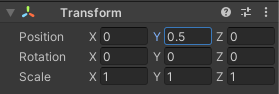

## Mise en place de la scène 3D

Ton monde 3D, ou « map », a besoin d'un sol et de murs. 

{:width="300px"}

Les gens passent plus de temps dans l'**environnements virtuels en ligne**. En plus de jouer à des jeux, les gens se détendent, explorent, socialisent, apprennent et participent à des divertissements interactifs. Certaines personnes appellent l'avenir de ces environnements le **métaverse**. Être capable de concevoir des mondes en 3D est une compétence importante.

Un projet Unity a besoin d'« Assets » graphiques et sonores.

--- task ---

Télécharge et décompresse le [package de démarrage Unity](https://rpf.io/p/en/explore-a-3d-world-go){:target="_blank"} sur ton ordinateur. Choisis un emplacement judicieux, tel que ton dossier Documents.

--- /task ---

--- task ---

Lance le Unity Hub et clique sur **Projects** puis sélectionne **New project** :

Dans la liste choisis **All templates** puis sélectionne **3D Core** :

Modifie les paramètres du projet pour donner à ton projet un nom approprié et enregistre-le dans un emplacement approprié. Clique ensuite sur **Create project** :

Ton nouveau projet s'ouvrira dans l'éditeur Unity. Le chargement peut prendre un certain temps.

--- /task ---

L'éditeur Unity ressemble à ceci :

--- collapse ---

---
title: Les fenêtres et les vues de l'éditeur Unity
---

1. **Le menu Unity** est utilisé pour importer, ouvrir et enregistrer des scènes et des projets. Tu peux modifier les préférences de ton éditeur Unity et ajouter de nouveaux GameObjects et composants.

2. **La barre d'outils** contient des outils permettant de naviguer dans la vue Scene, de contrôler le joueur dans la vue Game et de personnaliser la disposition de ton éditeur Unity.

3. **La vue Scene** est utilisée pour naviguer et éditer ta scène. Tu peux sélectionner et positionner des GameObjects, y compris des personnages, des décors, des caméras et des lumières.

4. **La vue Game** est accessible en cliquant sur l'onglet **Game**. Elle montre la scène telle qu'elle apparaît à travers l'objectif de tes caméras. Lorsque tu cliques sur le bouton **Play** pour entrer en mode Play, la vue Game simule ta scène telle qu'elle serait vue par un utilisateur.

5. **La fenêtre Hierarchy** affiche tous les GameObjects de ta scène et la structure entre eux. Ici, tu peux ajouter et parcourir les GameObjects dans ton projet. Les GameObjects peuvent avoir des « objets enfants » qui se déplacent avec eux.

6. **La fenêtre Project** affiche une bibliothèque de tous les fichiers inclus dans ton projet. Tu peux trouver les assets que tu souhaites utiliser ici.

7. **La fenêtre Console** est accessible en cliquant sur l'onglet **Console**. Elle affiche des messages importants. C'est là que tu peux voir les erreurs du compilateur (erreurs dans ton script) et les messages que tu imprimes en utilisant `Debug.Log()`.

8. **La fenêtre Inspector** te permet de visualiser et de modifier les propriétés des GameObjects. Tu peux ajouter d'autres composants à tes GameObjects et modifier les valeurs qu'ils utilisent.

--- /collapse ---

--- task ---

Le package de démarrage Unity que tu as téléchargé contient un certain nombre d'assets que tu peux utiliser dans ton projet.

Pour les importer dans ton nouveau projet, clique sur le menu **Assets** et sélectionne **Import package** > **Custom Package...** puis accède au **package de démarrage Unity** téléchargé.

--- /task ---

[[[unity-importing-a-package]]]

--- task ---

La **fenêtre Project** est l'endroit où tu peux voir tous les fichiers inclus dans ton projet. Clique sur le dossier **Models** dans le dossier Assets pour voir les modèles que tu as importés.

--- /task ---

Dans Unity, une **Scène** contient des GameObjects. Un projet Unity avec plusieurs niveaux de jeu peut avoir une scène par niveau.

--- task ---

Fais un clic droit sur **SampleScene** dans la hiérarchie et choisis **Save Scene As**.

Dans la fenêtre pop-up, nomme ta scène `Monde 3D` :

Un nouveau fichier apparaîtra dans le dossier Assets de la fenêtre Project :

--- /task ---

D'abord, ton monde a besoin d'un terrain.

--- task ---

Fais un clic droit sur ta scène (nom Monde 3D) dans la fenêtre Hierarchy et choisis **GameObject** > **3D Object** > **Plane** :

Cela créera un terrain pour ton monde.

La taille par défaut du plane est de 10 m × 10 m. Unity utilise les mètres comme unité de mesure.

--- /task ---

Le **matériau** d'un GameObject contrôle son apparence. Donne au plane un matériau de couleur différente.

--- task ---

Dans la fenêtre Project, fais un clic droit sur le dossier **Materials** et choisis **Create** > **Material**.

Un nouveau matériau devrait apparaître dans le dossier Materials. Décide de la couleur que tu utiliseras pour ton sol et nomme ton nouveau matériau :

Clique sur la couleur à côté de « Albedo » dans la fenêtre Inspector et choisis une couleur pour ton matériau (nous avons utilisé le gris) :

Fais glisser ton nouveau matériau de la fenêtre Project vers ton plane dans la vue Scene :

--- /task ---

Tu peux créer des objets à partir de formes 3D.

--- task ---

Fais un clic droit sur ta scène **3D World** dans la fenêtre Hierarchy et choisis **GameObject** > **3D Object** > **Cube**.

Cela créera un cube au centre de la scène, à (0, 0, 0).

--- /task ---

Tu peux voir le cube dans la vue Scene. C'est la vue des coulisses de ton jeu où tu mets tout en place.

**Astuce :** Clique sur l'onglet **Scene** pour t'assurer que tu peux voir la vue Scene.

--- task ---

Clique sur le cube dans la vue Scene ou la fenêtre Hierarchy pour le sélectionner.

Utilise <kbd>Maj</kbd>+<kbd>F</kbd> (maintiens la touche <kbd>Maj</kbd> enfoncée et appuie sur <kbd>F</kbd>) pour centrer la vue sur le cube.

Tu peux également utiliser la molette de défilement de la souris ou les touches fléchées haut et bas pour effectuer un zoom avant et arrière :

--- /task ---

Tu dois poser le cube sur le plane.

--- task ---

Clique sur le cube dans la vue Scene ou la fenêtre Hierarchy pour le sélectionner.

**Choisis**   
Tu peux soit :

+ Modifier la position y dans la fenêtre Inspector sur 0.5 (la moitié de la hauteur du cube) :

+ Utiliser l'outil Move pour faire glisser la flèche verte vers le haut jusqu'à ce que le cube se pose sur le plane :

--- /task ---

**Astuce :** Si tu fais une erreur dans l'éditeur Unity, tu peux utiliser <kbd>Ctrl</kbd>+<kbd>Z</kbd> (ou <kbd>Cmd</kbd>+<kbd>Z</kbd>) pour **annuler** ta dernière action.

--- task ---

Transforme maintenant le cube en mur avec les paramètres de position et d'échelle suivants :

{:width="400px"}

Tu peux soit entrer les valeurs dans le composant Transform pour le cube, soit cliquer sur l'outil Scale et faire glisser les poignées dans la vue Scene (cela mettra à jour les valeurs de transformation.)

Fais un zoom arrière pour voir ton mur :

--- /task ---

Un matériau peut avoir une couleur et une texture et il existe de nombreuses propriétés que tu peux ajuster pour obtenir différents effets. Une **texture** est une image 2D qui peut être créée dans un éditeur d'images.

--- task ---

Dans la fenêtre Project, fais un clic droit sur le dossier **Materials** et choisis **Create** > **Material**. Tu vas créer un mur de briques colorées. Donne un nom descriptif au matériau :

Clique sur la couleur à côté de « Albedo » dans la fenêtre Inspector et choisis une couleur pour ton matériau :

Ajoute une texture en cliquant sur le cercle à gauche de « Albedo » et en sélectionnant la texture **BrickWallAlbedo** dans la liste :

Fais glisser ton nouveau matériau de la fenêtre Project vers ton mur dans la vue Scene :

--- /task ---

--- task ---

Dans la fenêtre Inspector, fais un clic droit sur ton cube, choisis **Rename** dans le menu et renomme ton objet de `Cube` à `Wall` :

**Astuce :** Tu peux nommer un nouveau GameObject dans la fenêtre Hierarchy lorsque tu le crées et tu peux modifier le nom dans la fenêtre Inspector.

--- /task ---

--- task ---

Pour créer une copie de ton mur, tu peux soit :
+ Faire un clic droit sur ton objet Mur dans la fenêtre Hierarchy et choisir **Duplicate**
+ Sélectionner ton mur dans la vue Scene et utiliser <kbd>Ctrl</kbd>+<kbd>D</kbd> (ou <kbd>Cmd</kbd>+<kbd>D</kbd>) pour dupliquer

Ton nouveau mur sera exactement au même endroit que ton premier mur.

--- /task ---

--- task ---

Change la rotation y du nouveau mur en `90` :

--- /task ---

--- task ---

Repositionne le nouveau mur à la position suivante : x = 4, y = 1, z = -1.

Tu peux soit entrer les valeurs dans la fenêtre Inspector, soit faire glisser les flèches dans ta scène, peu importe si la position est exacte.

Ta scène devrait ressembler à ceci :

--- /task ---

--- task ---

Clique sur ton plane. Modifie les paramètres Scale sur le plane pour l'agrandir afin d'avoir plus d'espace :

Considère un plane de 4×4 comme 40 mètres sur 40 mètres dans le monde réel : beaucoup d'espace pour que ton personnage puisse se déplacer.

--- /task ---

--- task ---

Lorsque tu as des modifications non enregistrées, tu verras un "*" à côté de ta scène dans la fenêtre Hierarchy.

Enregistre ta scène en cliquant sur **File** > **Save**. Ou utilise <kbd>Ctrl</kbd>+<kbd>S</kbd>.

Enregistre également ton projet en cliquant sur **File** > **Save Project**.

Normalement, Unity n'enregistre pas automatiquement les modifications, mais ton projet de démarrage contient un script pour enregistrer automatiquement ton projet toutes les 60 secondes.

--- /task ---

Tu peux te déplacer dans ta scène pour la voir sous différents angles. Si tu te perds, clique simplement sur un mur dans la fenêtre Hierarchy, puis utilise <kbd>Maj</kbd>+<kbd>F</kbd> pour centrer la vue, puis fais un zoom arrière :

[[[unity-scene-navigation]]]

N'oublie pas que si tu te déplaces, tu regarderas ta scène sous un angle différent, de sorte que ta vue ne sera pas exactement la même que nos exemples.

--- save ---
