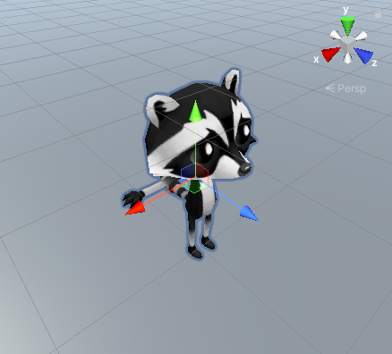
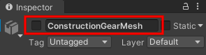

## Ajouter un personnage joueur

Le joueur dans ton monde sera un personnage de chat ou de raton laveur. 

{:width="300px"}

--- task ---

Clique sur le dossier **Models** dans la fenêtre Project. Un modèle décrit à quoi ressemble un objet 3D et peut être créé à l'aide d'outils de modélisation 3D tels que Blender. Nous avons inclus quelques modèles que tu peux utiliser.

Choisis le modèle `Cat` ou `Raccoon` et fais-le glisser de la fenêtre Project vers la vue Scene :

**Astuce :** Si tu as accidentellement ajouté des modèles « CatBase » ou « RaccoonBase », ou si tu souhaites modifier ton personnage à ce stade, tu peux supprimer le modèle de la scène. Fais un clic droit sur le modèle GameObject dans la fenêtre Hierarchy et sélectionne « Delete ».

--- /task ---

Ton personnage apparaîtra dans la vue Scene dans une pose en T.

La **pose en T** est la position par défaut d'un personnage de jeu avant qu'il ne soit animé.

--- task ---

Clique sur ton personnage dans la vue Scene et appuie sur la touche <kbd>F</kbd>.

**Astuce :** Si tu te perds dans la vue Scene, tu peux cliquer sur ton personnage (ou un autre GameObject) dans la fenêtre Hierarchy, puis clique sur <kbd>Maj</kbd>+<kbd>F</kbd> pour centrer la vue sur ton personnage dans la vue Scene.

--- /task ---

Hmm, ton personnage porte plusieurs accessoires.

--- task ---

Clique sur ton personnage dans la fenêtre Hierarchy. Cela ouvrira les paramètres du GameObject dans la fenêtre Inspector.

Clique sur la flèche à côté de ton personnage dans la fenêtre Hierarchy pour voir les « objets enfants ». Clique sur **ConstructionGearMesh** et décoche la case à côté de son nom dans la fenêtre Inspector. Cela cachera le casque et le gilet fluorescent :

Cache les autres accessoires de ton personnage de la même manière, ou gardes-en un actif.

**Astuce :** Les GameObjects qui ne sont pas actifs apparaissent grisés dans la fenêtre Hierarchy :

--- /task ---

--- task ---

Le joueur verra le jeu à travers la « Main Camera » (caméra principale), qui s'affiche sous la forme d'une icône de caméra vidéo dans la scène. Sélectionne la caméra dans la fenêtre Hierarchy pour afficher la vue de la caméra intégrée :

--- /task ---

La vue Game montre à quoi ressemblera ton projet pour un joueur.

--- task ---

Clique sur l'onglet vue Game. Ton personnage sera dans la position dans laquelle tu l'as fait glisser dans la vue Scene (tu ne pourras peut-être pas le voir).

--- /task ---

Si tu as suffisamment de place sur ton écran, il est alors très utile de voir la vue Scene et la vue Game en même temps.

--- task ---

Fais glisser l'onglet de la vue Game vers la droite pour qu'il apparaisse à côté de la vue Scene :

--- /task ---

Unity utilise les coordonnées x, y et z pour positionner les GameObjects dans l'espace 3D :

[[[unity-3D-coordinates]]]

--- task ---

Sélectionne ton personnage (dans la fenêtre Hierarchy ou la vue Scene), puis modifie ses paramètres de « Transform » pour que la « Position » soit (0, 0, 0) - le centre du monde :

Ton personnage se déplacera au centre de la vue Scene et de la vue Game :

--- /task ---

--- task ---

Renomme ton personnage en « Joueur » dans la fenêtre Inspector. Cela facilitera la recherche si tu ajoutes plus de GameObjects.

--- /task ---

--- save ---
