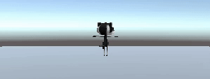
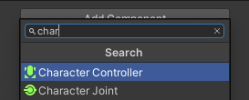
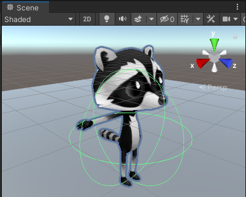
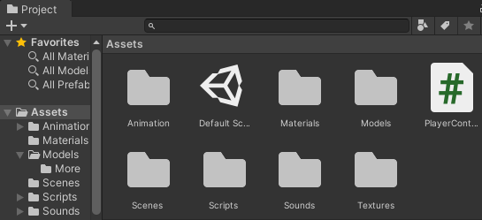
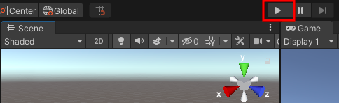
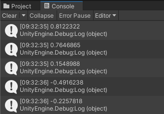
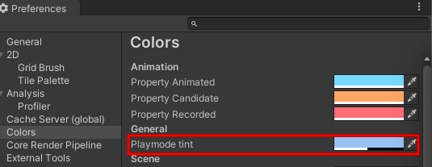
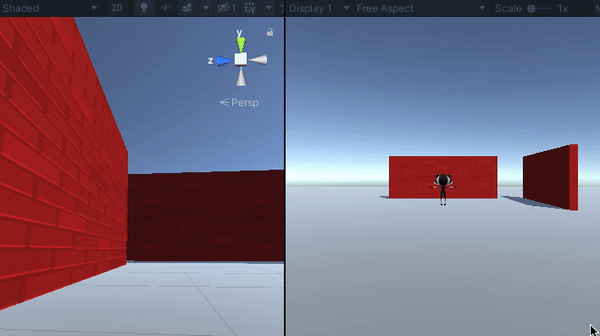

## Ajouter un mouvement de personnage

<div style="display: flex; flex-wrap: wrap">
<div style="flex-basis: 200px; flex-grow: 1; margin-right: 15px;">
Ton joueur se déplacera avec les touches WASD (clavier QWERTY) ou fléchées. 
</div>
<div>
{:width="300px"}
</div>
</div>

<p style="border-left: solid; border-width:10px; border-color: #0faeb0; background-color: aliceblue; padding: 10px;">
Unity utilise le langage de programmation <span style="color: #0faeb0">**C#**</span> (prononcé C sharp), qui est utilisé par les développeurs de logiciels professionnels. C# est un langage orienté objet avec des **classes** qui définissent le comportement d'objets similaires et des **méthodes**, qui sont des fonctions appartenant à une classe. Dans Unity, un **script** définit une classe avec des variables et des méthodes. Tu peux ajouter le même script à plusieurs GameObjects s'ils ont besoin des mêmes fonctionnalités.</p>

--- task ---

Clique sur le GameObject **Joueur** dans la fenêtre Hierarchy ou la vue Scene pour voir ses propriétés dans la fenêtre Inspector.

{:width="300px"}

**Astuce :** Assure-toi d'avoir sélectionné le **Joueur** et non l'un de ses objets enfants.

Clique sur **Add Component** et commence à taper `character` dans la zone de recherche, puis clique sur le composant **Character Controller** lorsqu'il apparaît :



--- /task ---

Le composant Character Controller ajoute de nouvelles fonctionnalités à ton GameObject Joueur, notamment une méthode `SimpleMove` et un **collider**. Les colliders peuvent être utilisés pour empêcher ton personnage de traverser des objets solides et pour détecter les collisions.

<p style="border-left: solid; border-width:10px; border-color: #0faeb0; background-color: aliceblue; padding: 10px;">
 Un <span style="color: #0faeb0">**collider**</span> est une forme qui est utilisée pour détecter quand un objet de jeu entre en collision, ou en intersection, avec un autre objet de jeu. Il est beaucoup plus rapide pour un ordinateur de vérifier les collisions avec une forme de collision simple que la forme complexe d'un GameObject. Une **hitbox** est une sorte de collider. </p>

--- task ---

Le collider du Character Controller a une hauteur de `2` et un centre à `0, 0, 0` ; cela signifie qu'il est positionné à moitié au-dessus et à moitié au-dessous du plane :

{:width="300px"}

Ton personnage a une hauteur de `1`, ce qui signifie que son centre sur l'axe y est à `0.5`. Modifie la valeur au centre de l'axe y du Character Controller en `0.5` et la hauteur en `1` pour correspondre au personnage :

{:width="400px"}

{:width="300px"}

--- /task ---

Ton personnage a besoin d'un script pour que le joueur puisse le déplacer. Tu auras besoin d'un éditeur de code installé sur ton ordinateur pour modifier ce script.

[[[unity-visual-studio]]]

--- task ---

Rends-toi à la fenêtre Inspector du joueur et clique sur le bouton **Add Component**. Tape `script` et sélectionne **New Script**. Nomme ton nouveau script `ContrôleurJoueur`, puis appuie sur <kbd>Entrée</kbd>.

Le nouveau script sera enregistré dans le dossier Assets :

{:width="400px"}

--- /task ---

--- task ---

Double-clique sur **ContrôleurJoueur** dans le composant de script de la fenêtre Inspector. Le script s'ouvrira dans un éditeur de code séparé et aura ce code :

--- code ---
---
language: cs filename: PlayerController.cs line_numbers: true line_number_start:
line_highlights:
---
using System.Collections; using System.Collections.Generic; using UnityEngine;

public class PlayerController : MonoBehaviour
{ // Start is called before the first frame update void Start()
    {

    }
    
    // Update is called once per frame
    void Update()
    {
    
    }
} --- /code ---

**Débogage :** Vérifie que le nom après « class » est `ContrôlleurJoueur` et qu'il correspond au nom de ton fichier de script : si tu renommes le fichier après l'avoir créé, tu devras alors changer le nom de la classe dans le script.

--- /task ---

La méthode Start est appelée une fois lorsque tu joues ta scène. Ajoute du code pour imprimer le message `Le joueur commence` lorsque ton projet démarre.

--- task ---

Utilise la méthode `Debug.Log()` pour imprimer un message lorsque la méthode `Start` est appelée pour le GameObject Joueur. Le message apparaîtra dans la barre en bas de l'éditeur Unity et dans la fenêtre Console :

--- code ---
---
language: cs filename: PlayerController.cs - Start() line_numbers: true line_number_start: 7
line_highlights: 10
---

    // Start is called before the first frame update
    void Start()
    {
        Debug.Log("Player started");        
    }
--- /code ---

**Astuce :** Les lignes commençant par // sont des commentaires qui expliquent le code. Tu n'as pas besoin de les taper.

**Enregistre** ton script ContrôleurJoueur dans ton éditeur de code, en utilisant <kbd>Ctrl</kbd>+<kbd>S</kbd> (ou <kbd>Cmd</kbd>+<kbd>S</kbd>), puis reviens dans l'éditeur Unity. L'éditeur Unity chargera ton script pour qu'il soit prêt à être exécuté ; cela peut prendre quelques secondes.

--- /task ---

--- task ---

Clique sur l'onglet de la fenêtre Console pour la mettre en avant :

{:width="400px"}

--- /task ---

--- task ---

**Test :** Va dans la barre d'outils et clique une fois sur le bouton **Play** pour mettre ta scène en mode Play. Cela simulera ta scène telle qu'elle serait vue et utilisée par un utilisateur :

{:width="400px"}

Unity prend quelques secondes pour démarrer, ensuite tu devrais voir la sortie `Debug.Log()` « Le joueur a commencé » dans la console.


**Débogage :** Ta scène ne sera pas lue s'il y a des erreurs dans ton code. Consulte la fenêtre Console pour plus d'informations. Tu peux voir :
+ `; expected` – vérifie s'il y a un point-virgule `;` à la fin de chaque ligne de code.
+ `Newline in constant` - tu as oublié un guillemet `"` à la fin d'une chaîne de texte.
+ `} expected` – tu dois avoir une paire d'accolades ouvrantes et fermantes `{}` autour de chaque méthode et autour de la classe. Vérifie que tes accolades correspondent.
+ `) expected` - assure-toi qu'il y a une `)` fermante à la fin de chaque appel de méthode, avant le point-virgule.
+ `Debug` does not contain a definition for 'log' – C# est sensible à la casse, il doit donc être `Log` avec un `L`majuscule.

Compare ton code avec celui de l'exemple et assure-toi que tout est exactement identique.

--- /task ---

--- task ---

Clique à nouveau une fois sur le bouton **Play** pour quitter le mode Play et la sortie de débogage s'arrêtera.

**Astuce :** Les modifications apportées en mode Play sont perdues lorsque tu quittes le mode Play. Assure-toi de quitter le mode Play lorsque tu as terminé les tests.

--- /task ---

Unity crée l'effet de mouvement en dessinant rapidement des images à l'écran. Chaque image est une **frame**. La méthode `Update` est appelée une fois par frame.

--- task ---

Tu pourras utiliser les touches WASD (clavier QWERTY) ou fléchées (les joueurs sur mobile ou console peuvent utiliser différentes entrées sans que tu changes de code.)

`Input.GetAxis("Vertical")` prend l'entrée des touches <kbd>W</kbd> et <kbd>S</kbd> ou des touches fléchées haut et bas, et renvoie un nombre entre 1 et -1, qu'il utilise pour le mouvement vers l'avant et vers l'arrière.

--- code ---
---
language: cs filename: PlayerController.cs - Update() line_numbers: true line_number_start: 14
line_highlights: 16-21
---

    void Update()
    {
        float speed = Input.GetAxis("Vertical");
    
        if (speed != 0) // Player moving
        {
            Debug.Log(speed);
        }
    }
--- /code ---

Un `float` est un nombre décimal.

**Enregistre** ton script ContrôleurJoueur dans ton éditeur de code, en utilisant <kbd>Ctrl</kbd>+<kbd>S</kbd> (ou <kbd>Cmd</kbd>+<kbd>S</kbd>), puis reviens dans l'éditeur Unity.

**Astuce :** Tu trouveras peut-être plus rapide d'utiliser <kbd>Alt</kbd>+<kbd>Tab</kbd> (ou <kbd>Cmd</kbd>+<kbd>Tab</kbd>) pour basculer entre ton navigateur Web avec les instructions du projet, l'éditeur Unity et ton éditeur de code.

--- /task ---

--- task ---

**Test :** Va dans la barre d'outils et clique une fois sur le bouton **Play** pour mettre ta scène en mode Play.

Place le **pointeur de ta souris dans la vue Game** et appuie sur les touches <kbd>Z</kbd> et <kbd>S</kbd>. Regarde les valeurs enregistrées dans la fenêtre Console lorsque tu appuies sur les touches. Chaque fois que tu appuies sur <kbd>Z</kbd>, un nombre positif est enregistré, lorsque tu appuies sur <kbd>S</kbd>, un nombre négatif est enregistré.

Les nombres sont compris entre -1,0 et 1,0 et correspondent au mouvement des commandes verticales du clavier (ou d'une manette de jeu). Tu peux également utiliser les touches fléchées haut et bas.



**Astuce :** La sortie apparaît également dans la barre en bas de l'éditeur Unity.

Clique à nouveau sur le bouton **Play** pour quitter le mode Play et la sortie de débogage s'arrêtera.

--- /task ---

Il est facile d'oublier si ton jeu est en cours ou non. Une couleur en mode Play permet de savoir plus facilement quand ta scène est en cours de lecture :


--- task ---

Pour définir une couleur, va dans le menu **Edit** (ou Menu Unity) et sélectionne **Preferences**. Choisis le menu **Couleurs** et trouve la propriété appelée **Playmode tint**.

Clique sur la couleur existante pour voir une roue chromatique où tu peux choisir une couleur et un niveau d'opacité :

{:width="400px"}

**Astuce :** Essaie une couleur claire afin que tu puisses toujours voir clairement le texte dans l'éditeur lorsque la scène est en cours d'exécution.

Reviens à l'éditeur Unity et appuie sur le bouton **Play** pour voir ta nouvelle couleur en action. Lorsque tu es satisfait de ta couleur, appuie à nouveau sur la touche **Play** pour quitter le mode Play.

--- /task ---

Le composant Character Controller fournit une méthode `SimpleMove`.

--- task ---

**Ajoute** le code pour utiliser la valeur d'entrée verticale pour déplacer le joueur à chaque frame.

Tu peux **supprimer** le code de débogage.

Un Unity `Vector3` est utilisé pour stocker des points ou des directions 3D. La variable `forward` stocke la direction dans laquelle le joueur fait face :

--- code ---
---
language: cs filename: PlayerController.cs - Update() line_numbers: true line_number_start: 14
line_highlights: 18-23
---

    void Update()
    {
        float speed = Input.GetAxis("Vertical");
    
        // Forward is the forward direction for this character
        Vector3 forward = transform.TransformDirection(Vector3.forward);
    
        // You need the Character Controller so you can use SimpleMove
        CharacterController controller = GetComponent<CharacterController>();
        controller.SimpleMove(forward * speed);
    }
--- /code ---

--- /task ---

--- task ---

**Test :** Clique sur **Play** pour entrer en mode Play et essaie ton code. Utilise les touches <kbd>W</kbd> et <kbd>S</kbd> ou les touches fléchées haut et bas pour glisser vers l'avant et vers l'arrière.

**Débogage :** N'oublie pas de consulter la fenêtre Console pour les messages utiles. Vérifie bien les parenthèses, les points-virgules et les majuscules dans ton code.

**Astuce :** Assure-toi que le pointeur de ta souris est dans la **vue Game**.

Essaie de traverser le mur. La méthode `SimpleMove` du composant Character Controller t'empêche de traverser les GameObjects qui ont un collider. Un collider est automatiquement ajouté lorsque tu crées une forme 3D comme tu l'as fait pour le mur.

Tu peux effectuer un déplacement latéral dans la vue Scene en maintenant le bouton droit de la souris enfoncé et en le faisant glisser. Effectue un déplacement latéral pour avoir une meilleure vue du mur lorsque ton personnage y entre :

{:width="500px"}

Pour déplacer ton joueur, déplace le pointeur de la souris vers la **vue Game**.

Clique à nouveau sur le bouton **Play** pour quitter le mode Play.

--- /task ---

--- task ---

Ajoute une autre ligne pour que ton personnage puisse faire une `Rotation` lorsque le joueur appuie sur les touches <kbd>A</kbd> et <kbd>D</kbd> ou les touches fléchées gauche et droite :

--- code ---
---
language: cs filename: PlayerController.cs - Update() line_numbers: true line_number_start: 14
line_highlights: 18-19
---

    void Update()
    {
        float speed = Input.GetAxis("Vertical");
    
        // Rotate around y-axis
        transform.Rotate(0, Input.GetAxis("Horizontal"), 0);
    
        // Forward is the forward direction for this character
        Vector3 forward = transform.TransformDirection(Vector3.forward);
    
        // You need the Character Controller so you can use SimpleMove
        CharacterController controller = GetComponent<CharacterController>();
        controller.SimpleMove(forward * speed);
    }
--- /code ---

Enregistre ton code et reviens à l'éditeur Unity. Unity chargera ton script mis à jour.

--- /task ---

--- task ---

**Test :** Clique sur **Play** pour entrer en mode Play et essaie ton code. Utilise les touches <kbd>A</kbd> et <kbd>D</kbd> ou les touches fléchées gauche et droite pour faire une rotation.

**Débogage :** Si tu vois toujours la sortie vers la console et que le mouvement ne fonctionne pas, assure-toi d'avoir enregistré ton script dans l'éditeur de code.

Clique à nouveau sur le bouton **Play** pour quitter le mode Play.

--- /task ---

Tu peux également contrôler la vitesse de déplacement et de rotation.

--- task ---

Ouvre ton script ContrôleurJoueur et ajoute des variables pour les `Vitessedéplacement` et `Vitesserotation`.

--- code ---
---
language: cs filename: PlayerController.cs line_numbers: true line_number_start: 5
line_highlights: 7-8
---
public class PlayerController : MonoBehaviour
{ public float moveSpeed = 4.0f; //The f at the end of the number says it is a floating-point number public float rotateSpeed = 1.5f;

    // Start is called before the first frame update
    void Start()
    {
--- /code ---

--- /task ---

--- task ---

Mets à jour le code pour faire un `Rotate` et `SimpleMove` sur ton personnage pour les multiplier par les nouvelles variables :

--- code ---
---
language: cs filename: PlayerController.cs - Update() line_numbers: true line_number_start: 21
line_highlights: 22
---

        // Rotate around y-axis
        transform.Rotate(0, Input.GetAxis("Horizontal") * rotateSpeed, 0);
--- /code ---

and

--- code ---
---
language: cs filename: PlayerController.cs - Update() line_numbers: true line_number_start: 27
line_highlights: 29
---

        // You need the Character Controller so you can use SimpleMove
        CharacterController controller = GetComponent<CharacterController>();
        controller.SimpleMove(forward * speed * moveSpeed);
--- /code ---

--- /task ---

--- task ---

**Test :** Joue ta scène et vérifie si tu es satisfait des paramètres de vitesse.

Modifie `Vitessedéplacement` et `Vitesserotation` dans ton script jusqu'à ce que tu sois satisfait.

**Astuce :** Tu peux masquer les lignes `Debug.Log()` en mettant `//` au début de la ligne. Tu peux également masquer plusieurs lignes en utilisant `/*` et `*/` :
```
        /*if (speed != 0) // Player moving
        {
            Debug.Log(speed);
        }*/
```

Clique à nouveau sur le bouton **Play** pour quitter le mode Play.

--- /task ---

--- save ---
