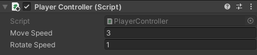

## Ajouter un mouvement de personnage

<div style="display: flex; flex-wrap: wrap">
<div style="flex-basis: 200px; flex-grow: 1; margin-right: 15px;">
Ton joueur se déplacera avec les touches WASD (clavier QWERTY) ou fléchées. 
</div>
<div>
{:width="300px"}
</div>
</div>

<p style="border-left: solid; border-width:10px; border-color: #0faeb0; background-color: aliceblue; padding: 10px;">
Unity utilise le langage de programmation <span style="color: #0faeb0">**C#**</span> (prononcé C sharp), qui est utilisé par les développeurs de logiciels professionnels. C# est un langage orienté objet avec des **classes** qui définissent le comportement d'objets similaires et des **méthodes**, qui sont des fonctions appartenant à une classe. Dans Unity, un **script** définit une classe avec des variables et des méthodes. Tu peux ajouter le même script à plusieurs GameObjects s'ils ont besoin des mêmes fonctionnalités.</p>

--- task ---

Clique sur le GameObject **Joueur** dans la fenêtre Hierarchy ou la vue Scene pour voir ses propriétés dans la fenêtre Inspector.

{:width="300px"}

**Astuce :** Assure-toi d'avoir sélectionné le **Joueur** et non l'un de ses objets enfants.

Clique sur **Add Component** et commence à taper `character` dans la zone de recherche, puis clique sur le composant **Character Controller** lorsqu'il apparaît :


--- /task ---

Le composant Character Controller ajoute de nouvelles fonctionnalités à ton GameObject Joueur, notamment une méthode `SimpleMove` et un **collider**. Les colliders peuvent être utilisés pour empêcher ton personnage de traverser des objets solides et pour détecter les collisions.

<p style="border-left: solid; border-width:10px; border-color: #0faeb0; background-color: aliceblue; padding: 10px;">
 Un <span style="color: #0faeb0">**collider**</span> est une forme qui est utilisée pour détecter quand un objet de jeu entre en collision, ou en intersection, avec un autre objet de jeu. Il est beaucoup plus rapide pour un ordinateur de vérifier les collisions avec une forme de collision simple que la forme complexe d'un GameObject. Une **hitbox** est une sorte de collider. </p>

--- task ---

Le collider du Character Controller a une hauteur de `2` et un centre à `0, 0, 0` ; cela signifie qu'il est positionné à moitié au-dessus et à moitié au-dessous du plane :

{:width="300px"}

Ton personnage a une hauteur de `1`, ce qui signifie que son centre sur l'axe y est à `0.5`. Modifie la valeur au centre de l'axe y du Character Controller en `0.5` et la hauteur en `1` pour correspondre au personnage :

{:width="400px"}

{:width="300px"}

--- /task ---

Ton personnage a besoin d'un script pour que le joueur puisse le déplacer. Tu auras besoin d'un éditeur de code installé sur ton ordinateur pour modifier ce script.

[[[unity-visual-studio-code]]]

--- task ---

Rends-toi à la fenêtre Inspector du joueur et clique sur le bouton **Add Component**. Tape `script` et sélectionne **New Script**. Nomme ton nouveau script `ContrôleurJoueur`, puis appuie sur <kbd>Entrée</kbd>.

Le nouveau script sera enregistré dans le dossier Assets :

{:width="400px"}

--- /task ---

--- task ---

Double-clique sur **ContrôleurJoueur** dans le composant de script de la fenêtre Inspector. Le script s'ouvrira dans un éditeur de code séparé et aura ce code :

--- code ---
---
language: cs filename: PlayerController.cs line_numbers: true line_number_start:
line_highlights:
---
using System.Collections; using System.Collections.Generic; using UnityEngine;

public class PlayerController : MonoBehaviour
{ // Start is called before the first frame update void Start()
    {

    }
    
    // Update is called once per frame
    void Update()
    {
    
    }
} --- /code ---

**Débogage :** Vérifie que le nom après « class » est `ContrôlleurJoueur` et qu'il correspond au nom de ton fichier de script : si tu renommes le fichier après l'avoir créé, tu devras alors changer le nom de la classe dans le script.

--- /task ---

La méthode Start est appelée une fois lorsque tu joues ta scène. Ajoute du code pour imprimer le message `Le joueur commence` lorsque ton projet démarre.

--- task ---

Utilise la méthode `Debug.Log()` pour imprimer un message lorsque la méthode `Start` est appelée pour le GameObject Joueur. Le message apparaîtra dans la barre en bas de l'éditeur Unity et dans la fenêtre Console :

--- code ---
---
language: cs filename: PlayerController.cs - Start() line_numbers: true line_number_start: 7
line_highlights: 10
---

    // Start is called before the first frame update
    void Start()
    {
        Debug.Log("Player started");        
    }
--- /code ---

**Astuce :** Les lignes commençant par // sont des commentaires qui expliquent le code. Tu n'as pas besoin de les taper.

**Enregistre** ton script ContrôleurJoueur dans ton éditeur de code, en utilisant <kbd>Ctrl</kbd>+<kbd>S</kbd> (ou <kbd>Cmd</kbd>+<kbd>S</kbd>), puis reviens dans l'éditeur Unity. L'éditeur Unity chargera ton script pour qu'il soit prêt à être exécuté ; cela peut prendre quelques secondes.

--- /task ---

--- task ---

Clique sur l'onglet de la fenêtre Console pour la mettre en avant :

{:width="400px"}

--- /task ---

--- task ---

**Test :** Va dans la barre d'outils et clique une fois sur le bouton **Play** pour mettre ta scène en mode Play. Cela simulera ta scène telle qu'elle serait vue et utilisée par un utilisateur :

{:width="400px"}

Unity prend quelques secondes pour démarrer, ensuite tu devrais voir la sortie `Debug.Log()` « Le joueur a commencé » dans la console.


**Débogage :** Ta scène ne sera pas lue s'il y a des erreurs dans ton code. Consulte la fenêtre Console pour plus d'informations. Tu peux voir :
+ `; expected` – vérifie s'il y a un point-virgule `;` à la fin de chaque ligne de code.
+ `Newline in constant` - tu as oublié un guillemet `"` à la fin d'une chaîne de texte.
+ `} expected` – tu dois avoir une paire d'accolades ouvrantes et fermantes `{}` autour de chaque méthode et autour de la classe. Vérifie que tes accolades correspondent.
+ `) expected` - assure-toi qu'il y a une `)` fermante à la fin de chaque appel de méthode, avant le point-virgule.
+ `Debug` does not contain a definition for 'log' – C# est sensible à la casse, il doit donc être `Log` avec un `L`majuscule.

Compare ton code avec celui de l'exemple et assure-toi que tout est exactement identique.

--- /task ---

--- task ---

Clique à nouveau une fois sur le bouton **Play** pour quitter le mode Play et la sortie de débogage s'arrêtera.

**Astuce :** Les modifications apportées en mode Play sont perdues lorsque tu quittes le mode Play. Assure-toi de quitter le mode Play lorsque tu as terminé les tests.

--- /task ---

Unity crée l'effet de mouvement en dessinant rapidement des images à l'écran. Chaque image est une **frame**. La méthode `Update` est appelée une fois par frame.

--- task ---

Switch to your code editor.

You will be able to use the WASD or arrow keys (players on a mobile or console can use different inputs without you changing your code.)

`Input.GetAxis("Vertical")` takes input from the <kbd>W</kbd> and <kbd>S</kbd> keys or the up and down arrow keys, and returns a number between 1 and -1, which it uses for forwards and backwards movement.

--- code ---
---
language: cs filename: PlayerController.cs - Update() line_numbers: true line_number_start: 14
line_highlights: 16-21
---

    void Update()
    {
        float speed = Input.GetAxis("Vertical");
    
        if (speed != 0) // Player moving
        {
            Debug.Log(speed);
        }
    }
--- /code ---

A `float` is a decimal number.

**Save** your PlayerController script in your code editor, using <kbd>Ctrl</kbd>+<kbd>S</kbd> (or <kbd>Cmd</kbd>+<kbd>S</kbd>), then return to the Unity Editor.

**Tip:** You might find it quicker to use <kbd>Alt</kbd>+<kbd>Tab</kbd> (or <kbd>Cmd</kbd>+<kbd>Tab</kbd>) to switch between your web browser with the project instructions, the Unity Editor, and your code editor.

--- /task ---

--- task ---

**Test:** Go to the Toolbar and click on the **Play** button to put your scene into Play mode.

Place your **mouse pointer in the Game view** and press keys <kbd>W</kbd> and <kbd>S</kbd>. Look at the values logged in the Console window as you press the keys. Each time you press <kbd>W</kbd> a positive number is logged, when you press <kbd>S</kbd> a negative number is logged. A number is only logged if the value of speed **is not** 0 (see line 18 of the code).

The numbers range between -1.0 and 1.0 and correspond to movement from the vertical controls on the keyboard (or a game controller). You can also use the up and down arrow keys.


**Tip:** The output also appears in the bar at the bottom of the Unity Editor.

Click the **Play** button again to exit Play mode and the debug output will stop.

--- /task ---

It's easy to forget whether your game is playing or not. A Play mode colour tint makes it easier to tell when your scene is playing:


--- task ---

To set a tint, go to the **Edit Menu** (or Unity Menu) and select **Preferences**. Choose the **Colours** menu and find the property called **Playmode tint**.

Click on the existing colour to see a colour wheel where you can choose a colour and opacity level:

{:width="400px"}

**Tip:** Try a light colour so that you can still clearly see the text in the editor when the scene is running.

Return to the Unity Editor and press the **Play** button to see your new tint in action. When you are happy with the tint you have chosen, press the **Play** button again to exit Play mode.

--- /task ---

The Character Controller component provides a `SimpleMove` method.

--- task ---

**Add** code to use the vertical input value to move the Player each frame.

You can **delete** the Debug code.

**Tip:** You can also mask the `Debug.Log()` lines by putting `//` at the beginning of the line. You can also mask multiple lines using `/*` and `*/`:
```
        /*if (speed != 0) // Player moving
        {
            Debug.Log(speed);
        }*/
```

Unity uses a special data type called a `Vector3` to store 3D points or directions. The `forward` variable stores the direction that the Player is facing:

--- code ---
---
language: cs filename: PlayerController.cs - Update() line_numbers: true line_number_start: 14
line_highlights: 18-23
---

    void Update()
    {
        float speed = Input.GetAxis("Vertical");
    
        // Forward is the forward direction for this character
        Vector3 forward = transform.TransformDirection(Vector3.forward);
    
        // You need the Character Controller so you can use SimpleMove
        CharacterController controller = GetComponent<CharacterController>();
        controller.SimpleMove(forward * speed);
    }
--- /code ---

--- /task ---

--- task ---

**Test:** Click **Play** to enter Play mode and try out your code. Use the <kbd>W</kbd> and <kbd>S</kbd> keys or the up and down arrow keys to glide forwards and backwards.

**Debug:** Remember to check the Console window for helpful messages. Check brackets, semicolons, and capital letters in your code carefully.

**Tip:** Make sure your mouse pointer is in the **Game view**.

Try and walk through the wall. The `SimpleMove` method from the Character Controller component stops you from being able to walk through GameObjects that have a collider. A collider is automatically added when you create a 3D shape as you did for the wall.

You can pan around in the Scene view by holding your right mouse button and dragging. Pan to get a better view of the wall as your character walks into it:

{:width="500px"}

To move your Player, move the mouse pointer back to the **Game view**.

Click the **Play** button again to exit Play mode.

--- /task ---

--- task ---

Add another line so your character can `Rotate` when the player presses the <kbd>A</kbd> and <kbd>D</kbd> keys or the left and right arrow keys:

--- code ---
---
language: cs filename: PlayerController.cs - Update() line_numbers: true line_number_start: 14
line_highlights: 18-19
---

    void Update()
    {
        float speed = Input.GetAxis("Vertical");
    
        // Rotate around y-axis
        transform.Rotate(0, Input.GetAxis("Horizontal"), 0);
    
        // Forward is the forward direction for this character
        Vector3 forward = transform.TransformDirection(Vector3.forward);
    
        // You need the Character Controller so you can use SimpleMove
        CharacterController controller = GetComponent<CharacterController>();
        controller.SimpleMove(forward * speed);
    }
--- /code ---

Save your code and switch back to the Unity Editor. Unity will load your updated script.

--- /task ---

--- task ---

**Test:** Click **Play** to enter Play mode and try out your code. Use the <kbd>A</kbd> and <kbd>D</kbd> keys or the left and right arrow keys to rotate.

**Debug:** If you are still seeing output to the Console and movement isn't working, then make sure you have saved your script in the code editor.

Click the **Play** button again to exit Play mode.

--- /task ---

You can also control the speed of movement and rotation.

--- task ---

Open your PlayerController script and add variables for the `moveSpeed` and `rotateSpeed`.

--- code ---
---
language: cs filename: PlayerController.cs line_numbers: true line_number_start: 5
line_highlights: 7-8
---
public class PlayerController : MonoBehaviour
{ public float moveSpeed = 4.0f; //The f at the end of the number says it is a floating-point number public float rotateSpeed = 1.5f;

    // Start is called before the first frame update
    void Start()
    {
--- /code ---

--- /task ---

--- task ---

Update the code to `Rotate` and `SimpleMove` your character to multiply them by the new variables:

--- code ---
---
language: cs filename: PlayerController.cs - Update() line_numbers: true line_number_start: 21
line_highlights: 22
---

        // Rotate around y-axis
        transform.Rotate(0, Input.GetAxis("Horizontal") * rotateSpeed, 0);
--- /code ---

and

--- code ---
---
language: cs filename: PlayerController.cs - Update() line_numbers: true line_number_start: 27
line_highlights: 29
---

        // You need the Character Controller so you can use SimpleMove
        CharacterController controller = GetComponent<CharacterController>();
        controller.SimpleMove(forward * speed * moveSpeed);
--- /code ---

--- /task ---

--- task ---

**Test:** Play your scene and check if you are happy with the speed settings.

If you select the Player in your scene view you can make changes to your `moveSpeed` and `rotateSpeed` variables in the Inspector.



--- collapse ---

---
title: Variables in the Inspector
---

When you change the value of a variable in the Inspector, it takes priority over the value set in your script.

Any future changes you make to those values in your script **will not take effect**.

--- /collapse ---

Click the **Play** button again to exit Play mode.

--- /task ---

--- save ---
