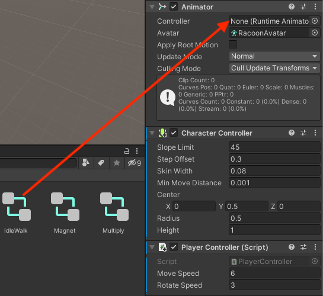

## Animation et position de la caméra

Ton personnage se déplace, mais pour le moment, il est bloqué dans une position en T. Tu peux améliorer cela en utilisant des animations.

--- task ---

Fais glisser l'animateur **IdleWalk** du dossier **Animation** > **Animators** de la fenêtre Project vers la propriété Controller du composant Animator de ton personnage :

Cela ajoutera des animations Attente et Marche à ton personnage avec un paramètre booléen `forward` que tu peux utiliser pour contrôler quelle animation est lue.

--- /task ---

--- task ---

**Test :** Joue ton projet et assure-toi que tu peux voir l'animation Attente :

--- /task ---

--- task ---

Ajoute du code à la méthode `Update` de ton script afin que lorsque le personnage avance, il utilise une animation de marche, sinon il utilise une animation d'attente :

--- code ---
---
language: cs
filename: PlayerController.cs - Update()
line_numbers: true
line_number_start: 17
line_highlights: 21-31
---
    void Update()
    {
        float speed = Input.GetAxis("Vertical");

        //Définir les animations
        Animator anim = gameObject.GetComponent<Animator>();

        if (Input.GetAxis("Vertical") > 0) // Avants
        {
            anim.SetBool("forward", true);
        }
        else // Attente
        {
            anim.SetBool("forward", false);
        }

        // Rotation autour de l'axe y
        transform.Rotate(0, Input.GetAxis("Horizontal"), 0);
--- /code ---

--- /task ---

--- task ---

**Test :** Joue ton projet et assure-toi que tu peux voir l'animation changer pour marcher lorsque tu avances et passer en mode attente lorsque tu n'avances pas :

--- /task ---

Dans les jeux, la caméra suit souvent le joueur.

Le placement d'une **caméra virtuelle** dans un environnement 3D est essentiel pour créer la bonne perspective pour les utilisateurs. Les niveaux de visibilité de l'objectif de la caméra affectent le niveau de difficulté et influencent l'atmosphère d'un jeu. 

--- task ---

Dans la fenêtre Hierarchy, fais glisser la **Main Camera** vers le GameObject Joueur ; il deviendra un « enfant » du joueur et suivra le joueur partout.

--- /task ---

--- task ---

**Test :** Joue ton projet. La caméra va maintenant suivre ton personnage, mais c'est un peu loin et des murs se dressent souvent entre le joueur et la caméra.

--- /task ---

Tu peux ajuster la position et la rotation de la caméra dans la vue Scene ou la fenêtre Inspector.

--- task ---

Quitte le mode Play et sélectionne **Main Camera** dans la fenêtre Hierarchy. Ajuste ses paramètres Transform pour obtenir une vue à la troisième personne de ton joueur, en regardant de derrière et au-dessus de ton joueur :

Tu peux positionner la caméra dans la vue Scene à l'aide des outils Transform et Rotate si tu préfères :

--- /task ---

--- task ---

**Test :** Joue ton projet. La caméra suivra maintenant ton personnage avec la caméra juste derrière et au-dessus de lui et regardant vers le bas.

Ajuste les paramètres de la caméra jusqu'à ce que tu en sois satisfait.

**Astuce :** Tu peux essayer les paramètres en mode Play, mais tu dois quitter le mode Play et mettre à jour les paramètres pour les conserver.

Que se passe-t-il si tu sors du bord du plane ? Ne t'inquiètes pas, ton personnage reviendra au centre la prochaine fois que tu entreras en mode Game :

--- /task ---

--- save ---
