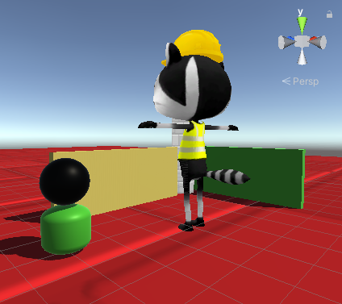

## Améliorer ton projet

Tu peux maintenant créer ton monde 3D comme tu le souhaites.

Tu peux :
+ Ajouter plus d'objets 3D à ton monde, essayer les sphères et les capsules
+ Essayer différentes couleurs et matériaux
+ Modifier les paramètres d'échelle ou les valeurs de transformation de ton personnage pour l'agrandir ou le réduire - tu devras modifier les trois valeurs pour que ce soit proportionné
+ Activer et désactiver différents accessoires dans la fenêtre Inspector pour obtenir l'apparence que tu souhaites
+ Ajuster la vitesse de mouvement et de rotation du joueur
+ Ajuster la position de la caméra

Tu peux télécharger les projets de base et étendus sous forme de packages avec les projets WebGL à partir du répertoire des solutions compressées à l'adresse [https://rpf.io/p/en/explore-a-3d-world-get](https://rpf.io/p/en/explore-a-3d-world-get)

--- collapse ---

---
title: Le projet terminé
---

Tu peux télécharger le [projet terminé ici](https://rpf.io/p/en/explore-a-3d-world-get){:target="_blank"}.

Tu peux voir le projet terminé ci-dessous.

<iframe allowtransparency="true" width="710" height="450" src="https://explore-a-3d-world-extended.rpfilt.repl.co" frameborder="0"></iframe>

--- /collapse ---

--- save ---
