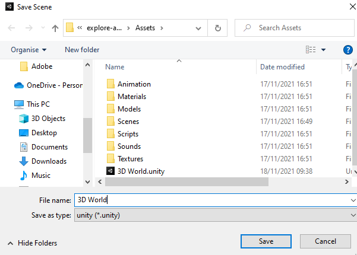
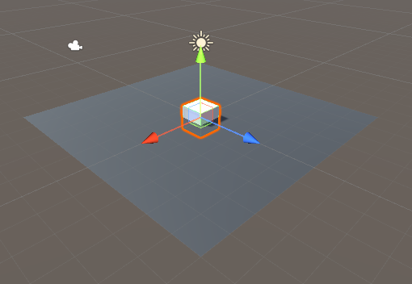

## Stel de 3D-scène in

Je 3D-wereld, of 'toegangspunt', heeft een vloer en muren nodig. 

{:width="300px"}

Mensen brengen meer tijd door in **online virtuele omgevingen**. Naast het spelen van games, ontspannen, verkennen, socialiseren en leren mensen. Het kunnen ontwerpen van 3D-werelden bied je eindeloze mogelijkheden om interactieve ervaringen zoals deze te creëren.

Een Unity-project heeft graphics en geluid 'Assets' nodig.

--- task ---

Download en pak het [Unity starter package](https://rpf.io/p/en/explore-a-3d-world-go){:target="_blank"} uit op je computer. Kies een geschikte locatie, zoals de map documenten.

--- /task ---

--- task ---

Start de Unity Hub en klik op **Projects** en selecteer vervolgens **New project**:

Kies uit de lijst **All templates** en selecteer vervolgens **3D Core**:

Bewerk de projectinstellingen om jouw project een zinnige naam te geven en bewaar het op een goede locatie. Klik vervolgens op **Create project**:

Je nieuwe project wordt geopend in de Unity Editor. Het laden kan enige tijd duren.

--- /task ---

De Unity Editor ziet er als volgt uit:

--- collapse ---

---
title: De vensters en weergaven van de Unity Editor
---

1. **het Unity-menu** wordt gebruikt om scènes en projecten te importeren, openen en op te slaan. Je kunt de voorkeuren van de Unity Editor aanpassen en nieuwe GameObjects en componenten toevoegen.

2. **De werkbalk** bevat hulpmiddelen voor het navigeren in de scèneweergave, het besturen van het spel in de spelweergave en het aanpassen van de lay-out van de Unity Editor.

3. **de Scene view** wordt gebruikt om te navigeren en je scène te bewerken. Je kunt GameObjects selecteren en positioneren, inclusief personages, landschappen, camera's en lichten.

4. **de Game view** is toegankelijk door op het tabblad **Game** te klikken. Het laat de scène zien terwijl deze door de lens van je camera kijkt. Wanneer je op de knop **Play** klikt om de afspeelmodus te openen, simuleert de spelweergave je scène zoals deze door een gebruiker zou worden gezien.

5. **het Hierarchy venster** toont alle GameObjects in je scene en de structuur ertussen. Hier kun je de GameObjecten in je project toevoegen en navigeren. GameObjecten kunnen 'onderliggende objecten' hebben die mee bewegen.

6. **het Project venster** toont een bibliotheek met alle bestanden in je project. Je kunt hier de elementen (assets) vinden die je wilt gebruiken.

7. **het console venster** kan worden geopend door op het tabblad **Console** te klikken. Het toont belangrijke boodschappen. Hier kun je compiler-fouten (fouten in je script) en berichten zien die je kunt tonen met `Debug.Log()`.

8. **in het Inspector venster** kun je de eigenschappen van GameObjects bekijken en bewerken. Je kunt andere onderdelen aan je GameObjecten toevoegen en de waarden die ze gebruiken bewerken.

--- /collapse ---

--- task ---

Het Unity-starter package dat je hebt gedownload bevat een aantal elementen die je in je project kunt gebruiken.

Om ze in je nieuwe project te importeren, klik je op het **Assets** menu en selecteer je **Import package** > **Custom Package...** en navigeer je vervolgens naar het gedownloade **Unity starter package**.

--- /task ---

[[[unity-importing-a-package]]]

--- task ---

In het **Project venster** kun je alle bestanden in je project zien. Klik op de map **Models** in de map Assets om de modellen te bekijken die je hebt geïmporteerd.

--- /task ---

In Unity bevat een **Scene** GameObjects. Een Unity-project met meerdere spelniveaus kan één scène per niveau hebben.

--- task ---

Klik met de rechtermuisknop op **SampleScene** in de hiërarchie en kies **Save Scene as**.

Geef in het pop-upvenster de naam van je scene `3D World`:

Er verschijnt een nieuw bestand in de map Assets in het Project venster:

--- /task ---

Ten eerste heeft je wereld wat grond nodig.

--- task ---

Klik met de rechtermuisknop op je scène (naam 3D World) in het Hierarchy venster en kies **GameObject** > **3D object** > **Plane**:

Dit zal een basis voor jouw wereld creëren.

Het standaardformaat voor het vlak is 10m × 10m. Unity gebruikt meters als maateenheid.

--- /task ---

Het **materiaal** van een GameObject bepaalt hoe het eruitziet. Geef het vlak een ander kleur materiaal.

--- task ---

Klik in het Project venster met de rechtermuisknop op de map **Materials** en kies **Create** > **Material**.

Er zou een nieuw materiaal moeten verschijnen in de materialen map. Bepaal welke kleur je voor je vloer gaat gebruiken en geef je nieuwe materiaal een naam:

Klik op de kleur naast 'Albedo' in het Inspector venster en kies een kleur voor je materiaal (we hebben grijs gebruikt):

Sleep je nieuwe materiaal van het Project venster naar je vlak in de scèneweergave:

--- /task ---

Je kunt objecten maken van 3D-vormen.

--- task ---

Klik met de rechtermuisknop op je **3D World**-scène in het venster Hierarchy en kies **GameObject** > **3D-object** > **Cube**.

Hiermee wordt een kubus gemaakt in het midden van de scène, op (0, 0, 0).

--- /task ---

Je kunt de kubus zien in de scèneweergave. Dit is de achter de schermen weergave van je spel waar je alles instelt.

**Tip:** Klik op het tabblad **Scene** om ervoor te zorgen dat je de scèneweergave kunt zien.

--- task ---

Klik op de kubus in de scèneweergave of het venster Hierarchy om deze te selecteren.

Gebruik <kbd>Shift</kbd>+<kbd>F</kbd> (houd de <kbd>Shift</kbd> toets ingedrukt en tik op <kbd>F</kbd>) om scherp te stellen op de kubus.

Je kunt ook het scrollwiel op de muis of de pijltjestoetsen omhoog en omlaag gebruiken om in en uit te zoomen:

--- /task ---

Je moet de kubus op de grond plaatsen.

--- task ---

Klik op de kubus in de scèneweergave of het venster Hierarchy om deze te selecteren.

**Kies**   
je kunt:

+ De y-positie in het Inspector-venster wijzigen in 0.5 (de helft van de hoogte van de kubus):

+ Het gereedschap verplaatsen gebruiken om de groene pijl omhoog te slepen totdat de kubus op het grondvlak zit:

--- /task ---

**Tip:** als je een fout maakt in de Unity Editor, kun je <kbd>Ctrl</kbd>+<kbd>Z</kbd> (of <kbd>Cmd</kbd>+<kbd>Z</kbd>) gebruiken om je laatste actie **ongedaan te maken (undo)</kbd>.

--- task ---

Verander nu de kubus in een muur met de volgende positie- en schaalinstellingen:

{:width="400px"}

Je kunt de waarden invoeren in de Transform-component voor de kubus of op de Scale-tool klikken en de handvatten in de Scene-weergave slepen (hiermee worden de Transform-waarden bijgewerkt.)

Zoom uit om je muur te zien:

--- /task ---

Een materiaal kan een kleur en een structuur hebben en er zijn veel eigenschappen die je kunt aanpassen om verschillende effecten te krijgen. Een **structuur** is een 2D-afbeelding die kan worden gemaakt in een beeldeditor.

--- task ---

Klik in het Project venster met de rechtermuisknop op de map **Materials** en kies **Create** > **Material**. Je gaat een gekleurde stenen muur maken. Geef het materiaal een duidelijke naam:

Klik op de kleur naast 'Albedo' in het Inspector venster en kies een kleur voor je materiaal:

Voeg een textuur toe door op de cirkel links van 'Albedo' te klikken en **BrickWallAlbedo** texture te selecteren in de lijst:

Sleep je nieuwe materiaal van het Project venster naar je muur in de scèneweergave:

--- /task ---

--- task ---

Klik in het Inspector venster met de rechtermuisknop op je kubus, kies **Rename** in het menu en wijzig de naam van je object van `Cube` naar `Wall`:

**Tip:** je kunt een nieuw GameObject een naam geven in het hiërarchie venster als je het maakt en je kunt de naam wijzigen in het venster Inspector.

--- /task ---

--- task ---

Om een kopie van je muur te maken, kun je:
+ Met de rechtermuisknop op het prikbord-object in het venster hiërarchie klikken en kies **Duplicate**
+ Je muur in de scèneweergave selecteren en <kbd>Ctrl</kbd>+<kbd>D</kbd> (of <kbd>Cmd</kbd>+<kbd>D</kbd>) gebruiken om te dupliceren

Je nieuwe muur zal op precies dezelfde plaats staan als je eerste muur.

--- /task ---

--- task ---

Wijzig de y-rotatie van de nieuwe muur in `90`:

--- /task ---

--- task ---

Verplaats de nieuwe muur naar de volgende positie: X = 4, y = 1, z = -1.

Je kunt de waarden in het Inspector venster invoeren of de pijlen in je Scène slepen — het maakt niet uit of de positie exact is.

Je scène zou er als volgt uit moeten zien:

--- /task ---

--- task ---

Klik op je vlak. Wijzig de schaalinstellingen op het vlak om deze groter te maken zodat je meer ruimte hebt:

Denk aan een 4×4 grondvlak als 40 meter bij 40 meter in de echte wereld: Veel ruimte voor je personage om rond te lopen.

--- /task ---

--- task ---

Als je niet-opgeslagen wijzigingen hebt, zie je een '*' naast je Scène in het venster Hierarchy.

Sla je scène op door op **File** > **Save** te klikken. Of gebruik <kbd>Ctrl</kbd>+<kbd>S</kbd>.

Je kan je project op ook slaan door op **File** > **Save Project** te klikken.

Unity slaat gewoonlijk geen wijzigingen op, maar je startersproject bevat een script om je project elke 60 seconden automatisch op te slaan.

--- /task ---

Je kunt door je scène navigeren om het vanuit verschillende hoeken te bekijken. Als je verdwaalt, klik je op een muur in het venster hiërarchie en gebruik je <kbd>Shift</kbd>+<kbd>F</kbd> om scherp te stellen en vervolgens uit te zoomen:

[[[unity-scene-navigation]]]

Vergeet niet dat als je navigeert, je naar je scène kijkt vanuit een ander perspectief, zodat je beeld er niet precies hetzelfde uitziet als onze voorbeelden.

--- save ---
