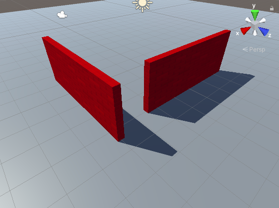
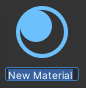
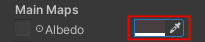
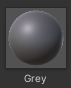

## Stel de 3D-scène in

Je 3D-wereld, of 'toegangspunt', heeft een vloer en muren nodig. 

{:width="300px"}

Mensen brengen meer tijd door in **online virtuele omgevingen**. Naast het spelen van games, ontspannen, verkennen, socialiseren en leren mensen en nemen deel aan interactief entertainment. Sommige mensen noemen de toekomst van deze omgevingen de **metaverse**. Het kunnen ontwerpen van 3D-werelden is een belangrijke vaardigheid.

Een Unity-project heeft graphics en geluid 'Assets' nodig.

--- task ---

Download and unzip the [Unity starter package](https://rpf.io/p/en/explore-a-3d-world-go){:target="_blank"} to your computer. Kies een geschikte locatie, zoals de map documenten.

--- /task ---

--- task ---

Launch the Unity Hub and click **Projects** then select **New project**:

Kies uit de lijst **All templates** en selecteer vervolgens **3D Core**:

Bewerk de projectinstellingen om jouw project een zinnige naam te geven en bewaar het op een goede locatie. Klik vervolgens op **Create project**:

Je nieuwe project wordt geopend in de Unity Editor. Het laden kan enige tijd duren.

--- /task ---

De Unity Editor ziet er als volgt uit:

--- collapse ---

---
title: De vensters en weergaven van de Unity Editor
---

1. **het Unity-menu** wordt gebruikt om scènes en projecten te importeren, openen en op te slaan. Je kunt de voorkeuren van de Unity Editor aanpassen en nieuwe GameObjects en componenten toevoegen.

2. **De werkbalk** bevat hulpmiddelen voor het navigeren in de scèneweergave, het besturen van het spel in de spelweergave en het aanpassen van de lay-out van de Unity Editor.

3. **de Scene view** wordt gebruikt om te navigeren en je scène te bewerken. Je kunt GameObjects selecteren en positioneren, inclusief personages, landschappen, camera's en lichten.

4. **de Game view** is toegankelijk door op het tabblad **Game** te klikken. Het laat de scène zien terwijl deze door de lens van je camera kijkt. Wanneer je op de knop **Play** klikt om de afspeelmodus te openen, simuleert de spelweergave je scène zoals deze door een gebruiker zou worden gezien.

5. **het Hierarchy venster** toont alle GameObjects in je scene en de structuur ertussen. Hier kun je de GameObjecten in je project toevoegen en navigeren. GameObjecten kunnen 'onderliggende objecten' hebben die mee bewegen.

6. **het Project venster** toont een bibliotheek met alle bestanden in je project. Je kunt hier de elementen (assets) vinden die je wilt gebruiken.

7. **het console venster** kan worden geopend door op het tabblad **Console** te klikken. Het toont belangrijke boodschappen. Hier kun je compiler-fouten (fouten in je script) en berichten zien die je kunt tonen met `Debug.Log()`.

8. **in het Inspector venster** kun je de eigenschappen van GameObjects bekijken en bewerken. Je kunt andere onderdelen aan je GameObjecten toevoegen en de waarden die ze gebruiken bewerken.

--- /collapse ---

--- task ---

The Unity starter package you downloaded contains a number of Assets for you to use in your project.

To import them into your new project, click on the **Assets** menu and select **Import package** > **Custom Package...** then navigate to the downloaded **Unity starter package**.

--- /task ---

[[[unity-importing-a-package]]]

--- task ---

The **Project window** is where you can see all the files included in your project. Klik op de map **Models** in de map Assets om de modellen te bekijken die je hebt geïmporteerd.

--- /task ---

In Unity bevat een **Scene** GameObjects. Een Unity-project met meerdere spelniveaus kan één scène per niveau hebben.

--- task ---

Klik met de rechtermuisknop op **SampleScene** in de hiërarchie en kies **Save Scene as**.

In the pop-up window, name your Scene `3D World`:

A new file will appear in the Assets folder in the Project window:

--- /task ---

First, your world needs some ground.

--- task ---

Right-click on your scene (name 3D World) in the Hierarchy window and choose **GameObject** > **3D Object** > **Plane**:

This will create a ground for your world.

The default size for the plane is 10m × 10m. Unity uses metres as the unit of measurement.

--- /task ---

The **material** of a GameObject controls how it looks. Give the plane a different colour material.

--- task ---

In the Project window, right-click on the **Materials** folder and choose **Create** > **Material**.

A new material should appear in the Materials folder. Decide what colour you will use for your floor and name your new material:

Click on the colour next to 'Albedo' in the Inspector window and choose a colour for your material (we used grey):

Drag your new material from the Project window to your plane in the Scene view:

--- /task ---

You can create objects from 3D shapes.

--- task ---

Right-click on your **3D World** scene in the Hierarchy window and choose **GameObject** > **3D Object** > **Cube**.

This will create a cube at the centre of the scene, at (0, 0, 0).

--- /task ---

You can see the cube in the Scene view. This is the behind-the-scenes view of your game where you set everything up.

**Tip:** Click on the **Scene** tab to make sure you can see the Scene view.

--- task ---

Click on the cube in the Scene view or Hierarchy window to select it.

Use <kbd>Shift</kbd>+<kbd>F</kbd> (hold down the <kbd>Shift</kbd> key and tap <kbd>F</kbd>) to focus on the cube.

You can also use the scroll wheel on the mouse, or the up and down arrow keys, to zoom in and out:

--- /task ---

You need to get the cube to sit on the plane.

--- task ---

Click on the cube in the Scene view or Hierarchy window to select it.

**Choose**   
You can either:

+ Change the y position in the Inspector window to 0.5 (half the height of the cube):

+ Use the Move tool to drag the green arrow up until the cube sits on the plane:

--- /task ---

**Tip:** If you make a mistake in the Unity Editor, you can use <kbd>Ctrl</kbd>+<kbd>Z</kbd> (or <kbd>Cmd</kbd>+<kbd>Z</kbd>) to **undo** your last action.

--- task ---

Now change the cube into a wall with the following Position and Scale settings:

{:width="400px"}

Je kunt de waarden invoeren in de Transform-component voor de kubus of op de Scale-tool klikken en de handvatten in de Scene-weergave slepen (hiermee worden de Transform-waarden bijgewerkt.)

Zoom uit om je muur te zien:

--- /task ---

Een materiaal kan een kleur en een structuur hebben en er zijn veel eigenschappen die je kunt aanpassen om verschillende effecten te krijgen. Een **structuur** is een 2D-afbeelding die kan worden gemaakt in een beeldeditor.

--- task ---

Klik in het Project venster met de rechtermuisknop op de map **Materials** en kies **Create** > **Material**. Je gaat een gekleurde stenen muur maken. Give the material a descriptive name:

Klik op de kleur naast 'Albedo' in het Inspector venster en kies een kleur voor je materiaal:

Voeg een textuur toe door op de cirkel links van 'Albedo' te klikken en **BrickWallAlbedo** texture te selecteren in de lijst:

Sleep je nieuwe materiaal van het Project venster naar je muur in de scèneweergave:

--- /task ---

--- task ---

Klik in het Inspector venster met de rechtermuisknop op je kubus, kies **Rename** in het menu en wijzig de naam van je object van `Cube` naar `Wall`:

**Tip:** je kunt een nieuw GameObject een naam geven in het hiërarchie venster als je het maakt en je kunt de naam wijzigen in het venster Inspector.

--- /task ---

--- task ---

Om een kopie van je muur te maken, kun je:
+ Met de rechtermuisknop op het prikbord-object in het venster hiërarchie klikken en kies **Duplicate**
+ Je muur in de scèneweergave selecteren en <kbd>Ctrl</kbd>+<kbd>D</kbd> (of <kbd>Cmd</kbd>+<kbd>D</kbd>) gebruiken om te dupliceren

Je nieuwe muur zal op precies dezelfde plaats staan als je eerste muur.

--- /task ---

--- task ---

Wijzig de y-rotatie van de nieuwe muur in `90`:

--- /task ---

--- task ---

Verplaats de nieuwe muur naar de volgende positie: X = 4, y = 1, z = -1.

Je kunt de waarden in het Inspector venster invoeren of de pijlen in je Scène slepen — het maakt niet uit of de positie exact is.

Je scène zou er als volgt uit moeten zien:

--- /task ---

--- task ---

Klik op je vlak. Wijzig de schaalinstellingen op het vlak om deze groter te maken zodat je meer ruimte hebt:

Think of a 4×4 plane as 40 metres by 40 metres in the real world: plenty of room for your character to move around.

--- /task ---

--- task ---

When you have unsaved changes, you will see a '*' next to your Scene in the Hierarchy window.

Save your Scene by clicking **File** > **Save**. Of gebruik <kbd>Ctrl</kbd>+<kbd>S</kbd>.

Also, save your project by clicking **File** > **Save Project**.

Unity slaat gewoonlijk geen wijzigingen op, maar je startersproject bevat een script om je project elke 60 seconden automatisch op te slaan.

--- /task ---

Je kunt door je scène navigeren om het vanuit verschillende hoeken te bekijken. Als je verdwaalt, klik je op een muur in het venster hiërarchie en gebruik je <kbd>Shift</kbd>+<kbd>F</kbd> om scherp te stellen en vervolgens uit te zoomen:

[[[unity-scene-navigation]]]

Vergeet niet dat als je navigeert, je naar je scène kijkt vanuit een ander perspectief, zodat je beeld er niet precies hetzelfde uitziet als onze voorbeelden.

--- save ---
