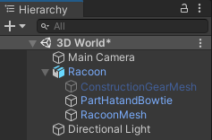
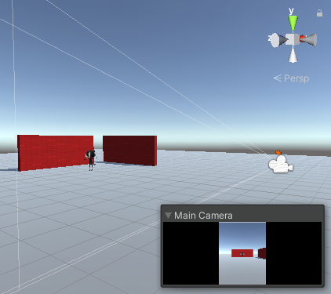

## Voeg een personage toe

De speler in je wereld zal een kat- of wasbeer-personage zijn. 

{:width="300px"}

--- task ---

Klik op de map **Models** in het Project venster. Een model beschrijft hoe een 3D-object eruit ziet en kan worden gemaakt met 3D-modelleringstools zoals Blender. We hebben enkele modellen toegevoegd die je kunt gebruiken.

Kies het `Cat` of `Raccoon` model en sleep het van het Project venster naar de Scene weergave:

**Tip:** als je per ongeluk 'CatBase'- of 'RaccoonBase'-modellen hebt toegevoegd, of als je je personage op dit punt wilt wijzigen, kun je het model uit de scène verwijderen. Right-click on the model GameObject in the Hierarchy window and select 'Delete'.

--- /task ---

Je personage verschijnt in de scèneweergave in een T-pose.

De **T-pose** is de standaardpositie voor een spelpersonage voordat het is geanimeerd.

--- task ---

Klik op je personage in de scèneweergave en tik op de <kbd>F</kbd> toets.

**Tip:** If you get lost in the Scene view, you can click on your character (or another GameObject) in the Hierarchy window and then click <kbd>Shift</kbd>+<kbd>F</kbd> to focus on your character in the Scene view.

--- /task ---

Hmm, je personage draagt meerdere accessoires.

--- task ---

Click on your character in the Hierarchy window. Hiermee worden de instellingen voor het GameObject geopend in het Inspector venster.

Click on the arrow next to your character in the Hierarchy window to see the 'child objects'. Click on **ConstructionGearMesh** and uncheck the box next to its name in the Inspector window. Dit verbergt de helm en het veiligheidsvest:

Verberg de andere accessoires voor je personage op dezelfde manier, of houd er gewoon een actief.

**Tip:** GameObjects that are not active appear greyed out in the Hierarchy window:

--- /task ---

--- task ---

The player will see the game through the 'Main Camera', which is shown as a video camera icon in the Scene. Select the camera in the Hierarchy window to see the embedded camera view:

--- /task ---

De spelweergave laat zien hoe je project er voor een speler uit zal zien.

--- task ---

Klik op het Game view tabblad. Je personage bevindt zich in de positie waarnaar je het hebt gesleept in de scèneweergave (je kunt het misschien niet zien).

--- /task ---

Als je genoeg ruimte op je scherm hebt, is het echt handig om de scèneweergave en de spelweergave tegelijkertijd in beeld te hebben.

--- task ---

Sleep het Game view tabblad naar rechts zodat het naast de scèneweergave verschijnt:

--- /task ---

Unity gebruikt x-, y- en z-coördinaten om GameObjects in de 3D-ruimte te positioneren:

[[[unity-3D-coordinates]]]

--- task ---

Select your character (in the Hierarchy window or Scene view) and then change its 'Transform' settings so the 'Position' is (0, 0, 0) — the centre of the world:

Je personage beweegt naar het midden in de scèneweergave en de spelweergave:

--- /task ---

--- task ---

Wijzig de naam van je personage in 'Speler' in het Inspector venster. Dit maakt het makkelijk om meer GameObjects toe te voegen.

--- /task ---

--- save ---
