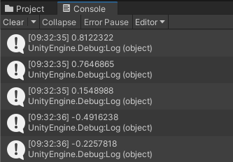

## Voeg een beweging toe

<div style="display: flex; flex-wrap: wrap">
<div style="flex-basis: 200px; flex-grow: 1; margin-right: 15px;">
Je speler beweegt met de WASD- of pijltjestoetsen. 
</div>
<div>
{:width="300px"}
</div>
</div>

<p style="border-left: solid; border-width:10px; border-color: #0faeb0; background-color: aliceblue; padding: 10px;">
Unity werkt met de <span style="color: #0faeb0">**C#**</span> (uitgesproken als C Sharp) programmeertaal, die wordt gebruikt door professionele software-ontwikkelaars. C# is een object-georiënteerde taal met **classes** die gedrag voor vergelijkbare objecten definiëren en met **methods**, wat functies zijn die tot een class behoren. In Unity definieert een **script** een class met variabelen en methods. Je kunt hetzelfde script aan meerdere GameObjects toevoegen als ze dezelfde functies nodig hebben.</p>

--- task ---

Klik op het **Player** GameObject in het venster Hierarchy of de scèneweergave, zodat je de eigenschappen kunt zien in het venster Inspector.

{:width="300px"}

**Tip:** Zorg ervoor dat de **Player** is geselecteerd en niet een van de onderliggende objecten.

Klik op **Add Component** en typ `character` in het zoekvak en klik vervolgens op de **Character Controller** component wanneer deze verschijnt:


--- /task ---

De Character Controller-component voegt nieuwe functies toe aan je Player Gameobject, waaronder een `SimpleMove`-methode en een **collider**. Colliders kunnen worden gebruikt om te zorgen dat je personage niet door vaste voorwerpen loopt en om te detecteren wanneer botsingen plaatsvinden.

<p style="border-left: solid; border-width:10px; border-color: #0faeb0; background-color: aliceblue; padding: 10px;">
 Een <span style="color: #0faeb0">**collider**</span> is een vorm die wordt gebruikt om te detecteren wanneer een GameObject botst of kruist met een ander GameObject. De computer kan veel sneller controleren op botsingen met een eenvoudige botsvorm dan met de complexe vorm van een GameObject. Een **hitbox** is een soort botsing. </p>

--- task ---

De Character Controller Collider heeft een hoogte van `2` en een middelpunt op `0, 0, 0`; dit betekent dat deze half boven en half onder het vlak is geplaatst:

{:width="300px"}

Je personage heeft een hoogte van `1`, wat betekent dat het midden op de y-as op `0.5` staat. Wijzig de waarde in het centrum van de y-as van de Character Controller in `0.5` en de hoogte in `1` om het aan te passen aan je personage:

{:width="400px"}

{:width="300px"}

--- /task ---

Je personage heeft een script nodig zodat de speler het kan verplaatsen. Je hebt een code-editor nodig die op je computer is geïnstalleerd om dit script te kunnen bewerken.

[[[unity-visual-studio-code]]]

--- task ---

Ga naar het venster Inspector voor de Player en klik op de knop **Add Component**. Typ `script` en selecteer **New Script**. Geef je nieuwe script een naam `PlayerController` en druk vervolgens op <kbd>Enter</kbd>.

Het nieuwe script wordt opgeslagen in de map Assets:

{:width="400px"}

--- /task ---

--- task ---

Dubbelklik op **PlayerController** in het script-onderdeel in het Inspector-venster. Het script wordt geopend in een aparte code-editor en heeft deze code:

--- code ---
---
language: cs filename: PlayerController.cs line_numbers: true line_number_start:
line_highlights:
---
using System.Collections; using System.Collections.Generic; using UnityEngine;

public class PlayerController : MonoBehaviour
{ // Start is called before the first frame update void Start()
    {

    }
    
    // Update is called once per frame
    void Update()
    {
    
    }
} --- /code ---

**Debug:** Controleer of de naam na 'class' `PlayerController` is en dit overeenkomt met de naam van je scriptbestand: Als je het bestand een andere naam geeft nadat je het hebt gemaakt, moet je de class name in het script wijzigen.

--- /task ---

De Start methode wordt eenmaal aangeroepen wanneer je de scène afspeelt. Voeg code toe om het bericht `Player started` te tonen wanneer je project begint.

--- task ---

Gebruik de `Debug.Log()` methode om een bericht te tonen wanneer de `Start` methode wordt aangeroepen voor het Player Gameobject. Het bericht verschijnt in de balk onder aan de Unity Editor en in het Console-venster:

--- code ---
---
language: cs filename: PlayerController.cs - Start() line_numbers: true line_number_start: 7
line_highlights: 10
---

    // Start is called before the first frame update
    void Start()
    {
        Debug.Log("Player started");        
    }
--- /code ---

**Tip:** de regels die beginnen met // zijn opmerkingen die de code toelichten. Je hoeft ze niet te typen.

**Sla het PlayerController script op** met <kbd>Ctrl</kbd>+<kbd>S</kbd> (of <kbd>Cmd</kbd>+<kbd>S</kbd>) en keer vervolgens terug naar de Unity Editor. De Unity Editor zal je script laden om het klaar te maken voor gebruik; dit kan een paar seconden duren.

--- /task ---

--- task ---

Klik op het tabblad van het consolevenster om het naar voren te brengen:

{:width="400px"}

--- /task ---

--- task ---

**Test:** Ga naar de werkbalk en klik eenmaal op de knop **Play** om de scène in de afspeelmodus te zetten. Dit zal je scène simuleren zoals het zou worden bekeken en interactief toegepast door een gebruiker:

{:width="400px"}

Unity vergt een paar seconden om op te starten, dan zou je de `Debug.Log()` 'Player started' uitvoer in de console moeten zien.


**Debug:** je scène wordt niet afgespeeld als er fouten in je code zijn. Controleer het Console-venster voor informatie. Je ziet mogelijk:
+ `; expected` – controleer of er een puntkomma `;` aan het einde van elke regel code staat.
+ `Newline in constant` – je hebt een aanhalingsteken `"` gemist aan het einde van een tekenreeks.
+ `} expected` – je zou een paar open en dichte accolades `{}` moeten hebben rond elke method en rond de class. Controleer of de accolades bij elkaar horen.
+ `) expected` – zorg ervoor dat er een afsluitende `)` is aan het einde van elke method-aanroep, vóór de puntkomma.
+ `Debug` does not contain a definition for 'log' – C# is hoofdlettergevoelig, dus het moet `Log` zijn met een hoofdletter `L`.

Vergelijk je code met de voorbeeldcode en zorg ervoor dat alles precies hetzelfde is.

--- /task ---

--- task ---

Klik nogmaals op de knop **Play** om de afspeelmodus te verlaten en de foutopsporing stopt.

**Tip:** Wijzigingen die in de afspeelmodus worden aangebracht, gaan verloren wanneer je de afspeelmodus afsluit. Zorg ervoor dat je de afspeelmodus afsluit wanneer je klaar bent met testen.

--- /task ---

Unity creëert het effect van beweging door snel afbeeldingen op het scherm te tonen. Elke afbeelding is een **frame**. De `Update` method wordt eenmaal per frame aangeroepen.

--- task ---

Switch to your code editor.

You will be able to use the WASD or arrow keys (players on a mobile or console can use different inputs without you changing your code.)

`Input.GetAxis("Vertical")` takes input from the <kbd>W</kbd> and <kbd>S</kbd> keys or the up and down arrow keys, and returns a number between 1 and -1, which it uses for forwards and backwards movement.

--- code ---
---
language: cs filename: PlayerController.cs - Update() line_numbers: true line_number_start: 14
line_highlights: 16-21
---

    void Update()
    {
        float speed = Input.GetAxis("Vertical");
    
        if (speed != 0) // Player moving
        {
            Debug.Log(speed);
        }
    }
--- /code ---

A `float` is a decimal number.

**Save** your PlayerController script in your code editor, using <kbd>Ctrl</kbd>+<kbd>S</kbd> (or <kbd>Cmd</kbd>+<kbd>S</kbd>), then return to the Unity Editor.

**Tip:** You might find it quicker to use <kbd>Alt</kbd>+<kbd>Tab</kbd> (or <kbd>Cmd</kbd>+<kbd>Tab</kbd>) to switch between your web browser with the project instructions, the Unity Editor, and your code editor.

--- /task ---

--- task ---

**Test:** Go to the Toolbar and click on the **Play** button to put your scene into Play mode.

Place your **mouse pointer in the Game view** and press keys <kbd>W</kbd> and <kbd>S</kbd>. Look at the values logged in the Console window as you press the keys. Each time you press <kbd>W</kbd> a positive number is logged, when you press <kbd>S</kbd> a negative number is logged. A number is only logged if the value of speed **is not** 0 (see line 18 of the code).

The numbers range between -1.0 and 1.0 and correspond to movement from the vertical controls on the keyboard (or a game controller). You can also use the up and down arrow keys.



**Tip:** The output also appears in the bar at the bottom of the Unity Editor.

Click the **Play** button again to exit Play mode and the debug output will stop.

--- /task ---

It's easy to forget whether your game is playing or not. A Play mode colour tint makes it easier to tell when your scene is playing:


--- task ---

To set a tint, go to the **Edit Menu** (or Unity Menu) and select **Preferences**. Choose the **Colours** menu and find the property called **Playmode tint**.

Click on the existing colour to see a colour wheel where you can choose a colour and opacity level:

{:width="400px"}

**Tip:** Try a light colour so that you can still clearly see the text in the editor when the scene is running.

Return to the Unity Editor and press the **Play** button to see your new tint in action. When you are happy with the tint you have chosen, press the **Play** button again to exit Play mode.

--- /task ---

The Character Controller component provides a `SimpleMove` method.

--- task ---

**Add** code to use the vertical input value to move the Player each frame.

You can **delete** the Debug code.

**Tip:** You can also mask the `Debug.Log()` lines by putting `//` at the beginning of the line. You can also mask multiple lines using `/*` and `*/`:
```
        /*if (speed != 0) // Player moving
        {
            Debug.Log(speed);
        }*/
```

Unity uses a special data type called a `Vector3` to store 3D points or directions. The `forward` variable stores the direction that the Player is facing:

--- code ---
---
language: cs filename: PlayerController.cs - Update() line_numbers: true line_number_start: 14
line_highlights: 18-23
---

    void Update()
    {
        float speed = Input.GetAxis("Vertical");
    
        // Forward is the forward direction for this character
        Vector3 forward = transform.TransformDirection(Vector3.forward);
    
        // You need the Character Controller so you can use SimpleMove
        CharacterController controller = GetComponent<CharacterController>();
        controller.SimpleMove(forward * speed);
    }
--- /code ---

--- /task ---

--- task ---

**Test:** Click **Play** to enter Play mode and try out your code. Use the <kbd>W</kbd> and <kbd>S</kbd> keys or the up and down arrow keys to glide forwards and backwards.

**Debug:** Remember to check the Console window for helpful messages. Check brackets, semicolons, and capital letters in your code carefully.

**Tip:** Make sure your mouse pointer is in the **Game view**.

Try and walk through the wall. The `SimpleMove` method from the Character Controller component stops you from being able to walk through GameObjects that have a collider. A collider is automatically added when you create a 3D shape as you did for the wall.

You can pan around in the Scene view by holding your right mouse button and dragging. Pan to get a better view of the wall as your character walks into it:

{:width="500px"}

To move your Player, move the mouse pointer back to the **Game view**.

Click the **Play** button again to exit Play mode.

--- /task ---

--- task ---

Add another line so your character can `Rotate` when the player presses the <kbd>A</kbd> and <kbd>D</kbd> keys or the left and right arrow keys:

--- code ---
---
language: cs filename: PlayerController.cs - Update() line_numbers: true line_number_start: 14
line_highlights: 18-19
---

    void Update()
    {
        float speed = Input.GetAxis("Vertical");
    
        // Rotate around y-axis
        transform.Rotate(0, Input.GetAxis("Horizontal"), 0);
    
        // Forward is the forward direction for this character
        Vector3 forward = transform.TransformDirection(Vector3.forward);
    
        // You need the Character Controller so you can use SimpleMove
        CharacterController controller = GetComponent<CharacterController>();
        controller.SimpleMove(forward * speed);
    }
--- /code ---

Save your code and switch back to the Unity Editor. Unity will load your updated script.

--- /task ---

--- task ---

**Test:** Click **Play** to enter Play mode and try out your code. Use the <kbd>A</kbd> and <kbd>D</kbd> keys or the left and right arrow keys to rotate.

**Debug:** If you are still seeing output to the Console and movement isn't working, then make sure you have saved your script in the code editor.

Click the **Play** button again to exit Play mode.

--- /task ---

You can also control the speed of movement and rotation.

--- task ---

Open your PlayerController script and add variables for the `moveSpeed` and `rotateSpeed`.

--- code ---
---
language: cs filename: PlayerController.cs line_numbers: true line_number_start: 5
line_highlights: 7-8
---
public class PlayerController : MonoBehaviour
{ public float moveSpeed = 4.0f; //The f at the end of the number says it is a floating-point number public float rotateSpeed = 1.5f;

    // Start is called before the first frame update
    void Start()
    {
--- /code ---

--- /task ---

--- task ---

Update the code to `Rotate` and `SimpleMove` your character to multiply them by the new variables:

--- code ---
---
language: cs filename: PlayerController.cs - Update() line_numbers: true line_number_start: 21
line_highlights: 22
---

        // Rotate around y-axis
        transform.Rotate(0, Input.GetAxis("Horizontal") * rotateSpeed, 0);
--- /code ---

and

--- code ---
---
language: cs filename: PlayerController.cs - Update() line_numbers: true line_number_start: 27
line_highlights: 29
---

        // You need the Character Controller so you can use SimpleMove
        CharacterController controller = GetComponent<CharacterController>();
        controller.SimpleMove(forward * speed * moveSpeed);
--- /code ---

--- /task ---

--- task ---

**Test:** Play your scene and check if you are happy with the speed settings.

If you select the Player in your scene view you can make changes to your `moveSpeed` and `rotateSpeed` variables in the Inspector.


--- collapse ---

---
title: Variables in the Inspector
---

When you change the value of a variable in the Inspector, it takes priority over the value set in your script.

Any future changes you make to those values in your script **will not take effect**.

--- /collapse ---

Click the **Play** button again to exit Play mode.

--- /task ---

--- save ---
