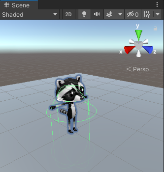

## Voeg een beweging toe

<div style="display: flex; flex-wrap: wrap">
<div style="flex-basis: 200px; flex-grow: 1; margin-right: 15px;">
Je speler beweegt met de WASD- of pijltjestoetsen. 
</div>
<div>
{:width="300px"}
</div>
</div>

<p style="border-left: solid; border-width:10px; border-color: #0faeb0; background-color: aliceblue; padding: 10px;">
Unity werkt met de <span style="color: #0faeb0">**C#**</span> (uitgesproken als C Sharp) programmeertaal, die wordt gebruikt door professionele software-ontwikkelaars. C# is een object-georiënteerde taal met **classes** die gedrag voor vergelijkbare objecten definiëren en met **methods**, wat functies zijn die tot een class behoren. In Unity definieert een **script** een class met variabelen en methods. Je kunt hetzelfde script aan meerdere GameObjects toevoegen als ze dezelfde functies nodig hebben.</p>

--- task ---

Klik op het **Player** GameObject in het venster Hierarchy of de scèneweergave, zodat je de eigenschappen kunt zien in het venster Inspector.

{:width="300px"}

**Tip:** Zorg ervoor dat de **Player** is geselecteerd en niet een van de onderliggende objecten.

Klik op **Add Component** en typ `character` in het zoekvak en klik vervolgens op de **Character Controller** component wanneer deze verschijnt:


--- /task ---

De Character Controller-component voegt nieuwe functies toe aan je Player Gameobject, waaronder een `SimpleMove`-methode en een **collider**. Colliders kunnen worden gebruikt om te zorgen dat je personage niet door vaste voorwerpen loopt en om te detecteren wanneer botsingen plaatsvinden.

<p style="border-left: solid; border-width:10px; border-color: #0faeb0; background-color: aliceblue; padding: 10px;">
 Een <span style="color: #0faeb0">**collider**</span> is een vorm die wordt gebruikt om te detecteren wanneer een GameObject botst of kruist met een ander GameObject. De computer kan veel sneller controleren op botsingen met een eenvoudige botsvorm dan met de complexe vorm van een GameObject. Een **hitbox** is een soort botsing. </p>

--- task ---

De Character Controller Collider heeft een hoogte van `2` en een middelpunt op `0, 0, 0`; dit betekent dat deze half boven en half onder het vlak is geplaatst:

{:width="300px"}

Je personage heeft een hoogte van `1`, wat betekent dat het midden op de y-as op `0.5` staat. Wijzig de waarde in het centrum van de y-as van de Character Controller in `0.5` en de hoogte in `1` om het aan te passen aan je personage:

{:width="400px"}

{:width="300px"}

--- /task ---

Je personage heeft een script nodig zodat de speler het kan verplaatsen. Je hebt een code-editor nodig die op je computer is geïnstalleerd om dit script te kunnen bewerken.

[[[unity-visual-studio]]]

--- task ---

Ga naar het venster Inspector voor de Player en klik op de knop **Add Component**. Typ `script` en selecteer **New Script**. Geef je nieuwe script een naam `PlayerController` en druk vervolgens op <kbd>Enter</kbd>.

Het nieuwe script wordt opgeslagen in de map Assets:

{:width="400px"}

--- /task ---

--- task ---

Dubbelklik op **PlayerController** in het script-onderdeel in het Inspector-venster. Het script wordt geopend in een aparte code-editor en heeft deze code:

--- code ---
---
language: cs filename: PlayerController.cs line_numbers: true line_number_start:
line_highlights:
---
using System.Collections; using System.Collections.Generic; using UnityEngine;

public class PlayerController : MonoBehaviour
{ // Start is called before the first frame update void Start()
    {

    }
    
    // Update is called once per frame
    void Update()
    {
    
    }
} --- /code ---

**Debug:** Controleer of de naam na 'class' `PlayerController` is en dit overeenkomt met de naam van je scriptbestand: Als je het bestand een andere naam geeft nadat je het hebt gemaakt, moet je de class name in het script wijzigen.

--- /task ---

De Start methode wordt eenmaal aangeroepen wanneer je de scène afspeelt. Voeg code toe om het bericht `Player started` te tonen wanneer je project begint.

--- task ---

Gebruik de `Debug.Log()` methode om een bericht te tonen wanneer de `Start` methode wordt aangeroepen voor het Player Gameobject. Het bericht verschijnt in de balk onder aan de Unity Editor en in het Console-venster:

--- code ---
---
language: cs filename: PlayerController.cs - Start() line_numbers: true line_number_start: 7
line_highlights: 10
---

    // Start is called before the first frame update
    void Start()
    {
        Debug.Log("Player started");        
    }
--- /code ---

**Tip:** de regels die beginnen met // zijn opmerkingen die de code toelichten. Je hoeft ze niet te typen.

**Sla het PlayerController script op** met <kbd>Ctrl</kbd>+<kbd>S</kbd> (of <kbd>Cmd</kbd>+<kbd>S</kbd>) en keer vervolgens terug naar de Unity Editor. De Unity Editor zal je script laden om het klaar te maken voor gebruik; dit kan een paar seconden duren.

--- /task ---

--- task ---

Klik op het tabblad van het consolevenster om het naar voren te brengen:

{:width="400px"}

--- /task ---

--- task ---

**Test:** Ga naar de werkbalk en klik eenmaal op de knop **Play** om de scène in de afspeelmodus te zetten. Dit zal je scène simuleren zoals het zou worden bekeken en interactief toegepast door een gebruiker:

{:width="400px"}

Unity vergt een paar seconden om op te starten, dan zou je de `Debug.Log()` 'Player started' uitvoer in de console moeten zien.


**Debug:** je scène wordt niet afgespeeld als er fouten in je code zijn. Controleer het Console-venster voor informatie. Je ziet mogelijk:
+ `; expected` – controleer of er een puntkomma `;` aan het einde van elke regel code staat.
+ `Newline in constant` – je hebt een aanhalingsteken `"` gemist aan het einde van een tekenreeks.
+ `} expected` – je zou een paar open en dichte accolades `{}` moeten hebben rond elke method en rond de class. Controleer of de accolades bij elkaar horen.
+ `) expected` – zorg ervoor dat er een afsluitende `)` is aan het einde van elke method-aanroep, vóór de puntkomma.
+ `Debug` does not contain a definition for 'log' – C# is hoofdlettergevoelig, dus het moet `Log` zijn met een hoofdletter `L`.

Vergelijk je code met de voorbeeldcode en zorg ervoor dat alles precies hetzelfde is.

--- /task ---

--- task ---

Klik nogmaals op de knop **Play** om de afspeelmodus te verlaten en de foutopsporing stopt.

**Tip:** Wijzigingen die in de afspeelmodus worden aangebracht, gaan verloren wanneer je de afspeelmodus afsluit. Zorg ervoor dat je de afspeelmodus afsluit wanneer je klaar bent met testen.

--- /task ---

Unity creëert het effect van beweging door snel afbeeldingen op het scherm te tonen. Elke afbeelding is een **frame**. De `Update` method wordt eenmaal per frame aangeroepen.

--- task ---

Je kunt de WASD- of pijltjestoetsen gebruiken (spelers op een mobiel of console kunnen verschillende invoer gebruiken zonder dat je de code hoeft te wijzigen)

`Input.GetAxis("Vertical")` neemt input van de <kbd>W</kbd> en <kbd>S</kbd> toetsen of de pijltjestoetsen omhoog en omlaag, en retourneert een getal tussen 1 en -1, dat wordt gebruikt voor vooruit- en achterwaartse beweging.

--- code ---
---
language: cs filename: PlayerController.cs - Update() line_numbers: true line_number_start: 14
line_highlights: 16-21
---

    void Update()
    {
        float speed = Input.GetAxis("Vertical");
    
        if (speed != 0) // Player moving
        {
            Debug.Log(speed);
        }
    }
--- /code ---

Een `float` is een decimaal getal.

**Save** je PlayerController script met <kbd>Ctrl</kbd>+<kbd>S</kbd> (of <kbd>Cmd</kbd>+<kbd>S</kbd>) en keer vervolgens terug naar de Unity Editor.

**Tip:** je kunt ook <kbd>Alt</kbd>+<kbd>Tab</kbd> (of <kbd>Cmd</kbd>+<kbd>Tab</kbd>) gebruiken om te schakelen tussen je webbrowser met de projectinstructies, de Unity Editor en je code-editor.

--- /task ---

--- task ---

**Test:** Ga naar de werkbalk en klik op de knop **Play** om de scène in de afspeelmodus te zetten.

Plaats de **muisaanwijzer in de spelweergave** en druk op de toetsen <kbd>W</kbd> en <kbd>S</kbd>. Kijk naar de waarden die in het Console-venster worden getoond terwijl je op de toetsen drukt. Elke keer dat je op <kbd>W</kbd> drukt, wordt er een positief getal geregistreerd, wanneer je op <kbd>S</kbd> drukt, wordt er een negatief getal geregistreerd.

De getallen lopen tussen -1,0 en 1.0 en komen overeen met de bewegingen van de verticale knoppen op het toetsenbord (of een spelcontroller). Je kunt ook de pijltjestoetsen omhoog en omlaag gebruiken.


**Tip:** de uitvoer verschijnt ook in de balk onder aan de Unity Editor.

Klik opnieuw op de knop **Play** om de afspeelmodus te verlaten en de uitvoer van foutopsporing stopt.

--- /task ---

Je kunt eenvoudig over het hoofd zien of het spel loopt of niet. Een kleurtint voor de afspeelmodus maakt het gemakkelijker om te zien wanneer je scène wordt afgespeeld:


--- task ---

Om een tint in te stellen, ga je naar het **Edit Menu** (of Unity Menu) en selecteer je **Preferences**. Kies het menu **Colours** en zoek de eigenschap **Playmode tint**.

Klik op de bestaande kleur om een kleurenwiel te zien waar je een kleur en transparantie niveau kunt kiezen:

{:width="400px"}

**Tip:** Probeer een lichte kleur zodat je de tekst in de editor nog steeds goed kunt zien wanneer de scène wordt uitgevoerd.

Ga terug naar de Unity Editor en druk op de **Play** knop om je nieuwe tint in actie te zien. Wanneer je tevreden bent met de tint die je hebt gekozen, druk je opnieuw op de **Play** knop om de afspeelmodus te verlaten.

--- /task ---

De Character Controller component biedt een `SimpleMove` methode.

--- task ---

**Voeg** code toe om de verticale invoerwaarde te gebruiken om de speler elk frame te verplaatsen.

Je kunt de Debug code **verwijderen**.

Een Unity `Vector3` wordt gebruikt om 3D-punten of -richtingen op te slaan. De `forward` variabele slaat de richting op waar de Player naar kijkt:

--- code ---
---
language: cs filename: PlayerController.cs - Update() line_numbers: true line_number_start: 14
line_highlights: 18-23
---

    void Update()
    {
        float speed = Input.GetAxis("Vertical");
    
        // Forward is the forward direction for this character
        Vector3 forward = transform.TransformDirection(Vector3.forward);
    
        // You need the Character Controller so you can use SimpleMove
        CharacterController controller = GetComponent<CharacterController>();
        controller.SimpleMove(forward * speed);
    }
--- /code ---

--- /task ---

--- task ---

**Test:** Klik op **Play** om de afspeelmodus te openen en je code uit te proberen. Gebruik de <kbd>W</kbd> en <kbd>S</kbd> toetsen of de pijltjestoetsen omhoog en omlaag om naar voren en naar achteren te schuiven.

**Debug:** Vergeet niet om het Console venster te controleren op nuttige berichten. Controleer zorgvuldig haakjes, puntkomma's en hoofdletters in de code.

**Tip:** Zorg ervoor dat de muisaanwijzer zich in de **Game view** bevindt.

Probeer eens door de muur te lopen. De `SimpleMove` methode van de Character Controller component zorgt ervoor dat je niet door GameObjects kunt lopen die een collider hebben. Een collider wordt automatisch toegevoegd wanneer je een 3D-vorm maakt zoals je dat deed voor de muur.

Je kunt in de scèneweergave "pannen" door de rechtermuisknop ingedrukt te houden en te verslepen. Pan om een beter zicht op de muur te krijgen terwijl je personage er tegenaan loopt:

{:width="500px"}

Om je Player te verplaatsen, beweeg je de muisaanwijzer terug naar de **Game view**.

Klik nogmaals op de knop **Play** om de Play mode te verlaten.

--- /task ---

--- task ---

Voeg nog een regel toe zodat je personage kan `draaien` wanneer de speler op de toetsen <kbd>A</kbd> en <kbd>D</kbd> of de pijltjestoetsen links en rechts drukt:

--- code ---
---
language: cs filename: PlayerController.cs - Update() line_numbers: true line_number_start: 14
line_highlights: 18-19
---

    void Update()
    {
        float speed = Input.GetAxis("Vertical");
    
        // Rotate around y-axis
        transform.Rotate(0, Input.GetAxis("Horizontal"), 0);
    
        // Forward is the forward direction for this character
        Vector3 forward = transform.TransformDirection(Vector3.forward);
    
        // You need the Character Controller so you can use SimpleMove
        CharacterController controller = GetComponent<CharacterController>();
        controller.SimpleMove(forward * speed);
    }
--- /code ---

Sla je code op en schakel terug naar de Unity Editor. Unity zal je bijgewerkte script laden.

--- /task ---

--- task ---

**Test:** Klik op **Play** om de Play mode te openen en je code uit te proberen. Gebruik de <kbd>A</kbd> en <kbd>D</kbd> toetsen of de linker- en rechterpijltjestoetsen om je personage te laten draaien.

**Debug:** als je nog steeds uitvoer naar de console ziet en beweging niet werkt, zorg er dan voor dat je het script in de code-editor hebt opgeslagen.

Klik nogmaals op de knop **Play** om de Play mode te verlaten.

--- /task ---

Je kunt ook de snelheid van beweging en rotatie regelen.

--- task ---

Open je PlayerController script en voeg variabelen toe voor `moveSpeed` en `rotateSpeed`.

--- code ---
---
language: cs filename: PlayerController.cs line_numbers: true line_number_start: 5
line_highlights: 7-8
---
public class PlayerController : MonoBehaviour
{ public float moveSpeed = 4.0f; //The f at the end of the number says it is a floating-point number public float rotateSpeed = 1.5f;

    // Start is called before the first frame update
    void Start()
    {
--- /code ---

--- /task ---

--- task ---

Update de code voor `Rotate` en `SimpleMove` om de nieuwe variabelen te gebruiken:

--- code ---
---
language: cs filename: PlayerController.cs - Update() line_numbers: true line_number_start: 21
line_highlights: 22
---

        // Rotate around y-axis
        transform.Rotate(0, Input.GetAxis("Horizontal") * rotateSpeed, 0);
--- /code ---

and

--- code ---
---
language: cs filename: PlayerController.cs - Update() line_numbers: true line_number_start: 27
line_highlights: 29
---

        // You need the Character Controller so you can use SimpleMove
        CharacterController controller = GetComponent<CharacterController>();
        controller.SimpleMove(forward * speed * moveSpeed);
--- /code ---

--- /task ---

--- task ---

**Test:** Speel je scène en controleer of je tevreden bent met de snelheidsinstellingen.

Breng wijzigingen aan in `moveSpeed` en `rotateSpeed` in je script totdat je tevreden bent.

**Tip:** je kunt de `Debug.Log()` regels verbergen door `//` aan het begin van de regel te zetten. Je kunt ook meerdere regels verbergen met `/*` en `*/`:
```
        /*if (speed != 0) // Player moving
        {
            Debug.Log(speed);
        }*/
```

Klik nogmaals op de knop **Play** om de Play mode te verlaten.

--- /task ---

--- save ---
