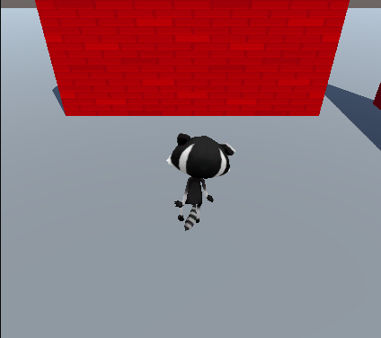

## Animatie en camerapositie

Je speler beweegt, maar zit op dit moment vast in een T-pose-positie. Je kunt dit verbeteren door animaties te gebruiken.

--- task ---

Selecteer de speler in het hiërarchievenster.

Sleep de **IdleWalk** animator van de **Animation** > **Animators** map in het Project venster naar de eigenschap Controller van de Animator-component van je personage:

Hiermee worden de animatie Idle and Walk aan je personage toegevoegd met een `forward` Booleaanse parameter die je kunt gebruiken om te bepalen welke animatie wordt afgespeeld.

--- /task ---

--- task ---

**Test:** Speel je project en zorg ervoor dat je de Idle animatie ziet:

--- /task ---

--- task ---

Voeg code toe aan de `Update` methode van je script zodat wanneer het personage vooruit beweegt een loopanimatie gebruikt, anders gebruikt het een idle animatie:

--- code ---
---
language: cs filename: PlayerController.cs - Update() line_numbers: true line_number_start: 17
line_highlights: 21-31
---

    void Update()
    {
        float speed = Input.GetAxis("Vertical");
    
        //Set animations
        Animator anim = gameObject.GetComponent<Animator>();
    
        if (speed != 0) // Is moving
        {
            anim.SetBool("forward", true);
        }
        else // Idle
        {
            anim.SetBool("forward", false);
        }
    
        // Rotate around y-axis
        transform.Rotate(0, Input.GetAxis("Horizontal"), 0);
--- /code ---

--- /task ---

--- task ---

**Test:** Speel je project en zorg ervoor dat je de animatie ziet veranderen om te lopen wanneer je vooruit gaat en overschakelt naar idle (inactief) wanneer je niet vooruit gaat:

--- /task ---

In games volgt de camera vaak de speler.

De plaatsing van een **virtuele camera** in een 3D-omgeving is cruciaal voor het maken van het juiste perspectief voor gebruikers. De zichtbaarheidsniveaus van de cameralens beïnvloeden het moeilijkheidsniveau en de sfeer van een spel. 

--- task ---

Sleep in het venster Hierarchy de **Main Camera** naar het Player GameObject; het wordt een 'kind' van de speler en volgt de speler.

--- /task ---

--- task ---

**Test:** Speel je project. De camera zal nu je personage volgen, maar het is een beetje ver weg en muren komen vaak tussen de speler en de camera.

--- /task ---

Je kunt de positie en rotatie van de camera aanpassen in de Scene view of het Inspector venster.

--- task ---

Verlaat de afspeelmodus en selecteer de **Main Camera** in het venster Hierarchy. Pas de Transform-instellingen aan om een derde-persoon weergave van je speler te krijgen, je kijkt dan van achter en boven je speler:

Je kunt de camera in de Scene view plaatsen met de Transform en Rotate tools als je dat wilt:

--- /task ---

--- task ---

**Test:** Speel je project. De camera volgt nu je personage met de camera net achter en boven je personage en kijkt naar beneden onder een hoek.

Pas de camera-instellingen aan totdat je er tevreden mee bent.

**Tip:** je kunt instellingen uitproberen in de Play mode, maar je moet de Play mode verlaten en de instellingen bij te werken en ze te behouden.

Wat gebeurt er als je van de rand van het vlak gaat? Maak je geen zorgen, je personage gaat weer naar het midden de volgende keer dat je de Play mode opent:

--- /task ---

--- save ---
